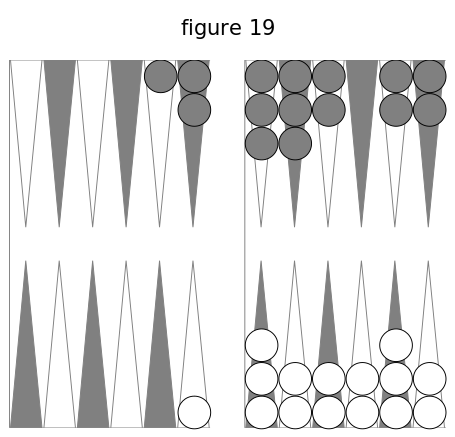
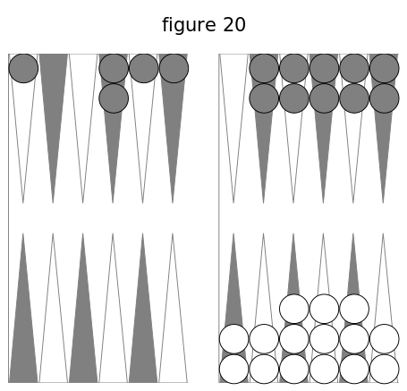
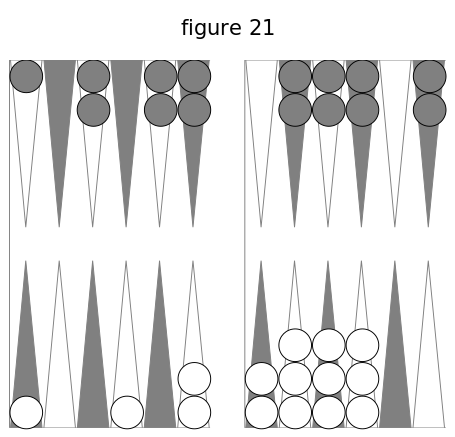
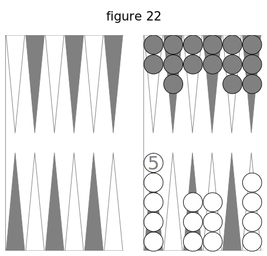

## VII. Points — trou — partie ordinaire

**140. Points. Trou. Partie ordinaire.**

Ce que l'on gagne se nomme des points. Leur nombre est toujours pair : 2, 4, 6, 8, 10, 12, 14. La réunion de douze points s'appelle un trou ; douze trous font la partie ordinaire.

**141. Marquer les points.**

On les marque avec des jetons, dans le tablier, chacun de son côté. Puisque douze points font un trou, il suffit d'en savoir marquer 2, 4, 6, 8, 10. Pour dix points, on met le jeton (figure 1) près de la bande B C ; pour huit points, le jeton est près de la bande de séparation, dans la deuxième table ; pour six points, près de la même bande, dans la première table. Il reste à trouver la place pour deux points et pour quatre. Les flèches d'une table laissent entre elles et les deux bandes douze demi-intervalles, dont le tiers est quatre : donc le jeton doit être placé , pour deux points, vis-à-vis le milieu entre la première flèche et la deuxième ; pour quatre points, vis-à-vis le milieu entre la troisième et la quatrième.

Mettez bien ces places dans votre tête, pour ne jamais placer le jeton d'une manière incorrecte ou incertaine.

A mesure qu'on obtient des points, on avance le jeton à la place convenable.

**142. Marquer les trous.**

Chaque joueur marque avec son fichet les trous qu'il gagne ou qu'on lui donne. La grande bande placée devant vous a douze trous destinés à recevoir votre fichet, que vous avancez pour indiquer le nombre de trous que vous avez. A mesure que vous prenez un trou, vous y placez votre fichet.

**143. Trou double. Bredouille. Trou simple. Débredouiller.**

Si, par les points que l'on gagne ou que l'on reçoit, on arrive à douze sans être interrompu par des points de l'adversaire, on marque comme si ces douze points étaient doublés, on avance le fichet de deux trous au lieu d'un. Au contraire, le trou est simple, le fichet n'avance que d'un trou, si l'adversaire a interrompu par des points les douze qui le font trou du premier joueur. Quand on n'a pas été interrompu par des points de l'adversaire, on dit que _l'on est en bredouille_. Si l'on a été interrompu dans la série des points que l'on a pris, on dit que _l'on est débredouillé_.

**144. Jetons pour les points. Bredouille.**

Celui qui marque des points en premier les marque avec un seul jeton, et il est en bredouille. Celui qui en prend le deuxième les marque avec deux jetons, pour faire voir qu'il a la bredouille ; c'est-à-dire que, s'il arrive à douze points sans interruption, il doit marquer le trou double, Il doit ôter un des deux jetons, si le premier prend de nouveau des points avant qu'il soit arrivé à douze, parce qu'il est débredouillé. Si le deuxième joueur n'ôte pas un des jetons, le premier a le droit de le faire, même le coup d'après, quand il s'en souvient.

La place des jetons indique l'état des joueurs pour la bredouille. S'il y en a deux ou point au talon, un joueur a la bredouille; s'il y en a un au talon, aucun joueur n'a la bredouille.

Perdre la bredouille, c'est perdre le droit de marquer le trou double, quand l'adversaire a pris des points depuis les vôtres. Oter la bredouille, c'est ôter le deuxième jeton qui annonçait que l'on devait marquer double le trou que l'on ferait.

**145. Oubli du deuxième jeton.**

Lorsque celui qui doit marquer ses points avec deux jetons ne les marque qu'avec un, il peut prendre le deuxième jeton, s'il s'en aperçoit, tant qu'il n'a pas joué ses dames, s'il marque en premier, ou tant qu'il n'a pas jeté les dés, s'il marque le deuxième. Dans le cas contraire, il perd le droit de la bredouille, mais l'adversaire n'en peut profiter. Si celui qui gagne le trou double le marque simple , il n'est plus reçu à le marquer double dès qu'il a joué.

**146. Un seul trou pour douze points de suite.**

On peut gagner douze points ou davantage sans être interrompu, et néanmoins n'avoir pas le droit de marquer le trou double. Par exemple, vous faites quatre points et l'adversaire quatre; vous en faites ensuite seize : cela ne vous donne pas deux trous, parce que, aux quatre premiers qui ne sont pas en bredouille, vous en ajoutez huit des seize, pour en avoir douze, qui font un trou simple. Pour que le trou soit double, il faut que les douze points qui le forment aient été pris de suite.

**147. Rentrer en bredouille.**

Cela a lieu lorsque, ayant été débredouillé, on a gagné assez de points pour rentrer en bredouille. Par exemple, si vous avez huit points simples et l'adversaire autant en bredouille, si d'un coup vous gagnez dix-huit points, vous dites : _Dix-huit et huit font vingt-six, un trou simple et un double, un, deux et trois_; et en même temps vous prenez votre fichet, vous le portez aux trois trous suivants, mais vous ne le faites entrer réellement qu'au troisième. Si la somme de vos points allait à trente-six ou davantage, cela vous ferait cinq trous, parce que, des trois trous de trente-six, un seul est simple.

**148. Points à effacer. Points de reste.**

Lorsque vous marquez un ou plusieurs trous, les points au delà de douze, vingt-quatre, trente-six, sont des points de reste ; vous les marquez avec un jeton. Vous effacez les points qu'a l'adversaire, en remettant au talon son jeton ou ses deux jetons, et les vôtres s'il ne vous reste rien.

**149. Points gagnés. Points donnés.**

Si c'est vous qui avez jeté les dés, vous marquez ce que vous gagnez, soit pour remplir ou conserver, soit pour battre à vrai. Vous jouez ensuite votre coup avec une ou deux dames. L'adversaire alors inarque ce que vous lui avez donné, soit en le battant à faux, soit pour les nombres que vous ne pouvez jouer. Puis il jette les dés à son tour.

**150. Points non marqués.**

Il y a un cas où l'usage est de ne pas marquer les points que l'où gagne : c'est lorsque, par le même coup, on donne ou complète le trou à l'adversaire, et alors on doit dire : _Je ne marque pas_.

## VIII. Conventions sur les points gagnés ou donnée

**151. Conventions sur les points.**

Pour les nombres des différents points que vous gagnez à chaque coup, et de ceux que l'adversaire vous donne, on a fait les conventions suivantes.

**152. Points gagnés par vous.**

Le jan de trois coups vaut quatre points. Le jan des deux coins, le jan de mézéas, battre le coin, valent quatre points si le coup est simple, six points si c'est un doublet. Un plein quelconque que l'on fait ou refait, ou que l'on conserve, vaut, pour chaque coup, quatre points pour un coup simple, six pour un doublet. Si l'on remplit de deux ou trois façons, cela vaut deux fois, trois fois autant que pour une façon: un coup simple vaut donc quatre, huit, douze points ; un doublet vaut six ou douze points. Pour achever de lever le premier au jan de retour, on gagne quatre points si le dernier coup est simple, six points quand c'est un doublet.

Une dame découverte est plus souvent battue dans la deuxième table que dans la première, puisque dans la deuxième il suffit d'un des deux nombres, au lieu que pour la première il faut la somme des deux nombres. C'est peut-être pour cela qu' une dame battue dans la deuxième table vaut deux points et quatre par doublet ;

dans la première table, quatre points et six par doublet. Si une dame est battue de deux ou trois façons, cela vaut le double, le triple.

**153. Points donnés.**

Le contre-jan des deux coins et celui de mézéas valent quatre points et six par doublet. Chaque nombre non joué vaut deux points; le doublet ne change rien. Les dames battues à faux valent autant que les dames battues à vrai.

**154. Résumé.**

Quand on fait le jan de trois coups, le jan des deux coins, le jan de mézéas; que l'on fait un des trois pleins, ou qu'on en conserve un ; quand on bat le coin ou une dame dans une première table, ou que l'on achève de lever le premier $ on gagne à chaque coup et de chaque façon quatre points pour un coup simple, six points quand c'est un doublet.

Celui dont l'adversaire fait un des deux contre-jans, ou bat à faux dans une première table, gagne quatre points.

## IX. s'en aller — rester

**155. S'en aller.**

_Le joueur qui gagne un ou plusieurs trous dont les deux derniers points proviennent de son coup peut s'en aller, c'est-à-dire ?cmettre toutes ses dames au talon, et obliger Vadversaire à en faire autant, quelque beau que soit son jeu_, pour recommencer à abattre du bois, en effaçant ses points de reste et ceux que l'adversaire marquerait si l'on ne s'en allait pas. On ne doit toucher aucune de ses dames (cf. n° 46), car cela ôterait le droit de s'en aller.

Quand on recommence à jouer, ce qu'on appelle _un relevé_, la primauté appartient à celui qui s'en est allé, comme ayant gagné le trou. Il marque ses trous, dit : _Je m'en vais_, puis efface ses points et ceux de l'adversaire, et remet ses dames au talon. L'adversaire est obligé de relever aussi ses clames. Ensuite l'on continne la partie.

**156. Conditions.**

Pour avoir le droit de s'en aller, il faut achever le trou de son coup, n'avoir pas marqué les points de reste, n'avoir pas touché ses dames, et ne pas avoir dit : _Je reste_ ou _Je ne m'en vais pas_. Si l'on s'en va, on dit : _Je m'en vais_, pour avertir l'adversaire qu'il est obligé de relever ses dames, Quand on a dit : Je m'en vais, l'adversaire peut forcer à s'en aller.

**157. Points effacés en s'en allant.**

On marque le trou ou les trous que l'on a complétés au moyen des points gagnés par son coup, et on a soin de remettre au talon les trois jetons, parce qu'on ôte à l'adversaire le droit de marquer ce qu'on lui donne en le battant à faux, même quand cela irait à vingt-quatre points, parce qu'il ne doit marquer que quand on a joué.

**158. Rester.**

C'est ne pas s'en aller. Quand on reste, ce qui a lieu le plus ordinairement, on marque ses trous et ses points de reste, en effaçant les points qu'avait l'adversaire; puis on joue son conp avec ses dames. L'adversaire perd les points qu'il avait

avant ce coup, mais il marque les trous et les points de reste que lui donne ce coup ; il faut qu'il marque le tout avant de jeter les dés ; il marque ses points en bredouille, avec deux jetons, si l'autre joueur a des points de reste.

**159. Avantages. Désavantages.**

Il est facile de voir qu'il y a souvent un très grand avantage à s'en aller, si l'on a un jeu moins bien disposé que celui de l'adversaire, ou si on lui donne deux trous ou plus, en le battant à faux. Le joueur qui s'en va "a l'avantage de la primauté. Il y a aussi très souvent de l'avantage à rester, par exemple : s'il reste six, huit ou dix points, avec la certitude de compléter un trou au premier coup, en conservant ; si l'on ne donne pas de points à l'adversaire, et s'il n'en peut prendre assez pour avoir un trou au coup suivant; et enfin si lejeu est mieux disposé que celui de l'adversaire pour remplir, conserver ou battre.

**160. Décision difficile.**

Il est souvent difficile de voir promp-tcment si l'on doit rester ou s'en aller. Une _tenue_ imprudente peut faire perdre beaucoup de trous, et même la partie tout entière; mais on doit rester quand on a la certitude ou même l'espoir de gagner un ou plusieurs trous.

**161. Conduite a tenir.**

La première chose à faire quand on gagne ou complète un ou plusieurs trous de son coup, c'est de marquer ces trous avec son fichet; et d'effacer les points de l'adversaire et les siens; puis, s'il y a des points de reste, on garde son jeton dans sa main, jusqu'à ce que l'on ait examiné ce que seront les deux jeux, quand OR aura joué ce dernier coup. Si l'on se détermine à s'en aller, on met son jeton au talon; si, au contraire, on veut rester, on marque ses points de reste. Au lieu de garder le jeton dans sa main, on peut le déposer à la bande.

**162. Relevé. Partie.**

Un relevé a lieu quand, après avoir marqué un ou plusieurs trous et s'en être allé, on recommence à garnir le tablier pour gagner des trous, jusqu'à ce qu'un joueur s'en aille ou achève les douze trous. La partie est tout ce qui se fait depuis le commencement jusqu'à ce qu'un joueur complète douze trous.

**163. S'en aller a la sortie des dames.**

Au jan de retour, celui qui lève ses deux dernières dames, et qui arrive à douze points par ce coup, a le droit de s'en aller, ou de rester, après avoir jeté les dés. Il examine ce qui lui est le plus avantageux. Par exemple, s'il a dix points, et s'il amène 6-6, il doit rester, car il aura quatre points de reste et la somme douze à jouer; s'il amène 3-2, il doit s'en aller. Cette décision est tirée de Guiton, qui l'a justifiée par des raisons ; en voici une : la détermination que prend un joueur de rester ou de s'en aller doit être la suite d'un examen réfléchi de ce que peut lui faire espérer ou craindre le coup qui lui confère le droit de s'en aller.

## X. Ecoles

**164. Définition.**

On fait une _école_ si l'on marque plus ou moins qu'on ne doit marquer. L'adversaire marque pour lui ce qu'il y a de trop ou de trop peu ; il met à l'école, il envoie à l'école, il marque l'école. Il y a l'école par trop et l'école par moins.

**165. Leur valeur.**

Les écoles sont égales aux points qu'on a marqués de trop ou qu'on a oublié de marquer.

**166. Ecole par trop. Ecole par moins.**

La deuxième est plus préjudiciable que la première. Si chaque joueur a 6 points , et si l'un, gagnant 6 autres points, oublie de les marquer, il donne le trou à l'adversaire, au lieu de le prendre : cela fait une différence de deux trous, et même de trois si l'un ou l'autre avait la bredouille. L'école par trop, au contraire, ne porte qu'un préjudice simple, de 6 points, et laisse le trou à celui qui a fait l'école.

**167. Quand l'école est-elle faite ?**

L'école par trop est faite quand on a quitté son jeton, parce qu'on ne peut le reculer. Il faut la marquer avant de jeter ses dés, sans quoi on n'y est plus reçu , et le premier joueur garde les points et les trous qu'il a marqués de trop.

L'école par moins est faite dès que l'on a touché une dame (cf. n° 46); elle l'est aussi quand on a jeté les dés, si elle vient d'un coup de l'adversaire. Elle ne serait pas faite si, gagnant 8 ou 10 points, on n'en marquait d'abord que 2, 4 ou 6; on aurait le droit d'avancer le jeton, tant que l'on n'aurait pas touché de dame , on jeté les dés. Elle serait faite si, au jan de retour, on levait par erreur une dame de l'adversaire.

**168. Écoles de l'adversaire.**

La première attention est d'éviter les écoles; la deuxième est d'examiner si l'adversaire en fait. On a un grand avantage sur lui si l'on n'en fait point ou presque point, et si l'on relève exactement celles qu'il fait. Au commencement de chaque relevé, il faut voir si vous ou l'adversaire ne faites point l'un des cinq jans.

**169. Jeton à la bande.**

Si l'on fait un trou, et si l'on oublie les points de reste, on est mis à l'école. Une erreur plus fréquente, c'est d'oublier d'effacer les points que l'on avait avant le coup, de ne point remettre le jeton au talon, lorsque le coup complète un ou deux trous, et qu'il ne reste rien : alors l'adversaire met à l'école et prend pour lui les points que l'on avait laissés marqués. Cependant si l'on avait des points au delà des douze, on n'est mis seulement à l'école de ce qui se trouve marqué de trop. Il n'y a pas d'école sijfon s'en va.

Lorsque, croyant qu'un trou est gagné par vous ou par l'adversaire, on démarque les points précédemment acquis, et que l'on remet le jeton à la bande sans marquer le trou, si l'on reconnaît son erreur avant d'avoir jeté les dés ou joué une ou deux dames, on est admis à les reprendre, en remettant le je ton à la place qu'il occupait ; si au con-traire le coup était fini lorsque l'erreur est reconnue, les points effacés seraient perdus, mais on n'encourrait pas la peine de l'école. Cependant si, en démarquant ses points, au lieu de mettre le jeton à la bande, on le posait à une placé qui indique la marque de deux ou quatre points, on ne serait plus admis à réparer cette erreur,, quoiqu'on n'eût ni marqué le trou, ni jeté les dés, ni joué de dame ; on remettrait le jeton à la place qu'il occupait ; et l'adversaire marquerait l'école des points qui manqueraient pour avoir le trou, et ceux qui auraient été marqués de reste.

**170. S'en aller sans en avoir le droit.**

Si l'on s'en va en marquant le trou n'ayant pas assez de points, on est à l'école dès que l'on a commencé à lever ses dames. L'adversaire peut forcer de remettre les dames comme elles étaient, et de jouer à son désavantage les dames levées pour s'en aller. L'adversaire peut ainsi empêcher de remplir ou conserver; il peut en outre marquer les points que l'on marquait de trop. Si, dans ce cas, l'adversaire avait déjà levé une ou plusieurs de ses dames, lorsqu'il s'aperçoit de l'erreur, il ne peut ni mettre à l'école le premier joueur, ni le forcer de rester.

**171. Examen des deux jeux.**

A chaque coup, aussitôt que les dés sont jetés, chaque joueur doit regarder les deux jeux. Celui qui a jeté les dés examine ce qu'il gagne et le marque avant de toucher une dame (cf. no 46), car sans cela il sera mis à l'école. L'autre joueur examine si le premier a joué ce qu'il devait jouer, et s'il a marqué tout ce qu'il était obligé de marquer : s'il y a lieu, il marque l'école et en outre les points qu'on lui a donnés. Si ce deuxième joueur jette les dés avant de marquer les points qu'on lui donnait, le premier le met à l'école pour cela.

**172. Paroles et marques différentes.**

Si l'on dit : _Je gagne huit points_, et que l'on n'en marque que six, aussitôt qu'on a touché ses dames, on est mis à l'école de deux points. Si l'on dit : _Je gagne six points_, et que l'on en marque huit, on peut être mis à l'école de deux points, quand on a lâché son jeton.

**173. Plus ou moins de trous.**

Ayant dix points, on amène un coup qui en donne douze; par erreur, croyant en gagner quatorze, on marque trois trous, et l'on rompt le jeu pour s'en aller : l'adversaire a le droit d'obliger à rester, de remettre à dix points en faisant effacer deux trous, et de marquer l'école de deux points.

Si l'erreur a lieu en sens contraire; si l'on a amené un coup qui donne réellement trois trous, et que, croyant n'avoir que vingt-deux points, on se contente de marquer un trou, puis de s'en aller, l'adversaire ne peut forcer à rester et mettre à l'école; on perd seulement les deux trous qu'on a oublié de marquer.

**174. Trous démarqués.**

Si, gagnant un ou plusieurs trous, au lieu de les marquer en avançant son fichet, on le fait au contraire rétrograder; si même on met son fichet au talon, au point de départ, on est admis à reprendre les trous démarqués, ainsi que ceux nouvellement gagnés, quand même on aurait marqué des points de reste, pourvu que le coup ne soit pas consommé : car, si on avait joué ses dames ou jeté les dés, on ne pourrait reprendre que les trous anciennement acquis, et non ceux nouvellement gagnés. Ces deux cas sont semblables à celui où, ayant à marquer un ou plusieurs trous et des points, on se contente de marquer les points, en oubliant les trous.

**175. Points démarqués a la sortie.**

Au jan de retour, à la sortie des dames, en les remettant au talon, si l'on démarque ses points, on les perd, mais l'adversaire n'en peut marquer l'école. Pour être passible de l'école, il faut avoir marqué des points qu'on n'a pas, ou n'avoir pas marqué des points qu'on a; mais ici il y a seulement abandon de points acquis précédemment, il y a faute.

**176. Avertissement qu'on ne marque pas.**

C'est un usage qui a force de loi, qu'un joueur qui gagne des points par le coup qu'il amène, mais qui, par le même coup, donne le trou à l'adversaire, au lieu de marquer les points qu'il gagne, se contente d'avertir qu'il ne marque pas; et cet avertissement équivaut à la marque réelle avec le jeton des points gagnés, car, par la marque du trou, ils seraient effacés aussitôt que marqués. Cet avertissement suffit pour priver l'adversaire de la bredouille des jetons, s'il l'a, et alors il ne peut marquer que le trou simple. Mais si le joueur qui a averti, parce qu'il croyait donner le trou, ne le donne pas, il n'a pas le droit, après avoir joué son coup et lorsqu'il reconnaît son erreur, de reprendre les points qu'il n'a pas marqués. Si l'adversaire a la bredouille des jetons,il la conserve malgré l'avertissement.

Il en est autrement si le joueur qui croit donner le trou le gagne lui-même. Supposons qu'ayant quatre points et l'adver-saire huit, il batte par son coup deux dames à vrai, mais qu'il croie en battre une à vrai et l'autre à faux, et avertisse en conséquence qu'il ne marque pas , alors l'adversaire a le droit de marquer quatre points d'école, qui lui donnent le trou, trou simple, à cause de l'avertissement.

**177. Avertissement a tort.**

Si le joueur averti qu'il a le trou ne l'a pas, mais le marque néanmoins, l'adversaire peut, s'il s'en aperçoit à temps, le lui faire effacer en le réduisant aux points qu'il avait; mais il ne peut marquer l'école : on ne peut profiler d'une erreur qu'on a occasionnée.

**178. Fichet déplacé.**

Le déplacement du fichet pour marquer des trous qu'on n'a pas ne fait pas école, parce qu'on n'a pas touché ses dames, ni placé son jeton.

**179. Trou sans bouger.**

Si d'un coup on gagne douze points, et qu'en marquant le trou on remette le jeton au talon, on fait école des points qu'on avait. Si, ayant dix points, on mettait le jeton à six, on ne ferait école que de quatre points.

**180. Trou pris par erreur.**

Croyant avoir le trou qu'on n'a pas, on le marque, et on rompt pour s'en aller : si l'adversaire, partageant l'erreur, rompt aussi, le trou est bien acquis.

**181. Points démarqués.**

Si, croyant que l'adversaire fait école, on efface ses points, sans les marquer, on ne fait pas école.

**182. Ecole d'école.**

Elle n'a point lieu. Si l'adversaire fait une école, et si vous ne la marquez pas, il ne peut vous mettre à l'école pour cela.

**183. Fausse école.**

1° Si l'adversaire , croyant que l'on fait une école,la marque, il est mis à l'écdle. Par exemple, on a trois cases dans sa deuxième table, les deux coins sont vides; on jette les dés et on ne marque rien ; l'adversaire, croyant que l'on bat son coin, met à l'é-cole : on efface ces points et on les marque pour soi.

2° L'adversaire a quatre points, on en a dix ; on amène un coup qui donne quatre points, on marque le trou et deux points de reste; l'adversaire, ne voyant pas comment on gagne ces quatre points, croit qu'il y a école; en conséquence, il démarque le trou, remet à dix points, et, rétablissant sa marque, il ajoute quatre points pour l'école à ceux qu'il avait déjà, et en marque huit : on démontre l'erreur, on reprend son trou avec deux points et on en ajoute quatre.

**184. Ecole de trou.**

' II n'y en a pas si, ayant le trou simple, on le marque double, ou bien, l'ayant double, on le marque simple: car un trou double, comme un simple, est la représentation de douze points; la seule différence, c'est que le premier représente douze points pris sans interruption, et le deuxième avec interruption. Le nombre des points marqués par le trou double et le trou simple étant égal, il n'y a pas école; on fait démarquer un trou lorsqu'on l'a marqué double, ne l'ayant que simple. Mais si, ayant par son coup trois trous, on n'en marque qu'un, ou si, n'ayant droit d'en marquer qu'un ou deux, on en marque trois ou quatre, on fait école de douze points, parce que trois ou quatre trous sont la représentation de vingt-quatre points , et que , ne devant en marquer que douze, on a fait école de douze.

Il n'y a pas non plus lieu à l'école lorsque, gagnant par le coup survenu assez de points pour compléter le trou et même au delà, on déplace son jeton, on le remet à la bande s'il n'y a pas de reste, et on marqua ce reste s'il y en a, mais en oubliant de marquer le trou. En effet, c'est le déplacement du jeton posé à la place qu'il doit occuper qui constitue la marque, et non le déplacement du fichet.

Mais si , gagnant un trou sans bouger, on ne le marque pas, l'adversaire a le droit de marquer l'école de ce trou, parce que, dans ce cas, il n'y a point à déplacer le jeton qui marque les points, et en ne marquant pas les douze points qui font un trou, on fait l'école de ce trou.

**185. Obliger de inarquer un trou.**

Lorsqu'on amène un coup qui donne un trou à l'adversaire , si l'on a intérêt à l'obliger de marquer ce trou , on doit l'avertir et lui imposer cette obligation avant que les dés soient jetés pour le coup suivant. Si l'on agit autrement, on est déchu du droit d'obliger à marquer ce trou. Si, pour prévenir l'avertissement, l'adversaire s'empresse trop de jeter les dés, il faut les rompre. Par exemple , si le jeu de l'adversaire est mauvais, s'il lui manque quatre points pour achever un trou , et si on le bat à faux de quatre ou six points, il faut l'obliger à marquer ces points ; par ce moyen il ne peut s'en aller. Si cependant on n'a besoin que des points de cette école, volontaire ou non, pour achever un trou, on doit en profiter, puisque l'on efface tous ses points.

**186. Ecole volontaire.**

Lorsque l'adversaire fait une école, ou par moins ou par trop, dont les résultats présentent pour lui une grande utilité, on présume, et souvent avec raison, que cette école a été faite volontairement. On est maître de marquer ou de ne pas marquer l'école, d'obliger à marquer les points omis, ou d'effacer ceux qui ont été marqués de trop. Tout cela doit se faire avant de jouer un autre coup.

Ces écoles sont faites pour empêcher de s'en aller, ou pour conserver la possibilité de s'en aller. Par exemple, l'adversaire a son grand jan et ses trois dames surnuméraires aux flèches cinquième, dixième, onzième ; on a son grand jan moins une dame à la septième flèche, et ses quatre dames surnuméraires au talon et aux flèches première, deuxième, cinquième; on amène 4-3, on remplit, et l'on bat l'adversaire à faux; il a déjà huit points, cela lui donne le trou et l'empêche de s'en aller, avec un jeu bien mauvais. L'école est volontaire ou non, mais il faut l'empêcher, et obliger l'adversaire à marquer le trou.

**187. Ecole entière.**

Si l'adversaire fait une école, on n'est pas obligé de la marquer ; mais on ne peut le faire partiellement, on est contraint de la marquer dans sa totalité. Si c'est une école par trop , et qu'on ne juge pas à propos de la marquer, on se contente d'effacer les points qui ont été marqués de trop.

L'adversaire a huit points avec un jeu si mauvais, qu'il a le plus grand intérêt de ne pas recevoir le trou, mais de le prendre ; on fait une école de quatre points; par erreur, l'adversaire croit qu'elle n'est que de deux points, et les marque : on l'oblige à marquer le trou, en marquant l'école entière.

L'adversaire amène un coup par lequel il bat à vrai et à faux ; il ne s'aperçoit pas qu'il bat à vrai, et joue sans rien marquer. On reconnaît l'école, on marque quatre points seulement, parce qu'on ne voit pas qu'on est battu à faux. L'adversaire prétend qu'on a fait une école de quatre points, que l'on devait en marquer huit, quatre pour l'école et quatre pour être battu à faux ; mais on répond qu'on n'était obligé qu'à marquer les quatre pour être battu à faux.

On a huit points et un jeu très mauvais ; on a le plus grand intérêt à s'en aller. L'adversaire fait une école, volontaire -ou non , en marquant deux points qu'il n'a pas. On efface ces deux points, dont on marque l'école, et l'on se met ainsi à dix points; l'adversaire vous remet à huit points, et en marque quatre. On se contente d'effacer ces quatre points, et l'on se remet à dix, en faisant connaître l'erreur. On n'est pas obligé de marquer quatre points, parce qu'il n'y a pas une école de quatre points, mais bien deux écoles de deux points chacune ; on a le droit de marquer la première et de ne pas marquer la deuxième.

**188. Attendre pour marquer.**

Quand l'adversaire fait une école de points qu'on lui donne, elle peut être marquée aussitôt que les dés sont jetés. Il vaut mieux attendre que l'adversaire ait achevé de jouer son coup, parce qu'après ce coup joué on est mieux en état de décider s'il est utile ou non de la marquer. D'ailleurs, celui qui a fait l'école joue souvent son coup sans s'en apercevoir, et le joue d'une manière toute différente de celle qu'il choisirait s'il en était averti auparavant. Par exemple, si l'adversaire qui a fait l'école n'a plus qu'une case à faire pour achever son plein, et qu'on n'ait encore que quatre points, il pourra mettre dedans, ignorant que l'on va marquer une école qui mettra à huit points; ce qu'il n'eût pas fait si l'école eût été connue avant qu'il jouât son coup.

**189. Attendre. Battu à faux.**

Par le même motif, on ne doit marquer les points qu'on gagne en étant battu à faux qu'après que l'adversaire a joué son coup, car cela peut influer sur sa manière de jouer. Il est possible que, ne s'apercevant pas des points qu'il donne, il s'expose au danger de perdre le trou ; ce qu'il n'aurait pas fait s'il eût été averti par cette marque trop précipitée des points. Il peut même faire école en marquant ce qu'il bat à faux.

**190. Les trous avant les jetons.**

L'usage et la régularité du jeu exigent que l'on marque les trous qu'on gagne avant de déplacer les jetons. Le contraire peut donner lieu- à des contestations sur la bredouille. Si l'adversaire qui vient de recevoir quatre points par vos dés oublie, en les marquant, de prendre la bredouille, et qu'il amène aussitôt un coup qui lui donne huit points, il est clair que, s'il déplace les jetons avant de marquer le trou, il pourra marquer double le trou qu'il ne devrait marquer que simple ; vous pouvez exiger que le trou soit marqué simple.

**191. Trou double.**

Si l'on a le trou double et qu'on ne marque que simple, on n'est plus admis à rectifier son omission lorsqu'on a touché ses dames ou jeté les dés ; mais si l'on n'a touché que les jetons, on le peut encore.

Celui qui marque le trou simple au lieu de le marquer double, ou qui oublie de
marquer Je trou, et lève ses dames pour s'en aller, n'est plus admis à réformer son erreur ; l'enlèvement des dames est assimilé à un coup joué.

**192. Remplir, conserver.**

Si l'on marque des points croyant remplir ou conserver, quoiqu'on ne remplisse pas ou qu'on ne conserve pas, on fait école des points marqués. Si, pouvant remplir, on ne remplit pas, ou, pouvant conserver, on ne conserve pas, l'adversaire marque autant de points qu'on aurak dû en marquer. Si, ayant bien reconnu que l'on remplit ou conserve, on marque les points qui sont acquis, et si par erreur on lève une dame qui mette dans l'impossibilité de remplir ou force de rompre, on fait école : l'adversaire efface les points et les marque à son profit. Dans l'un comme dans l'autre cas, l'adversaire a le droit d'obliger ou d'empêcher de remplir ou de conserver, sans que cette détermination change rien à l'école. Cette école ne sera point faite si l'on suit le conseil donné au n° 57 : _Jouer d'abord la dame qui remplit_.

**193. Grand jan trop conservé.**

Il est très dangereux de vouloir conserver un grand jan trop long- temps, et de se fier sur l'espérance d'amener de petits nom'bres: ou de recevoir des; points : car souvent il arrive que l'on est forcé de rompre. On a ces deux jeux; on fait un 6-6, et croyant n'être pas obligé de rompre , on marque avec les six points que l'on avait et six pour le plein un trou double, et l'on s'en va, parce qu'on donne six points, et parce que le jeu de l'adversaire est bien plus beau, et que vous pouvez être enfilé.

Mais aussitôt que l'on a touché ses dames, l'adversaire fait démarquer les deux trous, envoie à l'école de six points Illarqués mal à propos, parce qu'il fallait rompre par une dame de la huitième flèche pour la passer par la neuvième de l'adversaire à sa troisième : ainsi l'adversaire, gagnant six points comme battu à faux et six points pour l'école , marque un trou double. Si l'adversaire, croyant qu'on a gagné, levait une ou plusieurs de ses dames, il ne pourrait envoyer à l'école.

**191. Augmentation d'école.**

Cela a lieu quand on a fait une véritable école que l'adversaire a marquée. On croit que l'adversaire s'est trompé, on la démarque et on la marque à son profit. Celui-ci , à son tour, démarque vos points , et ajoute à la première école les points marqués parla deuxième, en vous donnant l'explication de l'erreur. Ce n'est pas en démarquant la juste école qu'on a fait l'augmentation d'école, mais bien en marquant les points de la prétendue fausse école.

**195. Ecole des deux jetons.**

On a huit ou dix points, on amène un coup qui en donne quatre; on oublie ceux qu'on a déjà, et on prend pour les marquer un des jetons de la bande : l'adversaire a le droit d'ôter l'une des deux marques, mais il ne peut pour cela marquer l'école. Ce qui caractérise essentiellement l'école, c'est la marque des jetons : on a bien exactement marqué le nombre de points que donne le coup; mais en les marquant on parait seulement avoir fait abandon de ceux qu'on avait déjà, et à cet égard on ne peut être assujetti à d'autre peine qu'à celle d'en être privé. Et même dans cette circonstance, pour que la faute soit consommée, il ne suffit pas qu'on ait placé et abandonné le jeton. Si l'on s'aperçoit de son erreur avant d'avoir joué son coup, ou d'avoir jeté les dés, on est admis à réparer cette erreur; on peut remettre à la bande le jeton dont on s'est servi mal à propos, et marquer avec le premier jeton les nouveaux points qu'on gagne.

Lorsqu'on a huit points avec la bredouille et que l'adversaire en a quatre, s'il amène un coup qui lui donne quatre autres points ou six, il arrive souvent qu'en ôtant la bredouille, il se sert du jeton qui l'indiquait pour marquer les nouveaux points qui lui sont acquis, et alors il doit remettre à la bande le jeton qui marquait les premiers points. S'il néglige de le faire, et qu'il joue son coup, on a le droit d'ôter une des marques sans marquer l'école, comme dans l'exemple précédent.

**196. Ecole de privilège.**

Si l'on rompt le jan de retour, pouvant le conserver par le privilége de la bande (cf. n° 110), on fait école. Ayant le jan de retour et ses dames surnuméraires aux flèches deuxième, troisième et quatrième, si, ayant 5-4, on rompt, l'adversaire met à l'école, car on pouvait conserver.

**197. Ecole impossible.**

Pour que l'école par omission soit consommée, il faut que celui qui la fait ait jeté les dés, ou qu'il ait touché ses dames sans avoir dit : _J'adoube_. Il peut arriver qu'on omette de marquer des points qu'on gagne, n'ayant à faire aucun des deux actes exigés pour l'école : c'est ce qui arrive dans l'exemple suivant. Avec ces deux jeux, vous amenez 6-6, qui vous donne douze points, six pour conserver, et six pour battre à vrai la dame du talon; mais, ne vous apercevant pas que vous battez à vrai, vous vous contentez de marquer six points, et, comme vous ne pouvez jouer votre 6-6, il n'y a aucun acte à faire qui constitue l'école et la détermine. L'adversaire, privé de tous moyens de s'en approprier le bénéfice, doit se contenter de marquer deux trous pour les deux dames battues à faux, et quatre points pour les six non joués. Néanmoins, si vous reconnaissez l'erreur avant d'avoir de nouveau jeté les dés, vous avez le droit de faire effacer les deux trous de l'adversaire, d'en marquer deux, et de vous en aller comme votre position l'exige.

Cependant cette école serait acquise à l'adversaire si vous le provoquiez à jeter les dés, parce que cela constaterait l'omission.

Il en serait de même s'il ne manquait que quatre points pour prendre le dernier trou de la partie, et si, croyant les gagner par le coup qu'on amène, on se levait sans toucher à aucune dame, en disant : _J'ai gagné_. L'adversaire, n'ayant aucun droit de marquer l'école, n'aurait qu'à faire reconnaître l'erreur, et à faire continuer la partie. Si la partie devait être suivie d'une autre, il faudrait attendre qu'on touchât ses dames pour les relever et les mettre en piles : l'adversaire, s'opposant à l'enlèvement des dames, marquerait les quatre points d'école, et la partie continuerait.

**198. S'attacher aux principes.**

Quelque soin que l'on prenne pour prévoir toutes les difficultés qui peuvent survenir, il s'en présente qui n'ont pas été prévues. Il faut toujours remonter aux principes et aux règles qui sont applicables aux questions à décider. Les difficultés dont je vais rendre compte sont simples et faciles à résoudre.

**199. Premier exemple.**

Les deux jeux sont comme ici. Vous amenez 6-6. Vous n'avez qu'un seul moyen de jouer ce coup, c'est de prendre votre coin directement avec les dames de la cinquième flèche; mais vous vous trompez et prenez votre coin par puissance avec les dames de la sixième flèche. L'adversaire, qui s'aperçoit de l'erreur, réforme le coup, et remet les dames sur la sixième flèche. Alors, ne pouvant jouer votre 6-6 autrement, vous prenez votre coin directement. L'adversaire vous oppose la règle qui prive celui qui, pouvant prendre son coin directement , le prend par puissance, du droit dont il n'a pas usé de le prendre directement; mais vous détruisez cette opposition par la loi incontestable qu'un joueur doit jouer son coup, quand c'est possible. L'adversaire veut alors que vous remettiez au coin les dames de la sixième flèche ; mais vous lui répondez qu'il a lui-même rétabli les dames comme elles étaient auparavant, et qu'il vous a forcé à prendre le coin directement.

**200. Second exemple.**

Un joueur battu à faux ne s'en aperçoit pas; il jette les dés, et fait par conséquent quatre points d'école ; par ce coup il bat à vrai et à faux, il marque quatre points pour la dame qu'il bat à vrai; l'adversaire en marque huit, quatre pour l'école, quatre parce qu'il est battu à faux. A-t-il le droit de marquer ces huit points en bredouille ? Non, car ces points sont composés de deux parties, et n'ont pas été acquis simultanément. Les quatre points d'école lui étaient acquis avant les quatre que le joueur gagne par son coup; les points, au contraire, qu'il donne en battant à faux, résultant du même coup, doivent être marqués après.

Pour rendre cette vérité plus sensible, on peut supposer qu'au moment où J'école a été faite, chacun des joueurs avait huit points: si le joueur qui fait l'école, et qui par le coup suivant a battu à vrai, eût marqué le trou, l'adversaire s'y serait opposé, en réclamant la priorité à raison de l'école; il aurait marqué ce trou en effaçant ses huit points, ainsi que les huit points que le joueur avait.

**201. Troisième exemple.**

1° Un joueur dont l'adversaire a déjà huit points a son grand jan, moins la case de la dixième flèche; trois de ses dames sont à la cinquième flèche, et deux sur deux autres flèches de la première table. Dans cet état, il amène 5-1. Ne voulant pas s'expo-ser à perdre le trou en mettant le cinq sur la flèche vide, il joue tout d'une en portant au coin une des dames de la cinquième flèche; mais, oubliant qu'il a joué tout d'une, et croyant qu'il lui reste encore l'as à jouer, il joue cet as dans sa première table. L'advei-saire prétend que puisque, après avoir joué la première dame, on a joué l'as, cette première dame doit reculer à la dixième flèche. On lui répond par cette loi : _Quand une dame a été bien jouée, une deuxième dame mal jouée n'a aucune influence sur la première_. L'adversaire n'a que le choix de laisser la deuxième dame où elle est, ou bien de la faire reculer d'une flèche.

2° On a des cases aux flèches cinquième, sixième, dixième, onzième; des demi-cases aux flèches quatrième, septième; on amène 2-1, on joue le deux de la cinquième flèche à la septième, et par erreur on joue Pas du talon à la deuxième flèche. L'adversaire ne peut forcer à jouer la première dame tout d'une, puisqu'elle a été bien jouée ; il a le choix de faire placer la deuxième à sa première flèche, ou de la laisser où elle est. Il n'en serait pas de même, dans ces deux exemples, si on joue l'as d'abord, puis le cinq ou le deux : dans le premier cas, le cinq eût porté la deuxième dame à la dixième flèche; dans le second, le deux ayant été réellement joué avec la première dame, la deuxième irait à la sixième flèche.

3° On a son grand jan, moins une dame à sa septième flèche ; on amène 6-1 ; on
remplit avec une dame du talon; oubliant qu'on a tout joué, on joue un as du talon.

Même décision que dans les deux autres cas.

## XI. Nouvelles lois — préambule nécessaire — dés — points — dames

### 11.1 Préambule nécessaire

**202. Observer les règles.**

Le jeu de trictrac veut être joué avec une rigide observation de toutes les règles que l'usage et la raison ont consacrées ; s'en écarter, c'est ouvrir un vaste champ aux difficultés, aux contestations. Les règles ont des bornes fixes et certaines, l'indulgence et la tolérance n'en ont pas : tel qui vient de se montrer indulgent pour une très légère fauté réclamera le moment d'après, la même faveur pour une faute beaucoup plus grave, et de laquelle dépend quelquefois le sort de la partie. Rien d'ar-bitraire dans les règles; tout l'est, au contraire, dans les modifications qu'on veut y apporter. Si l'on se plaint aujourd'hui de leur sévérité, parce qu'on en est la victime, demain on se louera de cette même sévérité, parce qu'on aura l'occasion de l'appliquer à son avantage. Ce qui doit surtout, dans l'observation des règles, détourner d'adopter un pareil relâchement, c'est qu'il fait nécessairement contracter l'habitude d'une certaine négligence irréfléchie dans la conduite du jeu, laquelle peut devenir très préjudiciable lorsqu'on a l'occasion de jouer avec des personnes qui n'a-doptent pas le même système de tolérance. Cette rigueur dans les lois, et cette gravité dans les peines attachées aux fautes, ont pour but principal de forcer les joueurs a apporter la plus grande attention au jeu. Nous croyons donner un avis très utile à tous les joueurs en les invitant à se soumettre sans répugnance à la rigidité des lois de ce jeu. Il faut se souvenir qu'on doit être plus sévère pour soi que pour les autres.

### 11.2 Les dés

**203. Dé couvert, hors du tablier.**

Un dé sur l'autre, ou sur la bande, ou hors du tablier, rend le coup nul ; on jette de nouveau les dés.

**204. Dé incliné, épreuve.**

Si un dé est incliné, de manière à ne pas porter sur sa base, le coup n'est pas bon. Si le dé est incliné sur les jetons, il est bon. Lorsqu'un dé est posé sur une dame contiguë à la bande et qu'il s'appuie sur cette bande, pour connaître s'il est bon, celui qui a intérêt à ce qu'il le soit doit écarter de la bande, avec précaution, la dame sur laquelle le dé est posé, et la tirer en avant : si le dé reste sur la dame, il est bon ; s'il tombe, il est mauvais.

**205. Dé pirouettant.**

Si, après avoir lancé les dés, l'un d'eux tourne long-temps sur une pointe, un des joueurs peut, d'accord avec l'autre, le fixer, en l'arrêtant avec le fond du cornet, sans le pousser. Si on le faisait sortir du tablier, l'autre joueur aurait le droit de faire recommencer le coup entier, ou de faire retirer le dé sorti. Tant qu'un dé tourne, on ne doit pas ôter l'autre.

Le mieux est de laisser tourner le dé jusqu'à ce qu'il s'arrête. Si cela arrive souvent, il faut voir si les dés sont usés, et alors en changer.

**206. Relever les dés. Jeter les dés.**

On ne doit pas relever les dés avant que le coup soit joué, ou au moins que les nombres aient été nommés par celui qui a jeté les dés.

Il ne faut pas jeter les dés avant que l'adversaire ait joué son coup, car il pourrait le jouer sur des nombres connus et avec sécurité. On dit qu'il y a des joueurs qui affectent, en jouant, une grande lenteur, pour profiter de la vivacité et de l'impatience de l'autre joueur. Dans ce cas, il faut avoir beaucoup de patience pour les corriger de leur lenteur. On- ne doit pas couvrir ses dés avec la main; c'est défendu.

### 11.3 Les points

**207. Points gagnés, points donnés (cf. n° 152, 153).**

Les points gagnés se marquent avant les points donnés. Par exemple, chaque joueur a dix points ; le premier jette les dés, bat son adversaire à vrai de deux points et à faux de deux points; il marque le trou et efface les dix points de l'adversaire, qui marque ensuite les deux points qui lui ont été donnés. Les joueurs ont chacun dix points et leur plein; le premier amène un coup qui le fait conserver par impuissance et lui donne quatre points ; il marque un trou et deux points ; il efface les dix points de l'adversaire, qui marque ensuite deux points pour le nombre qui n'a pu être joué.

**208. Battu à vrai, battu à faux.**

Le joueur qui, par le même coup, est battu à vrai et à faux, ne doit pas marquer les points qu'on lui donne avant que l'ad-versaire ait marqué les points qu'il gagne. Si le joueur battu à vrai et à faux gagne le trou par ce coup, il ne doit pas le marquer avant que l'adversaire ait marqué ses points, à moins qu'il n'en reçoive de lui l'avertissement : car il serait possible que l'adversaire, ne s'apercevant pas qu'il bat à vrai, fît école; et l'autre joueur la marquerait.

**209. Points à effacer (cf. n. 148).**

En marquant un trou, il faut effacer les points marqués par l'adversaire. Si on ne le faisait pas, on s'exposerait à ne pas profiter de l'école qu'il peut faire. S'il a quatre points, et si, par le coup qui donne le trou, il est battu à faux de quatre points, il est possible qu'il ne s'en aperçoive pas : il faut donc démarquer les points de l'adversaire.

Celui qui donne le trou ne doit pas non plus s'empresser d'effacer lui-même ses, points ; cela peut fournir matière à quelques erreurs. Le joueur qui marque le trou, ne voyant pas de points marqués par l'adversaire, peut croire qu'il doit le marquer double.

### 11.4 Les dames

**210. Dame sur une autre.**

Quand une dame a été enlevée de sa place, et posée sur une autre dame (ce qui ne peut arriver que quand on a l'intention de faire une case), il est incontestable qu'on doit jouer celle sur laquelle on a placé la première dame. L'intention de la jouer est manifestée de manière à ne laisser aucun doute. Ainsi, c'est bien le cas d'appliquer la loi (cf. n° 46) : _Dame touchée, dame jouée_.

**211. Dame mal posée.**

Lorsqu'on abandonne une dame sur une flèche autre que celle où le nombre doit aboutir, soit en deçà, soit au delà, cette dame reste entièrement à la discrétion de l'adversaire. Il peut, selon que son intérêt l'exige, ou la laisser à la place à laquelle elle est posée, ou la mettre à sa vraie place, ou même obliger de jouer avec cette dame le coup entier tout d'une, s'il y a possibilité. Mais ce droit de faire jouer tout d'une n'a lieu que dans le cas seulement où cette dame aurait été portée au delà du nombre le plus fort : car, si elle eut été posée en deçà, il ne resterait que le choix, ou de la laisser à la place à laquelle elle a été posée, ou de la mettre à celle où elle aboutit véritablement. Si l'un des nombres avait d'abord été joué régulièrement, on ne pourrait exiger que le coup entier fût joué tout d'une (cf. n° 201).

**212. Dame abandonnée.**

Lorsque, pour jouer l'un des nombres amenés, on a posé et abandonné une dame sur une flèche, et qu'on se repent ensuite de n'avoir pas joué préférablement l'autre nombre avec cette dame, on n'y est plus admis; elle doit rester à la place où elle a été posée pour jouer le premier nombre, et elle n'en peut sortir que pour jouer tout d'une. Ainsi, par exemple, si, ayant amené 5-3, l'on a d'abord joué le trois avec une dame qu'on a abandonnée sur la flèche où ce nombre aboutissait, et qu'on reconnaisse qu'il aurait été préférable de jouer le cinq avec cette dame, on ne le peut plus.

**213. Dame dans une table de l'adversaire.**

On a vu (cf. n° 61) qu'_on ne peut placer aucune dame dans une table où l'adversaire peut faire un plein_. Néanmoins il peut arriver que, par une inadvertance commune aux deux joueurs, l'un d'eux entre une dame dans une table de l'adversaire, lorsqu'il peut y faire un plein. Si l'adversaire ne réclame pas et jette les dés, l'erreur est consommée, et le coup ne peut être réformé pour le présent. Mais si, après ce coup joué, il est encore possible de remplir, et si l'on s'aperçoit de la faute, on a le droit d'obliger, si c'est dans sa deuxième table, à en sortir au coup suivant, si c'est possible, en passant dans la première table. Si le coup amené s'oppose à ce passage, on a le droit d'empêcher qu'il soit introduit une autre dame. Prenons l'exemple suivant.

L'adversaire amène 4-2, qui l'oblige à rompre ; mais, ne s'apercevant pas que vous pouvez remplir, il croit conserver, marque quatre points, et joue de sa septième flèche à votre dixième. Partageant l'erreur, vous ne réclamez pas, et jetez les dés, qui vous donnent 6-1. En portant votre as de la huitième flèche à la neuvième, vous voyez l'erreur, et que vous pouvez remplir. L'adversaire amène 6-5. Il pourrait conserver, en passant dans votre première table une des dames surnuméraires de sa i dixième flèche ou de son coin, mais vous l'obligez à jouer le six avec la dame qu'il a à votre dixième flèche, et de rompre pour jouer le cinq.

Si une dame est dans la première table, où le plein est possible, elle y restera nécessairement.

**214. Une dame de moins.**

Lorsqu'un joueur est reconnu n'avoir que quatorze dames, il a le droit de faire rentrer, aussitôt qu'il s'en aperçoit, la quinzième dame dans son jeu; mais ia place qu'elle doit y occuper varie suivant les différentes positions de ce jeu au moment où l'absence est reconnue. Si le talon a encore une ou plusieurs dames, celle qui rentre doit y être placée. Si le talon est vide, elle doit être placée sur la flèche de la première table déjà occupée par une ou plusieurs dames, la plus voisine du talon. Si la première table est totalement dégarnie, cette dame ne peut être mise qu'au coin, s'il est pris; ou, s'il ne l'est pas, sur la case la plus voisine de ce coin.

Si le jan de retour est avancé au point que toutes les dames se trouvent déjà passées dans le jeu de l'adversaire, la dame rentrante doit occuper la flèche garnie de dames la plus voisine du coin ; ou enfin, si toutes les dames se trouvent passées dans la table de sortie, on la place en surcase sur la flèche la plus distante du talon, quand il n'est plus possible d'y faire le plein. Si, au contraire, il y avait encore possibilité de remplir, elle doit être placée sur la flèche la plus voisine de la bande de sortie déjà garnie de surèase. Dans tous les cas; la rentrée de cette dame ne peut être profitable au joueur à qui elle appartient.

La sévérité que la règle prescrit pour la rentrée de cette dame est justifiée et même commandée par la nécessité de prévenir tout ce qui, dans cette circonstance, pourrait devenir préjudiciable à l'adversaire. Elle tend aussi à déjouer les spéculations auxquelles des joueurs qui se seraient aperçus de l'absence de leur dame pourraient se livrer, en retardant sa rentrée jusqu'au moment où ils trouveraient l'occasion de la rendre favorable et utile à leurs intérêts. Citons un exemple qui prouve combien, cette rentrée, si elle n'était pas réglée avec sagesse et prévoyance, pourrait devenir avantageuse à l'un des joueurs et préjudiciable à l'autre.

On suppose qu'au moment où l'absence de cette dame est reconnue, le joueur auquel elle appartient a son grand jan moins une dame à la sixième flèche; les trois autres dames sont aux flèches quatrième et cinquième. Comme nous le verrons en _Arithmétique_ (cf. n° 266), cela ne lui donne que vingt chances pour remplir. Si, en rappelant la dame absente, on la place au talon, le nombre des chances sera alors vingt-huit (cf. n° 269). La différence serait encore plus sensible si les dames sont sur la cinquième flèche ou la quatrième; on n'a alors (cf. n° 263) que onze chances ou douze, au lieu que la rentrée au talon donne (cf. no 266) vingt-trois ou vingt-quatre. En plaçant, au contraire, cette dame comme la règle le prescrit, elle n'améliore en rien la position de celui à qui elle appartient.

Si l'adversaire, après avoir gagné un trou, se détermine à rester sur l'examen des deux jeux, quoiqu'il ait joué son coup, il peut s'en aller, quand l'absence d,e . celte dame est reconnue avant que l'autre joueur ait jeté les dés pour le coup suivant, s'il voit que cette rentrée rend sa tenue défavorable.

Si l'adversaire amène un coup qui batte à faux la dame de la première table sur laquelle doit être placée la dame rentrante, il a le droit, s'il s'aperçoit de l'absence de cette dame, d'exiger sa rentrée immédiate, qui, couvrant la demi-case, la garantit de battre à faux.

Si l'adversaire bat à vrai cette dame, il peut exiger que la rentrée n'ait lieu qu'après le coup marqué et joué.

Il est une autre spéculation qu'il faut empêcher ; mais ceci ne peut être compris que quand on aura étudié le chapitre suivant. Un joueur qui n'a que quatorze dames, et dont le jeu est dans un état de ruine qui présente les apparences d'une grande bredouille (je dirai ce que c'est dans le chapitre suivant) presque inévitable, s'apercevant de l'absence de sa quinzième dame, pourrait dissimuler, et attendre, pour la réclamer, une occasion où sa rentrée lui fournirait un moyen de s'opposer efficacement au succès de la grande bredouille dont il est menacé. Cette occasion aurait lieu lorsque, ayant déjà les flèches sixième, septième, huitième, vides, il ne lui resterait que les trois dernières cases, parce qu'alors, faisant rentrer sa dame, et la plaçant en surcase sur la neuvième flèche (cf. n° 95), il fortifierait par là l'obstacle que ces trois dernières cases opposent au succès des grandes bredouilles, dont elles sont souvent l'écueil, lorsqu'on peut les conserver. C'est ce que la règle a sagement prévu en voulant que la dame rentrante ne puisse occuper d'autre place que le coin, lorsque toutes les dames se trouvent déjà passées dans la deuxième table.

La question que l'on vient de résoudre fait voir combien il est utile de placer ses dames en trois piles, en commençant la partie et à chaque relevé, pour reconnaître si leur nombre est complet. Il y a une grande différence entre cette question et celle où il y a seize dames. Le premier cas n'entraîne pas, comme le dernier, la nullité de ce qui a précédé; il ne produit pas même la nullité du relevé courant.

**215. Une dame de plus.**

Lorsqu'un joueur est reconnu jouer avec seize dames, l'adversaire a le choix, ou d'annuler toute la partie, soit qu'on la joue en douze trous, soit qu'on la joue à écrire (Voyez le chapitre suivant), ou de la continuer dans l'état où elle se trouve, en supprimant la seizième dame. Cette suppression se fait en ôtant une dame du talon, s'il y en a ; s'il n'y en a pas, en ôtant, au choix de l'adversaire, une de celles placées dans sa première table; et si la première table est vide, en ôtant, toujours au choix de l'adversaire, une de celles qui se trouvent en surcase dans la deuxième table.

**216. Fausse case.**

Si, pour faire une case, on enlève deux dames dont l'une n'aboutit pas à cette case, et qu'on s'aperçoive de l'erreur avant de les avoir posées et abandonnées, on est, à la vérité, forcé de les jouer; mais on a le choix de le faire de la manière la moins désavantageuse. Si, au contraire , elles ont été posées et abandonnées Tune et l'autre sur la flèche où l'on a l'intention de faire case, l'adversaire a le droit de les faire jouer à son plus grand avantage, soit en les mettant l'une et l'autre en surcase, soit en les étalant découvertes sur deux flèches vides, soit en faisant jouer avec une le coup tout d'une, et remettant l'autre à la place d'où elle est sortie , quand l'une des deux est au delà du nombre le plus fort amené : par exemple , si l'on avait joué 4-3 au lieu de 5-4, on ne pourrait pas être obligé de jouer tout d'une, parce qu'aucune dame n'est au delà du plus fort nombre. En vain celui qui a commis la faute objecterait-il qu'un des deux nombres se trouve bien joué , et aboutit réellement par une des dames à la flèche en question, et que le droit arbitraire de l'adversaire ne peut et" ne doit s'exercer que sur la seule dame qui ne peut y aboutir par l'autre nombre. A cette objection on oppose que les deux dames , ayant été enlevées , placées et abandonnées ensemble, ont concouru à la même faute d'une manière inséparable, et qu'elles doivent être, l'une comme l'autre, à la disposition de l'adversaire.

La rigueur de cette règle , et les dangers auxquels exposent les fausses cases, font connaître avec quel soin et quelle attention on doit chercher à se garantir de cette faute, qui, presque toujours, est l'effet d'une trop grande précipitation. C'est par cette raison que la prudence a suggéré à certains joueurs la très sage et très utile précaution, lorsqu'ils ont une case à faire, de ne lever et poser les dames que l'une après l'autre. Par ce moyen, ils atténuent les suites de l'erreur qu'ils pourraient commettre. En effet, si cette erreur a lieu sur la première dame posée, il est à présumer qu'ils s'en apercevront avant d'avoir placé et abandonné la deuxième, et alors ils joueront cette deuxième dame de manière, sinon à corriger entièrement cette erreur, du moins à la rendre moins fatale. Si, au contraire, la première se trouve posée à sa vraie place , et qu'on se trompe seulement sur la deuxième, la peine à subir ne peut tomber que sur la deuxième, l'adversaire n'ayant aucun droit à exercer sur la première, qui séparément a été bien jouée, et à l'égard de laquelle tout est consommé. Un joueur qui a couvert une demi-case avec une dame qui n'y aboutit pas est tenu de mettre cette dame à la place qu'elle doit occuper; mais il conserve le droit de couvrir cette demi-case avec la dame qui y aboutit par le nombre qui est à jouer. Quand un joueur ne s'aperçoit de la fausse case qu'après avoir jeté les dés, il ne peut réclamer; le coup est consommé.

De tout ceci on doit conclure combien il est essentiel de ne pas perdre de vue le jeu de l'adversaire pendant qu'il joue le coup qu'il vient d'amener, afin de pouvoir connaître et rectifier à temps les erreurs qu'il peut commettre. On ne peut exercer cette surveillance active et réciproque qu'en s'assujettissant, de part et d'autre, à ne jeter les dés qu'après que l'adversaire a achevé de jouer son coup.

Un joueur qui aurait joué dans son jeu celui de ses nombres par lequel seul il lui est possible de passer au retour, et qui ne pourrait ensuite jouer le deuxième nombre, peut être forcé de remettre à sa première place la dame jouée, et de jouer celle qui peut passer au retour. Cependant l'adversaire a le droit de laisser le coup tel qu'il a été joué, et dans ce cas il marque deux points pour le nombre qu'on n'a pas joué.

Il n'en est pas de même dans le cas suivant. Un joueur a son plein et deux dames- surnuméraires avec lesquelles il peut jouer 6-5 sans rompre. Il joue d'abord le cinq avec la dame qui doit jouer le six, ce qui le met dans l'impossibilité de jouer la totalité de son coup. L'adversaire a le droit, ou de laisser le coup tel qu'il est joué, ou de faire jouer le six avec la dame qui avait joué le cinq, et le cinq avec l'autre dame. L'adversaire ne peut faire rompre en faisant passer au retour, car pour cela il faut qu'il fasse remettre les deux dames à leurs places.

Lorsqu'on prend son coin par puissance, pouvant le prendre directement, l'adversaire a le droit de faire jouer tout d'une, si une dame peut passer au retour. Si c'est impossible, il est privé de prendre son coin à ce coup-, et joue du reste à sa volonté.

