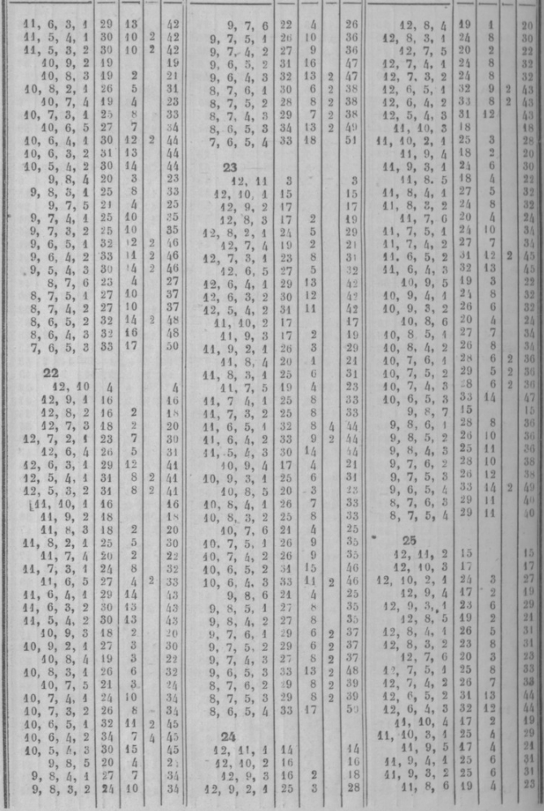
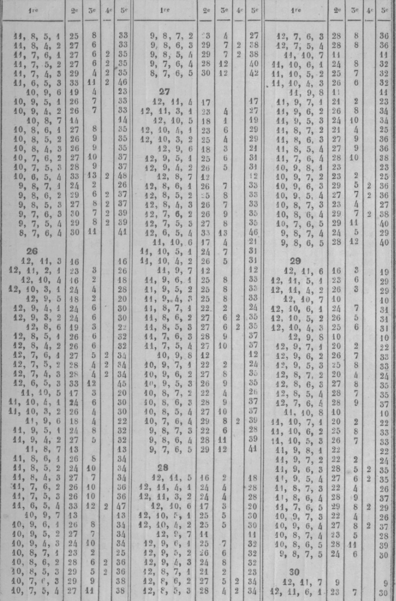

# SECTION V. CONSEILS.

## XXVI. Premiers conseils. — petit jan. — coin.

### 26.1. Premiers conseils.

**416. Attention au jeu.**

L'attention plus ou moins réfléchie que chaque coup exige pour être bien joué ; la comparaison que d'oit faire chaque joueur, par un prompt aperçu, de la position respective des jeux, de la situation de la partie , des avantages ou inconvénients qu'offrent tes différentes manières de jouer, sont autant d'opérations qui requièrent un esprit calme et libre de toute préoccupation d'idées étrangères. Sans cela , on fait des fausses cases et des écoles. Ces fautes sont toujours très graves, si on les apprécie par les suites qui peuvent en résulter. Une dame mal jouée, en commençant, entraîne quelquefois la perte d'un trou et même de plusieurs (n˚293, 294).

**417. Promptitude modérée.**

Pour ce jeu, il ne faut ni trop de vivacité, ni trop de lenteur. Les réflexions un peu longues ne sont nécessaires que pour certains coups décisifs qui demandent des calculs. Trop de vivacité a aussi ses inconvénients pour l'un comme pour l'autre joueur; elle trouble l'un, et fait faire à l'autre des fautes ou des écoles. On doit se montrer égal, dans l'adversité comme dans la prospérité.

**418. Suivre les conseils.**

Il faut s'attacher à suivre les conseils donnés, et à faire les calculs faciles. Il ne faut pas croire qu'il en résulte une lenteur à jouer : l'habitude familiarise tellement avec l'application des conseils et des calculs, que la marche du jeu n'en est nullement retardée.

**419. Jans très rares.**

Les 5 jans expliqués du n°122 au n° 127 arrivent rarement ; cependant, à chaque relevé, il faut voir si on en fait un, ou si l'adversaire en fait, car ils donnent des points à l'un ou à l'autre joueur.

**420. Jouer tout à bas.**

Le premier coup d'une partie ou d'un relevé doit être joué tout à bas, pour juger au deuxième coup s'il faut entreprendre le petit jan, ou chercher à prendre son coin ou à battre les deux coins. Par exemple, si l'on a joué tout d'une 5-3, et si l'on amène 1-1 ou 2-1, on est privé de chances favorables au petit jan. Si le deuxième coup est 4-4 , on couvre la première dame , mais cela ne donne que a chances pour prendre le coin, et 2 pour battre les deux coins. Au contraire, en jouant 5-3 tout à bas, on peut avec le 4-4 placer les 2 dames abattues sur les flèches septième et neuvième, ce qui donne pour le coup suivant 4 chances pour prendre le coin, et 4 autres pour battre les deux coins. Cette règle n'a d'exception que pour contrarier le succès d'un petit jan (n˚425).

**421. Ne point céder le premier trou.**

Il ne faut point céder le premier trou : on parvient plus facilement au marqué quand il suffit de 5 trous au lieu de 6. Il arrive souvent de voir un joueur marquer après avoir fait les cinq premiers trous : ce même joueur eût marqué en bredouille si on lui avait cédé un trou.

### 26.2. Petit jan.

**422. Cas où on l'entreprend.**

C'est lorsque les nombres sont très faibles, comme 2-1, 3-1, » Pour continuer , il faut que les nombres suivants garnissent les flèches de la première table.

Si un ou deux nombres portent une ou deux dames dans la deuxième table, on doit s'occuper de prendre le coin, et préparer le jeu pour le grand jan.

**423. Avantages et dangers du petit jan.**

Le premier avantage est d'ôter le pavillon à l'adversaire lorsqu'il l'a ; le deuxième est de pouvoir s'en aller en prenant le trou, et de détruire ainsi les grandes espérances que lui donnaient une position très favorable et un jeu. très avancé.

Le succès d'un petit jan se borne à un ou deux trous. Cet avantage est faible si on le compare avec les dangers auxquels il expose. Au lieu d'obtenir le trou , on peut le perdre, et on est exposé à des suites fâcheuses. On peut être forcé, pour la conservation du plein, de passer une ou deux dames dans la première table de 1 adversaire , ce qui lui fournit le moyen de les battre ; en outre, cela les rend inutiles. On j)eut être long-temps à prendre son coin , et il est exposé à être battu souvent. Il y a des cas où il faut jouer de manière à le rendre impossible. Il faut y renoncer quand l'adversaire a 8 ou 10 points, ou lorsqu'on n'est pas sûr de conserver deux fois, ou si l'adversaire a déjà 6 trous. On peut l'entreprendre, comme on l'a dit, si l'adversaire, ayant 6 trous ou plus, a aussi le pavillon , et si l'on a peu ou point de trous.

**424. Conserver le plein.**

Il faut s'occuper des moyens de le conserver deux fois, afin d'obtenir le trou et de s'en aller. On doit, dès le premier coup par lequel on conserve, jouer de la manière la plus favorable pour le coup suivant. Il ne faut pas tenir à la bredouille si cela diminue le nombre de chances pour conserver. Si l'on est forcé d'exposer une ou deux dames, il faut chercher les flèches sur lesquelles l'adversaire a moins de chances pour prendre le trou, et tâcher que l'une ou l'autre puisse passer au retour. On doit éviter de mettre une dame seule sur sa cinquième flèche.

**425. Contrarier un petit jan.**

Pour s'opposer au petit jan, on doit préparer les chances qui peuvent faire obtenir le trou avant l'adversaire. Pour cela, on garnit la deuxième table de cases et de demi-cases, afin de battre les dames que l'adversaire laisse découvertes dans sa première table, et dont chacune donne un gain de 4 points,

tandis que J on n en perd que 2 pour celles que l'on expose. De plus, on se donne une grande facilité pour prendre son coin, ce qui est bien important. Lorsque l'on arrive à 8 points, l'adversaire renonce à l'entreprise de son petit jan, ou joue de manière qu'il lui devient plus difficile. Ainsi, par exemple, si, l'adversaire ayant amené 2-1 ou 3-i au premier coup, l'on amène une somme 9 ou 10, on joue touf d'une, afin d'occuper dans sa deuxième table une place très avancée.

**426. Deux petits jans.**

Si les deux joueurs entreprennent le petit jan, les dangers disparaissent. Les deux jeux sont à peu près également retardés.

**427. Demi-cases dans sa deuxième table.**

L'adversaire a son petit jan ; on a son coin, et des dames dans sa deuxième table : au lieu de faire des cases, on doit préférer d'étaler ses dames en demi-cases, ce qui multiplie les chances pour battre le coin, et peut ôter au moins la bredouille des jetons. Si l'adversaire a 6 points, il peut, en battant une dame et en conservant, compléter un trou ; alors on doit se couvrir, et, si l'on est couvert, abattre du bois.

**428. Demi-case dans sa première table.**

L'adversaire a 8 points, son petit jan, et une ou deux dames dans sa deuxième table, avec lesquelles il cherche à passer dans votre première, pour conserver encore un coup, prendre le trou et s'en aller. On doit alors chercher à faire des cases pour l'empêcher de passer. Si on ne le peut, on ne doit pas craindre de mettre dans la seconde table des dames en demi-cases : car, comme il ne faut à l'adversaire que 4 points, s'il ne les a pas en battant, il les aura en conservant. Ainsi on n'est pas plus exposé avec des demi-cases qu'avec des flèches vides; et, en faisant des demi-cases, on a l'avantage d'étendre son jeu, ce qui donne des facilités pour caser, en cas que l'adversaire ne puisse ni battre ni conserver. On joue différemment, et on ne laisse rien à battre, si l'adversaire a pris son coin, duquel il peut partir pour battre dans la première table.

**429. Cases dans sa première table.**

L'adversaire a son petit jan et 8 points, mais avec un jeu si avancé que , pour conserver, il faut qu'il passe une de ses dames surnuméraires. On doit s'occuper de mettre obstacle à ce passage, en garnissant de cases quelques unes des flèches de sa première table , préférablement à celles de la deuxième table. Si l'on amène un coup par lequel on peut faire une case dans sa première table, ou dans sa deuxième, on la fait dans la première. Par exemple, l'adversaire a son petit jan, ses 3 dames surnuméraires sur les flèches huitième et dixième ; on a son coin, 2 cases aux flèches sixième et septième , 2 demi-cases sur les flèches troisième et cinquième. On amène 5-3 : on doit couvrir les 2 demi-cases, et ne pas faire case à la huitième flèche. On interdit tout passage par les sommes 8, 10, 12, qui donnent 9 chances : la case de la huitième flèche laisserait les passages libres. Si l'adversaire vient de terminer le petit jan et n'a que 4 points, on doit lui faciliter le passage et tenir sa première table dégarnie de dames.

### 26.3. Coin.

**430. Importance du coin.**

On doit préparer Jes moyens de le prendre promptement, et surtout d'obtenir la priorité. En prenant son coin le premier, on bat celui de l'adversaire et l'on empêche qu'il le prenne par puissance. En outre, on le gêne dans la marche de son jeu par la crainte de voir battre toutes ses dames en demi-case. Ce qui doit fixer l'attention au commencement d'un relevé , c'est la prise du coin : il faut s'en occuper, à moins que les premiers coups ne forcent à chercher le petit jan.

**431. Places des dames.**

Lorsqu'on le peut, il faut entrer 2 dames dans la deuxième table dès le second coup. On a prouvé l'avantage de cases et demi-cases non continues, et l'avantage des demi-cases sur les cases, puisque avec 3 demi-cases on a plus de chances qu'avec 2 cases , et qu'un nombre de cases a moins de chances que le môme nombre de demi-cases augmenté d'un. Deux dames non contiguës donnent 4 chances pour prendre le coin, et 4 pour battre les deux coins. On ne doit pas craindre d'être battu, pourvu que l'adversaire ne prenne pas le trou.

**432. Cases et surcases.**

Il faut encore, pour faciliter la prise du coin, une case à la cinquième flèche, parce qu'elle donne les 6 ; avoir des surcases sur les flèches sixième et septième, pour prendre le coin sans se découvrir, ou en ne découvrant qu'une dame. Il faut se donner des 6 pour prendre le coin, remplir ou battre.

**433. Donner le trou.**

Pour arriver le premier au coin, on ne doit pas s'exposer à la perte du trou, et peut-être à celle du marqué. Mais si l'adversaire a son grand jan, il faut prendre le coin, même si cela lui donnait 1 ou 2 trous, car il le battrait à tous les coups.

## XXVII. Grand jan. — trois pleins.

**434. Les trois pleins.**

Le petit jan n'est qu'une spéculation peu lucrative, dangereuse dans ses suites, à laquelle on ne se livre que lorsqu'on y est contraint par les petits nombres qu'on amène d'abord. Il est utile seulement si l'on prend 1 ou 2 trous, pour anéantir en s'en allant les avantages que promettent à l'adversaire la rapidité de sa marche et un jeu bien disposé.

Le jan de retour n'est qu'une suite du grand jan ; le succès de l'un dépend presque toujours du succès qu'a eu l'autre. Si le jan de retour offre de graves difficultés à surmonter, s'il exige une grande justesse dans les combinaisons, il est néanmoins le plus souvent peu important dans ses résultats, qui se bornent presque toujours à 1 ou 2 trous, et qui ne deviennent intéressants que quand il s'agit d'obtenir ou d'empêcher une grande bredouille, ou lorsque le trou auquel on aspire détermine et achève le marqué. Enfin le petit jan et le jan de retour ne sont pas très fréquents ; on voit souvent plusieurs marqués se succéder, et même une partie entière se terminer, sans qu'il y ait lieu ni au petit jan, ni au jan de retour.

Il n'en est pas de même du grand jan : il est le vrai but vers lequel, dès le commencement d'un relevé, se dirigent toutes les spéculations des joueurs. Chacun des coups doit tendre à en assurer le succès ; et si la nature des nombres et l'inégalité des jeux ôtent à l'un des joueurs tout espoir de ce succès, il doit alors s'occuper des moyens d'obtenir le trou, ou au moins 8 points, parce que, s'il prend le trou, il s'en va et anéantit ainsi l'avantage de l'adversaire. S'il n'arrive qu'à 8 points , il arrête ses progrès et entrave sa marche par la crainte où il le tient de perdre le trou. Enfin les résultats d'un grand jan, quoique variables, sont ordinairement très importants ; ils s'élèvent souvent à 3 ou 4 trous, même au marqué, et les grandes bredouilles sont toujours la suite d'un grand jan très heureux, ou d'un grand jan très désastreux.

On voit par cet exposé combien il est essentiel pour un joueur de bien connaitre les conseils qui doivent diriger la conduite du grand jan. Un va donner ces conseils, indiquer la marche à suivre, soit pour préparer ce plein, soit au moment d'y arriver, pas soit lorsque enfin on n'y est parvenu.

**435. Préparation du plein.**

On a dit, aux nos 43, 66, 430, l'importance du coin ; au n° 43i on a rappelé comment les dames doivent être placées. On doit faire d'abord la case de la cinquième flèche pour le coin ; mais quand on l'a pris, il faut tenir vide cette flèche, car étant pleine , elle presse le jeu et ôte les 6. On doit faire les cases des flèches sixième, septième , huitième, avant les autres, surtout la septième, à cause de la difficulté qu'on éprouve à les faire lorsqu'on les réserve pour les dernières. Pour la case de la septième flèche, on peut être forcé, par de grands nombres, à passer les dames au delà, ou, si on n'en passe pas, à les rapprocher tellement de cette flèche, qu'ou n'a plus pour remplir que les chances des petits nombres. Par exemple, si, cette flèche étant vide et la dernière à couvrir, les 5 dames sont au talon, à la cinquième flèche et à la sixième, tous les coups qui donneraient les nombres 6, 5, 4, 3, exposeraient à une ruine prochaine. La huitième flèche offre aussi des dangers, ainsi que la sixième.

**436. Case à la dixième flèche.**

Cette case doit être faite la dernière; si on ne le peut, on tâche de finir par la neuvième flèche. La première case a, il est vrai, l'avantage de battre les demi-cases de la première table, quand elle est faite au commencement. Mais l'expérience apprend que cet avantage apparent est balancé par de graves inconvénients; car si cette case bat quelques dames, elle en bat beaucoup à faux dans la première table, lorsque l'adversaire a bien des cases dans sa deuxième table. De plus, si l'on fait cette case avant d'avoir pris son coin, elle en retarde la prise, en diminuant le nombre de chances qu'on aurait pu se donner pour le prendre, si, au lieu de la faire, on eût joué d'une manière plus convenable. Par exemple, un joueur n'a que 2 dames à bas, aux flèches sixième et septième ; il amène 4-3, et, au lieu de jouer tout d'une à la septième flèche, il fait la case de la dixième : il n'a pour. prendre son coin que 1-1, 2-2, 1 ou 2 chances. Au contraire, la case de la septième flèche lui eût donné 5-4, 4-4, 6-5, 5-5, 3 chances ou 6, au lieu de i ou 2, et l'on sait combien la prise du coin est préférable au gain de quelques points.

En faisant d'abord case aux flèches dixième et neuvième, non seulement il y a perte de chances pour le coin, mais il y a dangers graves. Elles nuisent souvent au succès du plein, et exposent ainsi à des enfilades désastreuses. En effet, plus le champ qu'on a à parcourir pour arriver à ce plein est raccourci, plus il est à craindre qu'on ne soit porté, par une série de grands nombres, au delà des limites de ce champ. Supposons un joueur qui, après avoir pris son coin, s'est empressé de faire les cases des flèches neuvième et dixième, et de remplir ainsi la moitié de sa deuxième table la plus éloignée du point de départ. Si ce joueur amène une série de 4 à 5 coups composés de 6-6, 5-5, 6-5, ce qui arrive assez fréquemment, il est certain qu'il sera obligé, pour jouer les derniers coups, de passer plusieurs dames au delà de la limite qui lui reste à remplir : alors son jeu se trouve totalement ou presque totalement ruiné. Si, au contraire, il eût réservé la case de la dixième flèche pour la dernière à remplir, il lui resterait la latitude nécessaire pour placer ses grands nombres, sans être forcé à perdre des dames ; son jeu serait à la vérité raccourci, resserré, mais il ne serait pas désespéré.

En général, il faut, autant qu'on le peut, prévoir les coups même improbables, et chercher à s'en garantir, lorsqu'ils peuvent causer un préjudice considérable. Il ne faut pas pourtant porter celte crainte jusqu'à l'extrême peur, et jusqu'à se précipiter dans un danger prochain pour en éviter un très éloigné, et même improbable. Ainsi, lorsqu on recommande de ne pas s'enlpresser de faire Ja case de la dixième flèche et même de la neuvième, cette recommandation n'est pas tellement absolue qu 'on en doive conclure qu'il faille toujours les réserver pour les dernières. Ce conseil, comme tous ceux qu'on peut donner, est toujours subordonné aux circonstances , aux positions; il en est beaucoup qui commandent de les faire , et on ne doit pas s'y refuser.

Il faut éviter les cases alternes, qui exposent à être souvent battu à vrai et rendent le plein plus difficile.

**437. Avoir du bois à bas.**

II est essentiel d'avoir toujours du bois à bas , c'est-à-dire la première table garnie d'un nombre suffisant de dames placées de manière à multiplier les moyens de caser dans la deuxième table. Souvent même il arrive que, pouvant faire une case dans sa deuxième table, on préfère avec raison mettre deux dames à bas, lorsqu'on jouant ainsi on se prépare un plus grand nombre de moyens pour jouer le coup suivant à son plus grand avantage. Ainsi, par exemple, quand un joueur a 4 cases dans sa deuxième table, où il ne reste vides que les septième et huitième flèches, et deux dames seulement placées dans sa première table aux flèches deuxième et cinquième, s'il amène 6-3, il mettra à bas le 6 et le 3, et ne fera pas la case. Car, si, après avoir fait la case, et ayant sa première table dégarnie, il lui survenait une série de trois ou quatre coups composés de grands nombres, son jeu serait ruiné sans ressources. On doit préférer mettre deux dames à bas à l'avantage apparent de faire une case, si, en la faisant, la première table reste totalement dégarnie. Souvent, par le même motif, le joueur qui a dans sa deuxième table une dame découverte, et qui pourrait la couvrir en jouant tout d'une soit une dame du talon, soit une dame placée dans la première table, préfère avec raison mettre deux dames à bas, lorsque ces deux dames peuvent se placer d'une manière favorable.

Mais en mettant du bois à bas pour se donner une position plus avantageuse, il faut le faire avec choix et discernement; il ne faut pas s'exposer imprudemment à donner à l'adversaire des moyens de prendre le trou , et d'anéantir, en s'en allant, tout l'avantage qu'on était parvenu à obtenir. Si l'on met une dame à bas, il faut, autant qu'il est possible, la placer de préférence sur la flèche où elle est le moins exposée à être battue: on doit choisir celles où les chances se trouvent à peu près égales pour qu'elle soit battue à vrai ou à faux. Il faut éviter toute position qui pourrait exposer à de grands dangers pour l'avenir, car on ne doit pas perdre de vue que la ruine du jeû est bien plus à craindre que la perte d'un trou.

**438. Coup complet.**

Lorsque l'adversaire a un jeu ruiné qui n'offre plus aucune ressource , on ne saurait mettre trop de prudence et de circonspection dans sa manière de jouer, pour ne pas lui donner une ressource qu'il n a plus dans son jeu. On doit se borner à une exacte défensive ; et, lorsque la nature des coups force à exposer quelques dames à être battues, on doit surtout éviter de donner un coup complet qui, en donnant le trou, anéantirait les espérances les plus apparentes.

**439. Trou défendu.**

Lorsque les joueurs ont chacun 8 points, et aspirent l'un et l'autre à prendre le trou, ils se tiennent sur la défensive, évitant de s'exposer à être battus pour ne pas donner le trou. Lorsque cette'lutte arrive à son terme, et qu'on ne pourrait la prolonger sans courir un danger imminent, c'est à celui dont le jeu est le plus avancé à céder et à faire le sacrifice du trou. Si cependant, pour l'un comme pour l'autre, les 4 points qui restent à prendre consommaient le marqué, et qu'aucun n'eût le pavillon, on pourrait sans inconvénient continuer la défense, sauf à perdre quelques trous de plus en cas de non-succès.

**440. Cases, contiguës.**

Lorsque, par le coup amené et la disposition des dames, on a le choix entre plusieurs cases qui se présentent à faire, on doit faire celle qui se trouve contiguë à d'autres cases, parce que cela offre une position de jeu plus avantageuse que celle des cases alternes. Ainsi, par exemple, si un joueur a son jeu formé de manière qu'il ne lui reste à remplir que les flèches huitiènle , neuvième, dixième, et qu'il amène un coup qui lui donne le choix de faire case à la huitième ou à la neuvième, il doit préférer la huitième, parce qu'elle est contiguë à la septième, déjà faite, et que les deux flèches vides sont contiguës. Cette contiguïté des flèches vides offre des moyens bien plus faciles pour les garnir aux coups suivants : car les nombres pairs et les nombres impairs se trouveront nécessairement aboutir à l'une ou à l'autre de ces flèches. Si, au contraire , il fait case à la neuvième flèche, il sera possible que la disposition des dames destinées à garnir ces flèches soit telle qu'elles n'aboutissent à l'une et à l'autre flèche que par les nombres pairs ou par les nombres impairs. De là résulterait la ruine du jeu, si une série de coups continuait à donner des nombres contraires. Ce précepte néanmoins, comme les autres , admet des exceptions ; il peut arriver qu'on se trouve obligé de faire la case alterne, soit pour éviter de donner le coup complet, soit pour se faire battre à faux, soit enfin par d'autres motifs déterminants.

**441. Revirades.**

Elles sont utiles pour accélérer lamarche du jeu; elles sontmême quelquefois préférablesà une case, parce quelles donnentau jeu une plus belle disposition. L'état respectif des jeux et celui de la partie les rendent quelquefois nécessaires ; mais il ne faut, en général, user de ce moyen qu'avec discrétion et prudence. Il faut consulter sa position, celle de l'adversaire, le nombre de points que l'on a de part et d'autre, et voir surtout si la première table est garnie de manière qu'on puisse espérer de couvrir au coup d'après la dame que l'on découvre pour la revirade ; autrement l'on serait exposé à être battu aux coups suivants, d'où pourrait résulter la perte du trou. Les revirades les plus ordinaires, et, en général, les plus favorables, sont celles qui ont lieu en défaisant la case de la sixième flèche. Cette demi-case, en effet, ne pouvant être atteinte que par le seul nombre direct 6, est moins exposée à être battue ; de plus, on a pour la couvrir un plus grand nombre de chances : car, en supposant même que toutes les dames soient réunies au talon, on a le nombre pour jouer 6 1 16 chances, près de la moitié de 36.

Les revirades en défaisant la case du diable ne doivent être faites qu'avec la plus grande circonspection, et lorsque de fortes considérations l'exigent absolument, à moins toutefois que la première table ne se trouve garnie de dames qui y portent directement par les grands nombres. On doit aussi, en se déterminant à les faire, observer si la dixième flèche de l'adversaire est vide ou pleine : car dans ce dernier cas on lui fournirait un double moyen d'atteindre, par le 6 et le 5, non seulement cette dame découverte, mais celles qui le seraient dans la première table. Les revirades sur les autres cases n'ont ordinairement lieu qu'au commencement d'un relevé ou au moment de remplir. C'est surtout au commencement du relevé que leur utilité se fait sentir, parce que les moyens de battre sont plus éloignés et moins nombreux.

**442. Double revirade.**

Elle se fait en découvrant deux cases, celles des flèches sixième et septième, lorsque étant près de remplir on croit qu'elle est utile. On s'y détermine quand on croif que l'on sera moins battu sur ces deux demi-cases que sur une biep plu$ avancée, et quand la dixième flèche de l'adversaire est vide.

L'autre espèce de double revirade, en poussant une ou plusieurs cases, est une faute que font les joueurs inexpérimentés, qui par là retardent leur jeu, en resserrent l'étendue, et s'exposent à l'influence funeste des grands nombres plusieurs fois répétés; enfin en jouant ainsi ils se privent des moyens nombreux de jouer avantageusement les coups suivants, s'ils avaient mis deux dames à bas. Elle n'est utile que lorsque , ayant intérêt à défendre le trou, on l'emploie comme moyen de fermer dans sa deuxième table un passage par lequel une dame exposée dans la première table pourrait être atteinte; en sorte que, ce passage étant fermé, la dame qui aurait pu être battue à vrai ne peut l'être qu'à faux. Elle est encore utile lorsque le doublet amené ne peut être joué à bas que d'une manière défavorable , ce qui est très rare. Enfin on peut et l'on doit la faire lorsque le jeu reste disposé de manière à offrir la plus grande sécurité pour les coups suivants.

**443. Mettre dedans.**

C est lorsqu'on n'a plus qu'une case à faire, et qu'on est arrivé au moment du plein , que l'intérêt redouble de part et d autre ; c'est alors que l'on doit consulter avec une attention spéciale l'état des jeux et leur avancement respectif; c'est alors, si cet avancement est à peu près égal de part et d'autre, que chacun des joueurs doit aspirer à mettre dedans le premier, et éviter de perdre un temps propice, une occasion favorable, car cette perte peut devenir irrépa able. Il faut calculer les avantages et les dangers de cette priorité. On doit comparer le danger possible auquel on s'expose avec l'avantage certain qu'obtiendrait l'adversaire si cette priorité lui était abandonnée; enfin il faut, dans ce moment, éviter une prudence trop timide et une confiance trop peu réfléchie. Dans tous les cas, on doit se régler sur les résultats que donnent les calculs (n˚357, 3 exemples). On a vu quand il faut se faire battre à faux.

**444. Deux demi-cases.**

Lorsqu'il reste encore deux flèches vides, il est utile en beaucoup de circonstances, il est même quelquefois nécessaire de garnir, si on le peut, par un seul coup, ces deux flèches de demi-cases (n° 345). Il arrive même souvent que, pouvant faire une case, (n 344 et J54), on préfère avec raison deux demi-cases. C'est utile si l'adversaire n'a pas de points, et si sa dixième flèche est vide. On a un grand espoir d'arriver le premier au plein, parce que, toutes choses étant à peu près égales , on a plus de chances pour couvrir deux demi-cases que pour faire une case (n° 354). Mais il y a des cas où il est trop dangereux de donner le trou, en exposant deux demi-cases à être battues à vrai par bien des chances. Pour y avoir recours, il faut que l'adversaire n'ait pas de points, qu'il ait seulement un nombre direct portant sur les deux demi-cases , qu'elles soient sur les flèches sixième et septième, et qu'on ait beaucoup de demi-cases pour remplir.

Mais toutes ces considérations de dangers ne doivent plus arrêter lorsqu'il existe une urgence qui commande de tout risquer pour échapper à de grands désastres. Telle est celle dans laquelle un joueur menacé de la grande bredouille a son jeu dans un état de ruine qui présente un danger imlni. nent et prochain, tandis que celui de l'adversaire offre au contraire les plus grandes espérances. Ce joueur ainsi menacé doit tout risquer; il doit saisir avec empressement tous les moyens de garnir les deux flèches qui restent vides ; il ne doit pas craindre de sacrifier des trous, pour arrêter les progrès de l'adversaire , à qui ces flèches vides fourniraient de grands moyens d'accroître ses succès et d'en atteindre promptement le terme et le prix.

**445. Mettre dedans par revirade.**

Lorsqu'on met une dame dedans au moment de remplir, on doit examiner attentivement s'il est plus utile de la laisser découverte que de la couvrir par une revirade. Deux objets doivent spécialement fixer dans cet examen l'attention du joueur : pre- * mièrement le danger de donner le trou, et le nombre de chances pour ce danger ; secondement le nombre composé des chances qu'on aurait pour remplir dans l'un et J'autre cas. Si l'on se trouve avoir, soit en revirant, soit en ne revirant pas, le même nombre de chances pour remplir, nul doute qu'on ne doive revirer, parce que l'ou diminue le nombre de chances par lesquelles on peut être battu. Si, sans diminuer le nombre de chances pour remplir, on diminue, en revirant, le nombre de celles qui pourraient donner le trou à l'adversaire, on doit encore revirer. Mais si , au contraire, en revirant on diminue le nombre de chances pour la perte du trou, et qu'en môme temps on se prive de beau-coups de moyens de remplir, et surtout des nombres directs , tels que 6 et 5, dont l'influence est si utile quand ils sont favorables et si nuisible quand ils sont contraires, alors on doit s'abstenir de revirer, et s'exposer plutôt à quelques chances de plus qui peuvent donner le trou à J'adversaire.

**446. Conservation du plein.**

Lorsque le plein est enfin terminé , on doit s'occuper des moyens de le conserver le plus long-temps possible , et d'obtenir, en le conservant, au moins un ou deux trous, si l'état respectif des jeux ne permet pas d'en espérer davantage. Si le plein est terminé de part et d'autre, la conduite de chaque joueur doit être différente et relative à l'état d'avancement de son jeu.

**447. Tout entrer dans sa deuxième table.**

Lorsque le jeu s'avance au point qu'on n'a plus qu'un espoir faible et incertain de conserver encore deux fois, ou même une seule, un moyen bien utile et qu'on ne doit jamais négliger, c'est de monter, si le coup le permet, toutes les dames de la première table dans la deuxième , et de les y placer de manière à se réserver les plus grands nombres possibles. Par ce moyen, on se réduit à l'impuissance de jouer les 6, ce qui augmente le nombre des chances pour ne pas rompre. Cet avantage est bien préférable à celui très incertain qu'on aurait pu obtenir en laissant dans la première table une dame exposée à être battue à faux, puisque par là on se serait privé d'un grand nombre de chances pour conserver le plein.

Mais celle manière de jouer peut devenir nuisible à celui qui remploie. Supposons , par exemple, que les trois dames surnuméraires sont sur les flèches sixième et septième , et que l'adversaire a un jeu usé de manière à ne pouvoir plus conserver : il joue le coup qui lui survient en dégarnissant sa sixième flèche, afin de forcer de rompre par les 6, sauf le 6-5 et le 6-4, et même de passer son coin par 6-6. Ainsi , les mêmes 6 qui étaient favorables pour conserver feraient rompre tout de suite.

Quelquefois la conservation du grand jan se prolonge jusqu'à parcourir les deux tables de l'adversaire, et c'est alors que commence l'entreprise du jan de retour.

**448. Faire rompre.**

Si le grand jan de l'adversaire est fait le premier, et si son jeu est bien pressé, il faut voir quel nombre il ne peut jouer sans rompre, comme 6-6, 5-5, 6-5, 6-4, ou autre coup, et ôter les dames que l'on a sur les flèches où sont ces nombres, afin qu'en faisant un de ces nombres, il soit obligé de rompre et de passer dans la première table.

Lorsqu'on est forcé de rompre par 5-4, si l'adversaire est près de rompre , il est quelquefois plus avantageux de découvrir deux dames , au risque qu'elles soient battues, que de livrer passage : par ce moyen, s'il amène 5-5, ou même un 5, il est obligé de rompre.

## XXVIII. Jan de retour. — grande bredouille.

**449. Difficulté du jan de retour. Grande bredouille.**

On peut considérer le jan de retour comme la partie la plus difficile de ce jeiï; c'est celle qui exige l'attention la plus soutenue, l'application la plus exacte et la plus rigoureuse des principes fondés sur le calcul des chances. Toute négligence, même celle qui parait la plus insignifiante, conduit souvent à la perte; nul coup ne peut être regardé comme indifférent ; tous produisent des effets heureux ou pernicieux, selon qu'ils sont bien ou mal joués, en sorte que c'est là que l'on connaît la science du joueur. Souvent, en offrant des ressources inespérées à ceux qui en étaient menacés, il anéantit l'espoir des grandes bredouilles qui paraissent les plus sûres. Les révolutions s'y succèdent plus rapidement, et l'influence des chances y a des effets plus marqués et plus inopinés. L'intérêt du jan de retour et le grand avantage d'un talent supérieur se montrent surtout lorsque d'un côté on aspire à terminer une grande bredouille très avancée , et que de l'autre on s'efforce de s'en garantir. C'est alors qu'il Importe, .'t l'un comme à l'autre joueur, de ne pas dévier un moment des principes qui doivent les diriger dans leurs vues et vers les buts différents qu'ils se proposent. Dans celle position , celui qui est menacé de la grande bredouille, et qui, par conséquent, est présumé avoir rompu le premier son grand jan, doit mettre toute son attention à préparer de loin des obstacles pour entraver la sortie des dernières cases de l'adversaire, surtout celle du coin, qui est la plus difficile. Celui, au contraire, qui aspire au succès de la grande bredouille, doit s'attacher à prévoir ces obstacles, à se prémunir contre eux, et à se préparer tous les moyens de les surmonter. C'est donc dans la supposition de cet état de la partie que je me propose d'indiquer la conduite que l'on doit tenir de part et d'autre.

L'importance de la matière exige que les conseils généraux et essentiels qui y sont relatifs soient développés et motivés de manière à en montrer l'utilité et la sagesse, et que l'application en soit faite à quelques positions principales. On laissera à la sagacité et à la méditation des joueurs le soin de les appliquer aux diverses positions, et aux circonstances variables à l'infini qui peuvent se présenter.

Lorsque les grands jans sont achevés , lorsque les pleins sont rompus, une nouvelle carrière se présente à parcourir pour chacun des joueurs, un nouveau plein à faire. C'est dans la première table de l'adversaire que ce plein doit avoir lieu. C'est un nouveau but vers lequel de part et d'autre se dirigent les vues, les spéculatiens et l'ambition. Celui qui a réussi dans son grand jan aspire à ce nouveau succès; mais, par une vicissitude qui n'est pas rare, ce succès est quelquefois réservé à celui qui a échoué dans la première entreprise ; deux ou trois coups favorables d'un côté, défavorables de l'autre, suffisent souvent pour opérer celte révolution inallendue, et pour convertir en revers l'espoir du succès Je plus probable.

La route pour arriver au jan de retour est bien différente de celle que l'on suit pour parvenir au plein du grand jan; les incidents, les obstacles qui s'y rencontrent sont d une tout autre nature. An grand jan la route est ouverte et libre ; rien ne s'oppose à la marche du joueur, qui ne peut être contrarié que par la crainte d'être battu; il est maître du terrain, et a le choix des moyens pour jouer chaque coup. Au jan de retour, au contraire, la plupart des flèches se trouvent garnies et occupées; les passages sont plus difficiles, et jusqu'à ce que ces passages se multiplient et que les flèches se dégarnissent successivement, chaque coup n'offre presque aucune variété dans la manière de le jouer.

**450. Gêner le passage.**

Opposer des obstacles au passage de l'adversaire, gêner, entraver sa marche, est donc ce qui doit fixer l'attention des joueurs, surtout lorsque l'adversaire n'a pas encore rompu son plein, parce qu'en lui ouvrant un passage, il pourrait en profiter pour prolonger la conservation de, ce plein. C'est surtout alors qu'on ne doit rien négliger pour lui interdire tout accès, et qu'on ne doit pas craindre, si la position l'exige, d'exposer deux dames en demi-cases, de sacrifier un trou, plutôt que de fournir à l'adversaire un moyen qui lui assurerait presque le succès du jan de retour. Ainsi, par exemple, si l'on est obligé de rompre son plein le premier, et qu'on amène 5 -4 ou 5-3, on doit, au lieu de lever la case, jouer le 5 de celte case, et le 4 ou le 3 avec une dame de la septième flèche, quoique en jouant ainsi on s'expose à perdre 8 points, parce que le passage dont profiterait l'adversaire serait bien plus préjudiciable que celle perte.

Il n'en est pas de même si le jeu de l'adversaire présente une posi lion que les joueurs prudents et expérimentés ont toujours le soin de se donner le plus qu'il leur est possible : c'est celle où, passant toutes leurs dames surnuméraires dans leur première table, ces trois dames ou au moins deux sont sur la sixième flèche, parce que, se mettant ainsi dans l'impuissance de jouer les 6, ils étendent beaucoup leurs moyens de conservation. Dans ce cas, se trouvant forcé de rompre, on doit s'empresser de lever les dames de la sixième flèche : car, en le faisant, on rend douteuse la conservation du plein de l'adversaire, qui autrement aurait été certaine; et on rend défavorables pour l'adversaire presque tous les 6, qui lui auraient été favorables. En effet, supposons, comme on l'a dit, que l'adversaire ait ses trois dames surnuméraires à la sixième flèche, et qu'on ait deux dames à la neuvième et une à la dixième : si l'on amène 5 - 1 , par lequel on est forcé de rompre, il est évident que l'on doit jouer de la sixième flèche les deux nombres. Si l'on joue ainsi, l'adversaire, au lieu d'être assuré de conserver, sera forcé de rompre par tous les 6, excepté 6-5; il sera même obligé de passer son coin, s'il lui survient 6-6. Supposons une dame de la neuvième flèche portée à la cinquième : si l'on amène -5-3, qui force également de rompre, on doit lever les deux dames de la sixième flèche, parce qu'on force l'adversaire à rompre par les 6, et en outre on est battu à faux par tous les 6, excepté 6-1.

**451. Ouvrir le passage.**

Si l'on a le jeu le plus avancé, et si déjà on a un plus grand nombre de dames passées, on doit ouvrir les passages et lever les cases, a mesure qu'on en trouve l'occasion. Sans cela on serait exposé à subir bientôt rembarras qu'on voudrait susciter à l'adversaire. Si l'on a encore 4 cases dans sa deuxième table, et si l'on amène 3-1, 3-2, 3-3, on doit s'empresser de lever la case pour un de ces coups ; autrement on pourrait éprouver de grands embarras pour jouer les coups suivants.

**452. Surcases aux trois dernières flèches.**

Lorsque l'on s'aperçoit que le jeu de l'adversaire est tellement avancé qu'il ne tardera pas à être oblige d'entamer les cases qui lui restent, on doit avoir la prévoyance de tenir, si l'on peut, des dames en surcases sur ses 3 dernières flèches. Si; en effet, l'adversaire se trouve forcé, comme il arrive souvent, de passer une de ses cases intermédiaires, on a un certain nombre de chances pour occuper promptement cette flèche, et par cette occupation opposer de plus nombreux obstacles au passage des dames qui se trouvent placées au delà. Si l'on ne peut occuper cette brèche avec deux dames, on ne doit pas négliger d'y en placer d'abord une, au risque de perdre 2 points, parce que la présence de cette dame suffit pour empêcher le passage par les nombres qui y répondent.

**453. Trois dernières cases.**

Lorsqu'on est menacé d'une grande bredouille, tellement apparente que son succès n'offre presque plus d'incertitude, la seule ressource sur laquelle on puisse compter, la spéculation de laquelle seule peut dépendre le salut, c'est de s'assurer, si l'on peut, dès le principe de la rupture de son grand jan, la conservation de ses trois dernières cases. Par là on oppose, pour la suite, un puissant obstacle au passage des dernières dames de l'adversaire, et surtout au passage de son coin, obstacle qui très fréquemment devient l'écueil contre lequel viennent échouer les grandes bredouilles les plus apparentes et les plus menaçantes. Comme on l'a vu, le coin seul, même vide, oppose 11 chances, une case en ajoute 9, cela fait 20; une autre case ou demi-case en donne 7, ce qui fait 27 chances, les trois quarts de 36.

**454. Bien des dames sur la neuvième flèche.**

Afin de parvenir à l'exécution de ce plan et en assurer le succès, on doit, autar^ que les coups le permettent, placer et accumuler sur la neuvième flèche le plus grand nombre possible de dames, et en faire, si l'on peut, une sorte de forteresse qui assure la conservation des deux autres cases. Pour parvenir à ce but, on ne doit rien négliger; on ne doit pas craindre de découvrir des dames, de perdre des points, de se réduire à l'impuissance de jouer les coups suivants. Par cette impuissance, à la vérité, on donne des points et même des trous à l'adversaire; mais il ne peut s'en aller, il reste toujours exposé à venir se briser contre l'écueil qui lui est préparé.

**455. Se donner des 2 à jouer.**

Si l'on est parvenu à passer une ou deux dames dans les tables opposées, on doit, les coups suivants, avoir l'attention d'y disposer, si l'on peut, ces dames de manière à se donner des 2 pour jouer préférablement à tous nombres supérieurs , parce qu'on multiplie ainsi les moyens de conserver celte case de la neuvième flèche, qui est si importante. Mais lorsque le passage dans le jeu de l'adversaire devient plus libre, lorsqu'on a déjà un nombre suffisant de dames qui ont franchi ce passage, on doit dégarnir cette case des surcases et s'en servir pour arranger et disposer son jeu. Cette sage et utile prévoyance est le plus sûr moyen d'empêcher le succès des grandes bredouilles, et son efficacité est appuyée de nombreux exemples. En effet, tant qu'on peut se maintenir dans ces trois cases, on sent combien l'adversaire doit éprouver de difficultés pour parvenir à passer ses dernières cases. S'il y parvient, ce n'est le plus souvent qu'en les passant partiellement, et en exposant les dames qui restent découvertes à être battues.

**456. Passage du coin.**

L'obstacle le plus redoutable que cette position fait éprouver à l'adversaire, c'est la dif. ficulté qu'elle oppose au passage de son coin : il y a 27 chances contre ce passage. S'il s'est empressé de passer les dames du coin, on a pour le battre 6 chances, peut-être 8 ou 9. On ne peut trop appeler l'attention des joueurs sur ce conseil essentiel et souvent négligé

**457. Passer son coin.**

Lorsque l'état du jeu ne permet plus de conserver les trois dernières cases, et qu'il exige qu'on en sorte une, on doit sortir la case du coin, si on le peut, parce que, vide, il oppose 11 chances. Ce passage est important et difficile. On ne doit pas mettre une troisième dame au coin, car elle empêcherait le passage ; par exemple, avec les 3 cases, si l'on amène 6-2 ou 6-1, on doit jouer tout d'une, en laissant une dame découverte. On sait que les cases donnent bien moins de chances pour battre le coin que pour s'opposer au passage des dames du coin (n° 290, 367).

**458. Garder une case dans sa deuxième table.**

Lorsqu'on a déjà 9 ou 10 trous et 4 ou 6 points, et qu'on aspire à la grande bredouille, ayant passé son coin, s'il reste une case dans sa deuxième table, on doit éviter de la passer avant d'avoir fait son plein, à moins qu'on y soit contraint. Comme on a besoin, pour arriver à la grande bredouille, de 24 points, on doit se réserver les moyens les plus sûrs de les gagner, en prolongeant le plus possible la conservation du plein. On sent qu'en parvenant à remplir sans avoir passé les dames qui forment cette case, elles fournissent, par leur éloignement, de grands moyens de conserver trois ou quatre fois ; moyens qui ne seraient plus les mêmes si elles se trouvaient rapprochées par un passage prématuré.

## LE TRICTRAC COMPARÉ AVEC LE PIQUET.

Le piquet est un jeu savant, extrêmement intéressant, et qui demande une grande justesse de calcul ; mais si l'on cherche à en approfondir la science, on reconnaît qu'elle consiste principalement dans une certaine finesse employée à égarer l'adversaire dans ses conjectures, ou au moins à les rendre très incertaines. On dissimule, on cache son jeu, on cherche à déjouer la sagacité et la pénétration de l'adversaire ; on cherche aussi, par des conjectures probables, et d'après les données certaines qu'on a, à connaître ce qui est incertain. La sagacité, la justesse des conjectures, sont donc les principales qualités requises à ce jeu et en font tout le succès. L'écart est soumis à des règles fixes, mais simples, et que ne seconde pas toujours la rentrée, car c'est sur cette partie du jeu que le hasard exerce sa plus grande et presque son unique influence. Enfin , ce qui doit assurer au trictrac une préférence incontestable sur le piquet, c'est qu'à ce dernier jeu, si l'un des joueurs se trouve en perle de 8 à 10 fiches, et de 2 ou 3 postillons, le reste de la partie ne lui offre plus aucune ressource et presque aucun intérêt; il est assuré de perdre la queue et un grand nombre de fiches. Son courage, son émulation, s'étaignent, parce que le plus grand bénéfice que peuvent lui donner le seul coup ou les deux coups qui restent à jouer pour terminer la partie ne peut jamais couvrir rénorme perte qu'il a faite, ni même la balancer. Au trictrac, au contraire , le joueur qui se trouve dans une semblable position ne reste pas encore sans espoir : une faveur inespérée de la fortune, extrêmement rare à la vérité, mais néanmoins possible, peut lui offrir une telle continuité de prospérité, qu'il parvienne à une grande bredouille de 20 à 3o trous. Or d'un semblable succès résulterait un bénéfice équivalent et peut-être supérieur à la perte que lui ont fait éprouver tous les revers précédents. Cette perspective , quelque invraisemblable qu'elle soit, quelque peu de confiance qu'elle doive inspirer, suffit, par cela seul qu'elle est possible, pour soutenir et l'intérêt et l'espérance. Tant de motifs ne permettent pas de contester au trictrac la préférence qu'il mérite sur le piquet, quelque intéressant, quelque agréable que soit ce dernier jeu.

## LE TRICTRAC COMPARÉ AVEC LES ECHECS.

Le jeu des échecs est le plus beau, sans doute, le plus savant de tous les jeux, mais non pas le plus agréable ni le plus intéressant par la variété et la nature des événements. A ce jeu la science est tout, et le hasard n'est rien. Le but est la prise forcée du roi, car pour ce personnage important la surprise ne peut avoir lieu, la règle s'y oppose : s'il est en danger, on est obligé d'avertir, et sa prise ne peut avoir lieu que quand il ne reste absolument aucun moyen de l'empêcher. Il faut même que cette prise soit la suite et reflet d'un échec : car, si, dénué de tous ses défenseurs et resté seul, on le met dans une position telle que, quoique n'élant pas en échec , il ne puisse faire un pas sans s'y mettre lui-même, la partie est nulle. Chaque espèce de pièce a une marche différente, et chacune est destinée à protéger et à défendre son roi. Le succès dépend de Inhabileté des manœuvres, soit dans l'attaque, soit dans la défense, et de l'art avec lequel on sait préparer, exécuter et suivre l'une et l'autre.

Cette très courte et très superficielle définition suffit pour faire connaître combien ce jeu intéresse et exalte l'amour-propre des joueurs, combien il exige d'attention, à quel point il exerce l'imagination : car il ne suffit pas de préparer une attaque, il faut aussi prévoir celles de l'adversaire, s'en garantir, les fairè échouer, observer la marche de chacune des pièces qu'il met en mouvement, et chercher à conjecturer quels peuvent en être le dessein et le but. Mais plus ce jeu est attachant, plus il exige d'attention et de science, plus aussi il fatigue par la continuité soutenue de l'application et du travail d'esprit qui y sont nécessaires. On ne peut, par cette raison, le ranger au nombre des jeux récréatifs dans l'exercice desquels on cherche à se procurer un délassement. Il offre de plus un très grand inconvénient, c'est que, le hasard n'y exerçant aucune espèce d'influence, il n'existe aucune compensation qui puisse entretenir un espoir de succès en faveur de celui des joueurs qui a quelque infériorité ; il doit inévitablement succomber, et dès lors presque tout intérêt cesse pour lui. Il est vrai qu'on peut rapprocher des forces respectives par quelque avantage proportionné, ou à peu près, à la différence de ses forces ; mais cet avantage, quel qu'il soit, ne peut jamais établir un parfait équilibre ; et si cet adversaire avantagé fait une faute qui lui fasse perdre son avantage ou l'équivalent, il perd en même temps tout espoir de succès. Au trictrac, au contraire, un joueur plus faible ne perd pas de vue qu'il a un puissant auxiliaire dans le hasard : cette idée soutient son courage, ranime son émulation. Ce hasard en effet peut lui fournir des ressources inattendues, soit en lui rendant favorables des coups qu'il aurait mal joués, soit en amenant contre l'adversaire une de ces catastrophes qu'on ne saurait ni prévoir, ni empêcher : espoir auquel il se livre avec d'autant plus de confiance que souvent il se réalise, ce qui entretient son courage et son intérêt.

## TABLES

Contenant tous les nombres de chances qui peuvent remplir ou battre avec deux, trois, quatre nombres, directs ou indirects. (Voyez le n˚277.)

### C. Deux nombres.

|  | 2  | 3  | 4  | 5  | 6  | 7  | 8  | 9  | 10 | 11 | 12 | 
| - | - | - | - | - | - | - | - | - | -- | -- | - | 
| 1| 20 | 20 | 21 | 22 | 23 | 15 | 16 | 15 | 14 | 13 | 12 |
|  | 2  | 21 | 23 | 23 | 24 | 16 | 15 | 16 | 15 | 14 | 13 | 
|  |    | 3  | 23 | 24 | 26 | 17 | 16 | 15 | 16 | 15 | 14 | 
|  |    |    | 4  | 25 | 26 | 18 | 18 | 16 | 15 | 16 | 15 | 
|  |    |    |    | 5  | 27 | 19 | 18 | 17 | 17 | 15 | 16 | 
|  |    |    |    |    | 6  | 20 | 19 | 18 | 17 | 16 | 16 | 
|  |    |    |    |    |    | 7  | 11 | 10 | 9  | 8  | 7 | 
|  |    |    |    |    |    |    | 8  | 9  | 8  | 7  | 6 | 
|  |    |    |    |    |    |    |    | 9  | 7  | 6  | 5 | 
|  |    |    |    |    |    |    |    |    | 10 |  5 | 4 | 
|  |    |    |    |    |    |    |    |    |    | 11 | 3 |

### D. Trois nombres. 

|   |   | 3  | 4  | 5  | 6  | 7  | 8  | 9  | 10 | 11 | 12 |
| - | - | -- | -- | -- | -- | -- | -- | -- | -- | -- | -- | 
| 1 | 2 | 27 | 27 | 27 | 28 | 22 | 23 | 24 | 23 | 22 | 21 |
|   |   | 3  | 28 | 27 | 29 | 22 | 23 | 22 | 23 | 22 | 21 |
|   |   |    | 4  | 30 | 29 | 23 | 25 | 23 | 22 | 23 | 22 |
|   |   |    |    | 5 | 32 | 24 | 25 | 24 | 24 | 22 | 23 |
|   |   |    |    |    | 6 | 27 | 26 | 25 | 24 | 23 | 23 |
|   |   |    |    |    |    | 7 | 20 | 19 | 18 | 17 | 16 |
|   |   |    |    |    |    |    | 8 | 20 | 19 | 18 | 17 |
|   |   |    |    |    |    |    |    | 9 | 18 | 17 | 16 |
|   |   |    |    |    |    |    |    |    | 10 | 16 | 15 |
|   |   |    |    |    |    |    |    |    |    | 11 | 14 |
|   |
| 2  |    | 3  | 28 | 30 | 30 | 23 | 22 | 23 | 24 | 23 | 22 |
|    |    |    | 4  | 30 | 33 | 25 | 25 | 25 | 24 | 25 | 24 |
|    |    |    |    | 5  | 31 | 27 | 24 | 25 | 25 | 23 | 24 |
|    |    |    |    |    | 6  | 26 | 27 | 26 | 25 | 24 | 24 |
|    |    |    |    |    |    | 7  | 19 | 20 | 19 | 18 | 17 |
|    |    |    |    |    |    |    | 8  | 19 | 18 | 17 | 16 |
|    |    |    |    |    |    |    |    | 9  | 19 | 18 | 17 |
|    |    |    |    |    |    |    |    |    | 10 | 17 | 16 |
|    |    |    |    |    |    |    |    |    |    | 11 | 15 |
|  |
| 3  |    |    | 4  | 30 | 32 | 27 | 25 | 23 | 24 | 25 | 24 |
|    |    |    |    | 5  | 33 | 26 | 27 | 24 | 26 | 24 | 25 |
|    |    |    |    |    | 6  | 28 | 27 | 28 | 27 | 26 | 26 |
|    |    |    |    |    |    | 7  | 20 | 19 | 20 | 19 | 18 |
|    |    |    |    |    |    |    | 8  | 18 | 19 | 18 | 17 |
|    |    |    |    |    |    |    |    | 9  | 18 | 17 | 16 |
|    |    |    |    |    |    |    |    |    | 10 | 18 | 17 |
|    |    |    |    |    |    |    |    |    |    | 11 | 16 |
|  |
| 4  |    |    |    | 5  | 33 | 27 | 27 | 27 | 25 | 25 | 26 |
|    |    |    |    |    | 6  | 28 | 28 | 26 | 27 | 26 | 26 |
|    |    |    |    |    |    | 7  | 22 | 20 | 19 | 20 | 19 |
|    |    |    |    |    |    |    | 8  | 20 | 19 | 20 | 19 |
|    |    |    |    |    |    |    |    | 9  | 17 | 18 | 17 |
|    |    |    |    |    |    |    |    |    | 10 | 17 | 16 |
|    |    |    |    |    |    |    |    |    |    | 11 | 17 |
|  |
| 5  |    |    |    |    | 6  | 29 | 28 | 27 | 27 | 27 | 27 |
|    |    |    |    |    |    | 7  | 22 | 21 | 21 | 19 | 20 |
|    |    |    |    |    |    |    | 8  | 20 | 20 | 18 | 19 |
|    |    |    |    |    |    |    |    | 9  | 19 | 17 | 18 |
|    |    |    |    |    |    |    |    |    | 10 | 17 | 18 |
|    |    |    |    |    |    |    |    |    |    | 11 | 16 |
|  |
| 6  |    |    |    |    |    | 7  | 23 | 22 | 21 | 20 | 20 |
|    |    |    |    |    |    |    | 8  | 21 | 20 | 19 | 19 |
|    |    |    |    |    |    |    |    |    | 9  | 18 | 18 |
|    |    |    |    |    |    |    |    |    | 10 | 17 | 17 |
|    |    |    |    |    |    |    |    |    |    | 11 | 16 |
|  |
| 7  |    |    |    |    |    |    | 8  | 15 | 14 | 13 | 12 |
|    |    |    |    |    |    |    |    | 9  | 13 | 12 | 11 |
|    |    |    |    |    |    |    |    |    | 10 | 11 | 10 |
|    |    |    |    |    |    |    |    |    |    | 11 | 9 |
|  |
| 8  |    |    |    |    |    |    |    | 9  | 12 | 11 | 10 |
|    |    |    |    |    |    |    |    |    | 10 | 10 | 9  |
|    |    |    |    |    |    |    |    |    |    | 11 | 8  |
|  |
| 9  |    |    |    |    |    |    |    |    | 10 | 9  | 8  |
|    |    |    |    |    |    |    |    |    |    | 11 | 7  |
|  |
| 10 |    |    |    |    |    |    |    |    |    | 11 | 6  |

### E. Quatre nombres.

|    |    |    | 4  | 5  | 6  | 7  | 8  | 9  | 10 | 11 | 12 |
| -- | -- | -- | -- | -- | -- | -- | -- | -- | -- | -- | -- | 
| 1,2|    | 3  | 32 | 32 | 32 | 27 | 28 | 29 | 30 | 29 | 28 |
|    |    |    | 4  | 32 | 33 | 27 | 29 | 29 | 28 | 29 | 28 |
|    |    |    |    | 5  | 33 | 29 | 28 | 29 | 29 | 27 | 28 |
|    |    |    |    |    | 6  | 30 | 31 | 30 | 29 | 28 | 28 |
|    |    |    |    |    |    | 7  | 25 | 26 | 25 | 24 | 23 |
|    |    |    |    |    |    |    | 8  | 27 | 26 | 25 | 24 |
|    |    |    |    |    |    |    |    | 9  | 27 | 26 | 25 |
|    |    |    |    |    |    |    |    |    | 10 | 25 | 24 |
|    |    |    |    |    |    |    |    |    |    | 11 | 23 |
|  |
| 1,3 |   |     | 4 | 33 | 33 | 30 | 30 | 28 | 29 | 30 | 29 |
|    |    |    |    | 5 | 34 | 27 | 30 | 27 | 29 | 27 | 28 |
|    |    |    |    |    | 6 | 31 | 30 | 31 | 30 | 29 | 29 |
|    |    |    |    |    |    | 7 | 25 | 24 | 25 | 24 | 23 |
|    |    |    |    |    |    |    | 8 | 25 | 26 | 25 | 24 |
|    |    |    |    |    |    |    |    | 9 | 25 | 24 | 23 |
|    |    |    |    |    |    |    |    |    | 10 | 25 | 24 |
|    |    |    |    |    |    |    |    |    |    | 11 | 23 |
|  |
| 1,4 |    |    |    | 5 | 36 | 30 | 32 | 32 | 30 | 30 | 31 |
|    |    |    |    |    | 6 | 31 | 31 | 29 | 30 | 29 | 29 |
|    |    |    |    |    |    | 7 | 27 | 25 | 24 | 25 | 24 |
|    |    |    |    |    |    |    | 8 | 27 | 26 | 27 | 26 |
|    |    |    |    |    |    |    |    | 9 | 24 | 25 | 24 |
|    |    |    |    |    |    |    |    |    | 10 | 24 | 23 |
|    |    |    |    |    |    |    |    |    |    | 11 | 24 |
|  |
| 1,5 |    |    |    |    | 6 | 34 | 33 | 32 | 32 | 32 | 32 |
|    |    |    |    |    |    | 7 | 27 | 26 | 26 | 24 | 25 |
|    |    |    |    |    |    |    | 8 | 27 | 27 | 25 | 26 |
|    |    |    |    |    |    |    |    | 9 | 26 | 24 | 25 |
|    |    |    |    |    |    |    |    |    | 10 | 24 | 25 |
|    |    |    |    |    |    |    |    |    |    | 11 | 23 |
|  |
| 1,6 |    |    |    |    |    | 7 | 30 | 29 | 28 | 27 | 27 |
|    |    |    |    |    |    |    | 8 | 28 | 27 | 26 | 26 |
|    |    |    |    |    |    |    |    | 9 | 26 | 25 | 25 |
|    |    |    |    |    |    |    |    |    | 10 | 24 | 24 |
|    |    |    |    |    |    |    |    |    |    | 11 | 23 |
|  |
| 1,7 |    |    |    |    |    |    | 8 | 24 | 23 | 22 | 21 |
|    |    |    |    |    |    |    |    | 9 | 22 | 21 | 20 |
|    |    |    |    |    |    |    |    |    | 10 | 20 | 19 |
|    |    |    |    |    |    |    |    |    |    | 11 | 18 |
|  |
| 1,8 |    |    |    |    |    |    |    | 9 | 23 | 22 | 21 |
|    |    |    |    |    |    |    |    |    | 10 | 21 | 20 |
|    |    |    |    |    |    |    |    |    |    | 11 | 19 |
|  |
| 1,9 |    |    |    |    |    |    |    |    | 10 | 20 | 19 |
|    |    |    |    |    |    |    |    |    |    | 11 | 18 |
|  |
| 1,10 |    |    |    |    |    |    |    |    |    | 11 | 17 |
|  |
| 2,3 |    |    | 4 | 33 | 35 | 30 | 28 | 28 | 29 | 30 | 29 |
|    |    |    |    | 5 | 35 | 32 | 31 | 30 | 32 | 30 | 31 |
|    |    |    |    |    | 6 | 30 | 31 | 32 | 31 | 30 | 30 |
|    |    |    |    |    |    | 7 | 24 | 25 | 26 | 25 | 24 |
|    |    |    |    |    |    |    | 8 | 24 | 25 | 24 | 23 |
|    |    |    |    |    |    |    |    | 9 | 26 | 25 | 24 |
|    |    |    |    |    |    |    |    |    | 10 | 26 | 25 |
|    |    |    |    |    |    |    |    |    |    | 11 | 24 |
|  |
| 2,4 |    |    |    | 5 | 36 | 32 | 30 | 32 | 30 | 30 | 31 |
|    |    |    |    |    | 6 | 33 | 35 | 33 | 34 | 33 | 33 |
|    |    |    |    |    |    | 7 | 27 | 27 | 26 | 27 | 26 |
|    |    |    |    |    |    |    | 8 | 27 | 26 | 27 | 28 |
|    |    |    |    |    |    |    |    | 9 | 26 | 27 | 26 |
|    |    |    |    |    |    |    |    |    | 10 | 26 | 25 |
|    |    |    |    |    |    |    |    |    |    | 11 | 26 |
|  |
| 2,5 |    |    |    |    | 6 | 33 | 32 | 31 | 31 | 31 | 31 |
|    |    |    |    |    |    | 7 | 28 | 29 | 29 | 27 | 28 |
|    |    |    |    |    |    |    | 8 | 26 | 26 | 24 | 25 |
|    |    |    |    |    |    |    |    | 9 | 27 | 25 | 26 |
|    |    |    |    |    |    |    |    |    | 10 | 25 | 26 |
|    |    |    |    |    |    |    |    |    |    | 11 | 24 |
|  |
| 2,6 |    |    |    |    |    | 7 | 29 | 28 | 27 | 26 | 26 |
|    |    |    |    |    |    |    | 8 | 29 | 28 | 27 | 27 |
|    |    |    |    |    |    |    |    | 9 | 27 | 26 | 26 |
|    |    |    |    |    |    |    |    |    | 10 | 25 | 25 |
|    |    |    |    |    |    |    |    |    |    | 11 | 24 |
|  |
| 2,7 |    |    |    |    |    |    | 8 | 23 | 22 | 21 | 20 |
|    |    |    |    |    |    |    |    | 9 | 23 | 22 | 21 |
|    |    |    |    |    |    |    |    |    | 10 | 21 | 20 |
|    |    |    |    |    |    |    |    |    |    | 11 | 19 |
|  |
| 2,8 |    |    |    |    |    |    |    | 9 | 22 | 21 | 20 |
|    |    |    |    |    |    |    |    |    | 10 | 20 | 19 |
|    |    |    |    |    |    |    |    |    |    | 11 | 18 |
|  |
| 2,9 |    |    |    |    |    |    |    |    | 10 | 21 | 20 |
|    |    |    |    |    |    |    |    |    |    | 11 | 19 |
|  |
| 2,10 |    |    |    |    |    |    |    |    |    | 11 | 18 |
|  |
| 3,4 |    |    |    | 5 | 35 | 32 | 32 | 30 | 30 | 30 | 31 |
|    |    |    |    |    | 6 | 34 | 32 | 32 | 33 | 32 | 32 |
|    |    |    |    |    |    | 7 | 29 | 27 | 28 | 29 | 28 |
|    |    |    |    |    |    |    | 8 | 25 | 26 | 27 | 26 |
|    |    |    |    |    |    |    |    | 9 | 24 | 25 | 24 |
|    |    |    |    |    |    |    |    |    | 10 | 26 | 25 |
|    |    |    |    |    |    |    |    |    |     11 | 26 |
|  |
| 3,5 |    |    |    |    | 6 | 33 | 34 | 33 | 33 | 33 | 33 |
|    |    |    |    |    |    | 7 | 29 | 26 | 28 | 26 | 27 |
|    |    |    |    |    |    |    | 8 | 27 | 29 | 27 | 28 |
|    |    |    |    |    |    |    |    | 9 | 26 | 24 | 25 |
|    |    |    |    |    |    |    |    |    | 10 | 26 | 27 |
|    |    |    |    |    |    |    |    |    |    | 11 | 25 |
|  |
| 3,7 |    |    |    |    |    |    | 29 | 30 | 29 | 28 | 28 |
|    |    |    |    |    |    |    | 8 | 27 | 29 | 27 | 28 |
|    |    |    |    |    |    |    |    | 9 | 26 | 24 | 25 |
|    |    |    |    |    |    |    |    |    | 10 | 26 | 27 |
|    |    |    |    |    |    |    |    |    |    | 11 | 25 |
|  |
| 3,7 |    |    |    |    |    |    | 8 | 22 | 23 | 22 | 21 |
|    |    |    |    |    |    |    |    | 9 | 21 | 20 | 19 |
|    |    |    |    |    |    |    |    |    | 10 | 22 | 21 |
|    |    |    |    |    |    |    |    |    |    | 11 | 20 |
|  |
| 3,8 |    |    |    |    |    |    |    | 9 | 21 | 20 | 19 |
|    |    |    |    |    |    |    |    |    | 10 | 21 | 20 |
|    |    |    |    |    |    |    |    |    |    | 11 | 19 |
|  |
| 3,9 |    |    |    |    |    |    |    |    | 10 | 20 | 19 |
|    |    |    |    |    |    |    |    |    |    | 11 | 18 |
|  |
| 3,10 |    |    |    |    |    |    |    |    |    | 11 | 19 |
|  |
| 4,5 |    |    |    |    | 6 | 33 | 33 | 33 | 33 | 33 | 33 |
|    |    |    |    |    |    | 7 | 29 | 29 | 27 | 27 | 28 |
|    |    |    |    |    |    |    | 8 | 29 | 27 | 27 | 28 |
|    |    |    |    |    |    |    |    | 9 | 27 | 27 | 28 |
|    |    |    |    |    |    |    |    |    | 10 | 25 | 26 |
|    |    |    |    |    |    |    |    |    |    | 11 | 26 |
|  |
| 4,6 |    |    |    |    |    | 7 | 30 | 28 | 29 | 28 | 28 |
|    |    |    |    |    |    |    | 8 | 28 | 29 | 28 | 28 |
|    |    |    |    |    |    |    |    | 9 | 27 | 26 | 26 |
|    |    |    |    |    |    |    |    |    | 10 | 27 | 27 |
|    |    |    |    |    |    |    |    |    |    | 11 | 26 |
|  |
| 4,7 |    |    |    |    |    |    | 8 | 24 | 23 | 24 | 23 |
|    |    |    |    |    |    |    |    | 9 | 21 | 22 | 21 |
|    |    |    |    |    |    |    |    |    | 10 | 21 | 20 |
|    |    |    |    |    |    |    |    |    |    | 11 | 21 |
|  |
| 4,8 |    |    |    |    |    |    |    | 9 | 21 | 22 | 21 |
|    |    |    |    |    |    |    |    |    | 10 | 21 | 20 |
|    |    |    |    |    |    |    |    |    |    | 11 | 21 |
|  |
| 4,9 |    |    |    |    |    |    |    |    | 10 | 19 | 18 |
|    |    |    |    |    |    |    |    |    |    | 11 | 19 |
|  |
| 4,10 |    |    |    |    |    |    |    |    |    | 11 | 18 |
|  |
| 5,6 |    |    |    |    |    | 7 | 30 | 29 | 29 | 29 | 29 |
|    |    |    |    |    |    |    | 8 | 28 | 28 | 28 | 28 |
|    |    |    |    |    |    |    |    | 9 | 27 | 27 | 27 |
|    |    |    |    |    |    |    |    |    | 10 | 27 | 27 |
|    |    |    |    |    |    |    |    |    |    | 11 | 27 |
|  |
| 5,7 |    |    |    |    |    |    | 8 | 24 | 24 | 22 | 23 |
|    |    |    |    |    |    |    |    | 9 | 23 | 21 | 22 |
|    |    |    |    |    |    |    |    |    | 10 | 21 | 22 |
|    |    |    |    |    |    |    |    |    |    | 11 | 20 |
|  |
| 5,8 |    |    |    |    |    |    |    | 9 | 22 | 20 | 21 |
|    |    |    |    |    |    |    |    |    | 10 | 20 | 21 |
|    |    |    |    |    |    |    |    |    |    | 11 | 19 |
|  |
| 5,9 |    |    |    |    |    |    |    |    | 10 | 19 | 20 |
|    |    |    |    |    |    |    |    |    |    | 11 | 18 |
|  |
| 5,10 |    |    |    |    |    |    |    |    |    | 11 | 18 |
|  |
| 6,7 |    |    |    |    |    |    | 8 | 25 | 24 | 23 | 23 |
|    |    |    |    |    |    |    |    | 9 | 23 | 22 | 22 |
|    |    |    |    |    |    |    |    |    | 10 | 21 | 21 |
|    |    |    |    |    |    |    |    |    |    | 11 | 20 |
|  |
| 6,8 |    |    |    |    |    |    |    | 9 | 22 | 21 | 21 |
|    |    |    |    |    |    |    |    |    | 10 | 20 | 20 |
|    |    |    |    |    |    |    |    |    |    | 11 | 19 |
|  |
| 6,9 |    |    |    |    |    |    |    |    | 10 | 19 | 19 |
|    |    |    |    |    |    |    |    |    |    | 11 | 18 |
|  |
| 6,10 |    |    |    |    |    |    |    |    |    | 11 | 17 |
|  |
| 7,8 |    |    |    |    |    |    |    | 9 | 18 | 17 | 16 |
|    |    |    |    |    |    |    |    |    | 10 | 16 | 15 |
|    |    |    |    |    |    |    |    |    |    | 11 | 14 |
|  |
| 7,9 |    |    |    |    |    |    |    |    | 10 | 15 | 14 |
|    |    |    |    |    |    |    |    |    |    | 11 | 13 |
|  |
| 7,10 |    |    |    |    |    |    |    |    |    | 11 | 12 |
|  |
| 8,9 |    |    |    |    |    |    |    |    | 10 | 11 | 13 |
|    |    |    |    |    |    |    |    |    |    | 11 | 12 |
|  |
| 8,10 |    |    |    |    |    |    |    |    |    | 11 | 11 |
|  |
| 9,10 |    |    |    |    |    |    |    |    |    | 11 | 10 |

### Détail des chances pour conserver deux fois. (voyez le n˚379)

### Table F

Contenant : 1ere colonne, les différentes sommes de 1 à 42, et toutes les décompositions possibles en 2, 3, 4 nombres de 1 à 12. — 2e colonne, les nombres de chances pour remplir ou battre d'une façon. — La 3e colonne, de deux façons. — 4e colonne, de trois façons. — La 5e colonne est la somme des trois espèces de chances.

