# SECTION IV. ARITHMÉTIQUE DU TRICTRAC

Règles pour calculer facilement à chaque coup la meilleure manière de jouer. — Règles pour connaître combien il y a de chances en deux dés, et voir promptement, à chaque instant, combien il y en a pour et contre soi.

**256. Considérations de calcul, considérations de position.**

A tout moment il se présente plusieurs manières de jouer le coup que donnent les dés ; pour se déterminer, il faut examiner les avantages et les désavantages de chacune, ou du moins des principales. Il est souvent très facile et très important de voir quelle est la meilleure. Elle ressort de considérations de deux espèces. Les unes font connaître combien il y a de chances favorables et de chances défavorables dans chaque manière de jouer ; elles sont données par les calculs que vous apprendrez à faire. Je les appelle _considérations de calcul_, ou arithmétiques. Dans certains cas, la crainte de perdre le marqué ou la partie, le pavillon ou la bredouille, modifie la manière dont on eût dû jouer sans cela. On se détermine alors par des considérations que j'appelle _considérations de position_ ; j'en parlerai plus tard.

**257. Calculer les chances.**

Bien souvent on voit tout de suite combien il y a de chances pour et contre soi. On prouvera (cf. n° 259) que les deux dés donnent trente-six chances; s'il ny en a qu'une contre , on en conclut qu'il y en a trente-cinq pour (il peut y en avoir qui ne soient ni pour ni contre ; il y a des chances qui ne battent ni à vrai ni à faux). S'il y a vingt chances pour soi, il y en a seize contre. C'est cette connaissance qui détermine a jouer d'une façon ou d'une autre. Celui qui a vingt chances pour lui doit amener une de ces vingt plutôt qu'une des seize qui sont contre lui, quoiqu'on sache bien qu'il n'y a pas certitude.

**258. Grands avantages des calculs.**

On verra comment on trouve et comment on emploie facilement les règles qui donnent la manière de compter, ou, pour ainsi dire, de lire dans le trictrac combien il y a de chances favorables et combien de contraires. Quoique cela puisse paraître peu de chose à quelques personnes, c'est pourtant le seul fondement sur lequel il soit possible de s'appuyer pour bien jouer. Ce n'est que par là que l'on apprend comment il faut placer ses dames, le moyen de prendre son coin plus tôt, s'il faut rester ou s'en aller. Il est des circonstances critiques où il est bien important de se garantir des coups défavorables. Le calcul montre quand il faut se faire battre à faux. Les personnes qui connaissent les calculs remarquent souvent des fautes chez les joueurs très expérimentés qui ont des idées erronées sur certains coups.

## XIII. Chances que donnent les deux dés

**259. Chances.**

Chaque dé a six faces, marquées chacune d'un des six nombres 1, 2, 3, 4, 5, 6. Chaque nombre d'un dé peut s'assembler avec les six nombres de l'autre dé, et donne six arrangements, six chances : donc _les six nombres d'un dé avec les six nombres de l'autre dé donnent six fois six ou trente-six chances_ également possibles. On a mis ces trente-six chances dans la table A : 6-6, 6 -5, 6-4, 6-3, 6-2, 6-1, 5-6, 5-5, 5-4, 5-3, 5-2, 5-1, 4-6,4-5, 4-4, 4-3, 4-2, 4-1, 3-6, 3-5, 3-4, 3-2, 3-1, 2-6, 2-5, 2-4, 2-3, 2-2, 2-1, 1-6,1-5, 1-4, 1-3, 1-2, 1-1.

**260. Coups simples. Doublets.**

Puisque chaque nombre d'un dé est combiné avec les six nombres de l'autre dé, il y a cinq fois autant de chances à nombres inégaux qu'il y en a à nombres égaux. Les premiers sont les coups simples; les autres sont des doublets : il y a six doublets et trente coups simples. Les doublets se nomment sonnez, quine, carme, terne, double-deux, beset. Les autres s'énoncent en commençant par le plus grand nombre, _six-cinq_, _cinq-trois_. Quand il y a un as, il est précédé du mot _et_; on dit _six-et-as_. Pour écrire les chances, on sépare les deux nombres par un trait d'union, 6-5,5-3, 3.1.

**261. Coup. Chances.**

La table A montre que chaque coup simple se trouve deux fois. En effet, le dé qui a donné le six peut donner le cinq, et le dé qui a donné le cinq peut donner le six; cela s'énonce et s'écrit de même 6-5. Ainsi _chaque coup simple a deux chances, un doublet a une chance_. On peut n'écrire qu'une fois chaque coup simple , en le comptant pour deux chances, quand on comptera les chances. En ce cas on emploie la table B : 6-6, 6-5, 6-4, 6-3, 6-2, 6-1, 5-5, 5-4, 5-3, -5-2, 5-1, 4-4 , 4-3, 4-2, 4-1, 3-3, 3-2, 3-1, 2-2,2-1, 1-1; ce qui fait vingt et un coups, six doublets, quinze coups simples.

**262. Nombre direct, nombre indirect. Chances directes, chances indirectes.**

Je donne le premier nom à 1, 2, 3, 4, 5, 6, qui sont plus petits que 7, et peuvent aller directement d'une flèche à une autre sans ajouter les nombres. Les nombres indirects sont 7, 8, 9, 10, 11, 12; ce sont ceux plus grands que 6, qui ne peuvent aller d'une flèche à une autre qu'en ajoutant les deux nombres. Les _chances directes_ sont celles dont les nombres sont directs ; les _chances indirectes_ celles dont les deux nombres donnent une somme plus grande que 6.

**263. Chances des douze nombres.**

Sur la table B, compter successivement le nombre de chances de 1, 2, 3, 4, 5, 6, 7, 8, 9, 10, 11,12. Pour 1, vous avez 11 chances; pour 2, 11 chances. Mais 1-1 donne 2, qui peut aussi remplir avec cinq cases et demie ou battre : on a donc 12 chances pour 2; pour 3, 11 chances, plus 2-1, 13 chances ; pour 4, 1 4 chances ; pour 5, 15; pour 6, 16. On voit que pour 1, 2, 3, 4, 5, 6, on a 11, 12, 13,14, 15, 16 chances, nombres qu'on obtient en ajoutant 10 aux premiers nombres; d'où la règle : _On a le nombre de chances d'un nombre direct en y ajoutant 10_. Remarquez que 6 se divise, et est donné par 5-1, 4-2, 3-3, ce qui ajoute 5 chances aux 11 où il se trouve un 6; de même 5 est produit par 4-1, 3-2, faisant 4 chances, qui avec les 11 donnent 15. J'appelle ce genre de chance _chances de division_.

Pour les nombres indirects 7, 8, 9, 10, 11, 12, le nombre de chances qui les donnent est respectivement 6, 5, li, 3, 2, 1. On peut voir qu'avec les six nombres donnés on a les autres en retranchant de 13 les premiers ; d'où l'on conclut : On a le nombre de chances d'un nombre indirect en le retranchant de 13. La solution de cette double question pourrait être placée au commencement du chapitre 14.

**264. Tables de chances.**

Je donnerai quatre tables , qui contiendront les nombres de chances qu'on a pour remplir ou pour battre avec des nombres donnés, mais variables. La dernière contiendra plus de sept mille chiffres. Ceux qui veulent vérifier ces nombres ou faire d'autres tables peuvent employer trois moyens différents. Le premier est de compter sur la table B, en doublant pour les coups simples, ou mieux en doublant tous les coups qui contiennent 1111 des deux nombres à jouer, et retranchant autant d'unités qu'il y a de doublets. Le deuxième moyen est de prendre les vingt et un dominos qui n'ont pas de blanc, de les placer sur une ligne verticale, puis de faire glisser à droite les dés qui contiennent un des nombres indiqués, ou dont les deux nombi -es ajoutés donnent un de ces nombres; on double pour les nombres inégaux. Le troisième moyen est plus facile quand on a fait faire les vingt et un petits cartons dont nous allons parler ( ce sont des rectangles ayant h centimètres de long, 2 de large et 2 millimètres d'épaisseur). On les divise en deux parties égales par une ligne verticale qui sépare les deux nombres de chacun des vingt et un coups de la table B ; en bas du carton, à droite, on écrit la somme des deux nombres. Pour s'enservir, on les place sur une ligne verticale ; on fait glisser à droite les cartons qui contiennent les nombres indiqués à gauche , à droite ou en bas; on compte ensuite ces cartons séparés, on en double le nombre, et l'on retranche autant d'unités qu'il y a de doublets.

**265. Solutions utiles.**

On a vu (n˚56, 73, 104, 131) qu'on peut avoir une, deux, trois, quatre dames pour remplir ou battre : il est donc fort important de chercher des règles pour calculer combien on a de chances pour amener un, deux, trois, quatre nombres, en n'ajoutant pas les deux nombres des dés ou en les ajoutant, ou autrement, comme on l'a dit (n° 262), combien il y a de chances directes ou indirectes.

## XIV. Combien de chances donnent un, deux, trois, quatre des douze nombres.

### 14.1 Règles pour les chances qui ont l'un ou l'autre de deux nombres

**266. Cas différents. Premier cas.**

On peut avoir deux nombres directs, un direct et un indirect, deux indirects : trois cas.

Premier cas. _Deux nombres directs_, soient les deux nombres 5, 6; avec la règle du n° 263 , on a 15 plus 16, ou 31 chances. On peut voir que 5, 6, ont les quatre chances communes 6-5, 5-1 ; il faut de 31 retrancher Il -, ou à 16 ajouter 5 et 6, on aura 27 chances. Appliquant cette règle à 1, 2, on trouve 19; mais 1 , 2, ont pour chances communes 2-1, 1-1, 3 chances communes au lieu de 4: cela tient à ce que 2 est le double de 1. Il en serait de même pour 2 et A. pour 3 et 6. Donc, pour compléter la régle, il faut dire : _Pour connaître le nombre de chances qui contiennent l'un ou Vautre de deux nombres directs, ajoutez à 16 les deux nombres donnés, puis 1, si un nombre est double de l'autre_.

**269. Deuxième cas.**

_Un nombre direct et un indirect_. Prenons 3, 10. Les deux parties de la règle n°263 donnent 13 plus 3, 16 chances. Les deux nombres 3, 8, ont deux chances communes 5-3 : donc ils donnent 13 plus 5 moins 2, ou 16. Dans ce cas, _il faut à 10 ajouter le nombre direct, puis les chances du nombre indirect, moins celles déjà comptées_.

**268. Troisième cas.**

_Deux nombres indirects_. _De 13 retranchez chacun des deux nombres, et ajoutez les deux restes_; 7 et 8 donnent 6 plus 5 , 11 chances. Les nombres indirects n'ont point de chance commune.

### 14.2. Règles pour les chances qui ont l'un ou l'autre de trois nombres.

**269. Cas différents. Premier cas.**

On peut avoir trois nombres directs, deux directs et un indirect, un direct et deux indirects, trois indirects.

_Trois nombres directs._ Soient 4, 5, 6. La règle du n° 263 donne 14 plus 15 plus 1G, ou 45 chances , et il n'y en a en tout que 36. Comptez les chances communes 6-5, 6-4, 5-4, 5-1, 4-1, 4-2, 12 chances communes à retrancher de 45 , il reste 33. Ainsi les trois nombres directs doivent être ajoutés à 30 moins 12 ou à 18. Prenez 1 , 2, 4, où chacun est le double du I)récé -dent : en les ajoutant a 18, on a 25 ; mais, comme on l'a vu pour 1 et 2 ,n° 266), il faut ajouter 2, parce qu'il y a deux nombres dont chacun est double d'un autre , et le nombre de chance est 27. Prenons 2, 3, 5, où un nombre est la somme des deux attires. Cela augmentant le nombre de chances, prenons une marche que nous reprendrons au n. 273. De 36 retranchons les chances qui n'ont aucun des trois nombres 2, 3, 5; il ne reste à combiner que les trois nombres 1,4,6:1-1 donne 2,1-4 donne 5; il faut donc de 36 retrancher 6-6, 6-4, 6-1 , 4-4 ; il reste 30 chances pour 2, 3, 5. On obtient aussi le nombre 30 en ajoutant à 18 les trois nombres, et 2 pour un nombre qui est la somme des deux autres. D'où l'on conclut la règle : _Pour trois nombres directs , à 1 8 ajoutez leur somme , puis 1 pour chaque nombre double d'un autre, et 2 pour un nombre qui est la somme des deux autres_. Ainsi 2, 4, 6, donnent 18, plus les nombres 2,4, 6, 1 , 2, ce qui fait 33 chances; il manque seulement 5-5, 5-3.

**270. Deuxième cas.**

_Deux nombres directs, un indirect_. Pour les deux nombres directs, c'est la règle du n° 266; on ajoute au résultat les chances du nombre indirect qui ne sont pas encore prises. Ainsi 2, 4, 8, donnent 16, plus les nombres 2, 4, 1 , et les chances 5-3 , 23 et 2, ce qui fait 25 chances.

**271. Troisième cas.**

_Un nombre direct, deux indirects_. À 10 ajoutez le nombre direct, puis les chances des deux nombres indirects qui ne sont pas prises. Avec 4, 8, \ 2, on a 14, plus les chances 6-2,5-3, 6-6: dix-neuf chances. Pour 6, 8,10, c'est 16, plus les chances 5-3,4-4,5-5 : 20 chances.

**272. Quatrième cas.**

_Trois nombres indirects_. _Il faut de 13 retrancher successivement les trois nombres et ajouter les trois restes_ ; 7, 8, 9, donnent 6, 5, 4 : 15 chances.

### 14.3. Règles pour les chances qui ont l'un ou l'autre de quatre nombres.

**273. Cas différents. Premier cas.**

On a quatre nombres directs trois nombres directs et un indirect; deux nombres directs et deux indirects ; un nombre direct et trois indirects; quatre nombres indirects : cinq cas.

Premier cas. _Quatre nombres directs_. Pour ce seul cas, le nombre des chances est au moins 32, donc : _À 32 ajoutez les chances des quatre autres, dont la somme des nombres est un des quatre nombres donnés_. Pour 1, 2, 3, 4, il n'y a rien à ajouter. Pour 1, 3, 5, 6, les quatre autres chances sont 4-4, 4- 2, 7.-2 ; il faut ajouter 4-2 : 34 chances. Avec 3, 4, 5, 6, les 4 chances sont 2-2, 2-1 , 1-1; trois chances à ajouter : 35 chances. Pour 1, 4, 5, 6, on a 3-3, 3-2, 2-2 ; 4 chances à ajouter : 36 chances. Avec 2, 4, 5, 6, on a 3-3, 3-1, 1-1; 4 chances à ajouter : 36 chances.

**274. Deuxième cas.**

_Trois nombres directs, un indirect_. Il faut calculer les chances pour les trois nombres directs (n° 269), et à ce nombre ajouter celles du nombre indirect qui n'y sont pas. Pour 1, 2, 3, 9, on a 27 plus 5-4 : 29 chances. Avec 1, 2, 3, 10, on ajoute, à 27 les chances 6-4, 5-5 : 30 chances. Avec 1, 3, 5, 7, on a 27 chances plus les 6 du 7, mais elles n'ajoutent rien.

**275. Troisième cas.**

_Deux nombres directs, deux indirects_. Il faut calculer les chances pour les deux nombres directs (n° 266), et à ce nombre ajouter les chances des nombres indirects qui n'ont pas été prises. Ainsi 2, 4, 8, 9, donnent 23, plus 5-3, 6-3 : 27 chances. Avec 5, 6,7,8, on a 27, plus 4-3, 4-4 : 30 chances. Pour 1, 2, 9, 10, c'est 20 plus 4 plus 3 : 27 chances.

**276. Quatrième et cinquième cas.**

_Un nombre direct, trois indirects_. À 10 ajoutez le nombre direct, et à cette somme les chances des nombres indirects qui n'y sont pas. Avec 5, 8, 9, 12, on a 15 plus 6-2, 4-4, 6-3, 6- 6 : 21 chances. Pour 6 , 7, 8, 9, c'est 16 plus 5-2, 4-3, 5-3,4-4, 5-4: 25 chances.

_Quatre nombres indirects_. De 13 retranchez successivement ces quatre nombres, et ajoutez les quatre restes : avec 7, 8, 9, 10, on a 6, 5, 4, 3, ou 18 chances; 9, 10, 11, 12, donnent 4, 3, 2, 1, ou 10 chances.

**277. Tables des chances.**

Ces douze règles et les deux du n° 263 sont d'une grande importance ; il faut apprendre à les appliquer promptement. Pour qu'on puisse mieux en voir les résultats si différents, je les ai mis tous dans les tables C, D, E. La première est à double entrée , comme la table qu'on dit de Pythagore (mathématicien mort 500 ans avant J.-C., et les chiffres arabes étaient inconnus avant le XIIIe siècle). Si l'on peut parler ainsi, on dira que D a une double première entrée, et que E a une triple première entrée.

## XV. Une case déterminée. — coin. — remplir avec cinq cases.

### 15.1. Faire une case déterminée.

**278. Une case avec des cases.**

Ayant des cases, on veut faire une autre case à une flèche déterminée. Si, avec la fig. 23, on amène 6-6, on prend son coin ; si l'on veut faire case à la dixième flèche , on a les chances 6-6, 6-2, 2-2 chances. Si c'était celle de la neuvième flèche, les trois cases donneraient 6-6, 6-5, 6-1, 5-5, 5-1, 1-1 : 9 chances. Pour la case de la septième flèche, on a quatre cases, qui donnent 6-6, 6-5, 6-4, 6-3, 5-5, 5-4, 5-3, 4-4, 4-3, 3-3 : 46 chances. On voit qu'avec 2, 3, 4 cases, le nombre des chances est 4, 9, 16, et, en continuant, on trouve la même loi. On a ainsi la règle : _Le nombre de chances pour faire une case à une flèche déterminée est le nombre des cases qui peuvent servir, multiplié par lui-même_.

**279. Une case avec des demi-cases.**

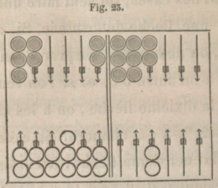
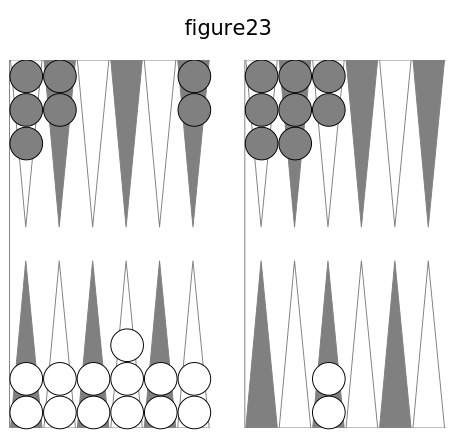

Supposons que, dans la fig. 23, les cases sont des demi-cases. Le coin ayant été pris, les dames des quatrième et huitième flèches , pour faire case à la neuvième, ne donnent que 5-1, 2 chances; les dames des troisième, quatrième et huitième flèches, donnent 6-5, 6 -1, 5-1, 6 chances. Pour faire case à la septième flèche, les dames des flèches première, deuxième, troisième, quatrième, donnent 6-5, 6-4, 6-3, 5-4, 5-3, 4-3, 12 chances; pour la sixième flèche, les cinq dames donnent 6-5, 6-4, 6-3, 6-2, 5-4, 5-3, 5-2,4-3,4-2, 3-2, 10 coups, 20 chances, car tous sont simples. Ainsi, le nombre des dames étant 2, 3, 4, 5, le nombre des chances est 2, 6, 12, 20; 20 est 5 fois 4, 12 est 4 fois 3, 6 est 3 fois 2; d'où la règle : _Le nombre de chances pour faire une case à une flèche déterminée est le nombre de demi - cases qui peuvent servir, multiplié par ce nombre moins 1_.

**280. Une case, avec des cases et des demi-cases.**

Si l'on a des cases et des demi-cases, pour faire une case déterminée il faut voir -s'il y a plus de cases que de demi-cases, ou le contraire. Dans le premier cas, on emploie la règle du n° 278, et on retranche autant d'unités qu'il y a de demi-cases. Trois cases et une demi-case donnent 4 fois 4, ou 16, moins 1 : c'est 15 chances. S'il y a plus de demi-cases que de cases, on prend la deuxième règle, et au résultat on ajoute autant d'unités qu'il y a de cases ; une case et trois demi-cases donnent 4 fois 4 moins 1 , on 12, plus 1:13 chances.

**281. Préférer trois demi-cases à deux cases.**

On peut remarquer que 3 demi - cases donnent plus de chances que 2 cases , 6 au lieu de 4; 4 demi-cases plus que 3 cases, 12 et 9; 6 demi-cases plus que 5 cases, 20, 30, au lieu de 16, 25. D'où la règle : _Un nombre de cases donne moins de chances que ce nombre de demi-cases augmenté de 1_.

**282. Augmentation de chances par une demi-case.**

Le nombre des cases étant 1, 2, 3, 4, 5, le nombre des chances est 1, 4, 9, 16, 25 ; si une demi-case est ajoutée, on a les nombres de chances 3, 8, 15, 24, 35, règle du n° 280. L'augmentation des nombres de chances est 2, 4, 6, 8, 10, le double du nombre de cases. _Une demi-case ajoutée à des cases augmente le nomhre de chances de deux fois le nombre des cases_. On peut dire aussi : _Une demi-case de plus augmente le nombre de chances de deux fois le nombre des demi-cases ou cases_. En effet, la nouvelle demi-case se combine avec chacune des anciennes demi-cases ou cases, et, chacun de ces coups étant simple, il donne 2 chances.

Deux demi-cases ajoutées à des cases donnent sept chances, 14, 23, 34; l'augmentation est 6, 10, 14, 18, ou le double de 3, 5, 7, 9.

### 15.2. Faire l'une ou l'autre de deux cases déterminées.

**283. L'une ou l'autre de deux cases non contiguës.**

Dans la fig. 23, pour faire une case à la flèche septième ou à la neuvième, il y a bien des chances : pour la septième il y a 25 chances, toutes, excepté celles des as; pour la neuvième, toutes, excepté les 3 et les 2. Donc il n'y a que 3-1, 2-1, à retrancher ; donc 32 chances feront case à la septième ou à la neuvième flèche.

**284. L'une ou l'autre de deux cases contiguës.**

Si, dans la fig. 23, on veut faire case à la flèche neuvième ou dixième, pour la neuvième il y a toutes les chances, excepté les 3 et les 2; pour la dixième, toutes, excepté les 4 et les 3. Ainsi les 11 chances du 3 sont contraires aux deux cases, celles du 2 à la neuvième, et celles du 4 à la dixième, ce qui fait A-2. Donc il y a 13 chances à retrancher, et 23 chances font case à la neuvième flèche ou à la dixième.

**285. Cases non contiguës, préférables.**

Au n° 283, on trouve 32 chances, et au n°284, 23 chances : ainsi on a plus de chances pour faire l'une ou l'autre de deux cases non contiguës.

### 15.3. Chances pour prendre son coin, chances pour le battre.

**286. Deux questions.**

L'adversaire a son coin ou il ne l'a pas : c'est une application du 15.1 ou du 15.2.

**287. Prendre son coin naturellement.**

Je suppose que, dans la fig. 23, vous avez votre coin: l'adversaire a, pour prendre le sien , 3 fois 3, 9 chances; s'il a une dame à la cinquième flèche, 4 fois 4 moins 1, ou 15 chances.

**288. Prendre son coin par puissance.**

Dans la fig. 23, l'adversaire, pouvant prendre son coin des deux manières, a d'abord les 5, les 4, les 3 ; on ajoute les 6. Il a contre lui les 2 et les as, 20 chances ; il en a 16 pour prendre son coin.

**289. Cases et demi-cases non contiguës.**

Je suppose que l'adversaire n'a, poui prendre son coin, que les cases des flèches sixième et huitième, c'est-à-dire les chances 5-5, 5-3, 3-3, puis 6-6, 6-4, 4-4, 8 chances. Avec les cases des flèches septième et huitième, il a 4-4, 4-3, 3-3, puis 5-5, 5-4, 4-4, 8 chances.

**290. Battre le coin.**

C'est comme si l'on voulait faire une case au coin de l'adversaire : ainsi c'est le 15.1. Je suppose que l'adversaire a son coin et des cases sur trois autres flèches : il a, pour battre le vôtre, 3 fois 3, 9 chances, le quart de 36.

### 15.4. Chances tour remplir, ayant cinq cases.

**291. Remplir ayant cinq cases.**

C'est encore le 15.1. Ainsi, dans la fig. 24, il y a vingt chances. Pour connaître combien on a de chances pour remplir, il faut _multiplier le nomhre des flèches qui ont des dames surnuméraires par ce nombre, diminué de 1, puis ajouter autant d'unités qu'il y a de doubles dames surnuméraires_. C'est surtout au jan de retour que l'on doit étendre ses dames sur bien des flèches.

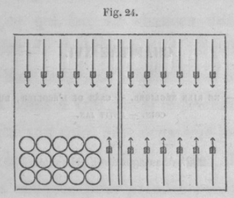
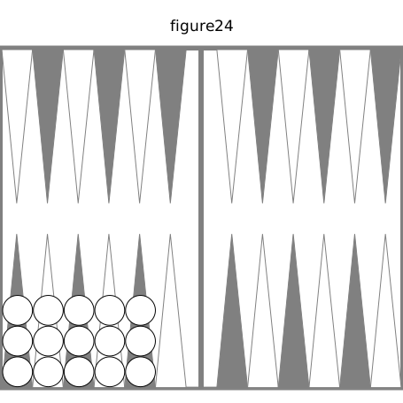

## XVI. Primauté. — ne rien négliger. — case de l'écolier, du diable. coin. — petit jan.

**292. Avantages de la primauté.**

Si les deux joueurs amènent 4-3, 5-2, celui qui a la primauté place ses deux dames à ses flèches sixième, huitième, pour avoir quatre chances de prendre son coin et quatre de battre les deux coins ; il ne peut y avoir qu'une dame battue par 6-6, 6-5, 3 chances. Si l'adversaire place ses dames de même sur les flèches sixième, huitième, il a une dame battue par la somme 7 et la somme 9, ce qui fait 10 chances; son autre dame est battue par les sommes 9 et 11 ; mais la somme 9 est déjà prise ; il ne faut ajouter que les deux chances de la somme 11, ce qui fait 12 chances différentes, au lieu de 3. En outre, il ne peut prendre son coin par puissance ou battre les deux coins à vrai que si le premier joueur n'a pas son coin. Si le deuxième joueur fait une case à sa septième flèche, il n'a que deux chances pour prendre son coin, et * deux chances pour battre les deux coins.

**293. Ne rien négliger.**

La manière de jouer les premiers coups est importante. Si pour premiers coups on a 6-5, 2-1 , il faut jouer tout d'une de la cinquième flèche à la huitième ; on a pour prendre le coin lt. chances , et 4 pour battre les deux coins. Si l'on fait la case, on a 2 chances pour prendre le coin et 2 pour battre les deux coins. Si l'on a 6-4, puis 1..1, en faisant la case on ne laisse rien à battre, et l'on a, pour prendre le coin, 6-6, 5-5, 2 chances, et pour battre les coins 6-5 ; si l'on joue aux flèches cinquième et septième, on a deux dames à battre , 6-4 pour prendre le coin , 6-5 pour battre les deux coins : la première manière vaut mieux. Il en est de même si l'on a 3-2, puis 4-3 ; on fait la case.

Supposons que l'adversaire ait onze dames au talon, deux à chacune de ses flèches huitième et onzième , et que l'on ait neuf dames au talon , trois à la deuxième flèche , une à la sixième et deux à la neuvième. On amène alors 6-1 ; on joue le 6 du talon, l'as de la deuxième flèche; on est battu à faux par 6-6, 6-3, à vrai par 5-4. Si l'on joue l'as du talon, on est battu à vrai par 6-5 , point à faux.

**294. Case de l'écolier.**

Si on doit presque toujours faire cette case la dernière, il y a pourtant des exceptions à ce conseil. L'adversaire , ayant la primauté, amène 2-1, 3-1, 5-1 ; on a 5-4, puis 6-5 : on doit faire la case de la dixième flèche. On a, pour battre une dame de l'adversaire, les coups dont la somme est 8, ou 10, ou 11 , ce qui fait 10 chances. En outre, 1-1 , 2-2, donnent le coin. On bat les deux coins par 2-1 : ainsi on a 14 chances favorables. Si l'on ne fait pas la case, on n'a que 6-6 pour battre, 6-6 et 6-5 pour prendre le coin, 3 chances différentes.

**295. Case du diable.**

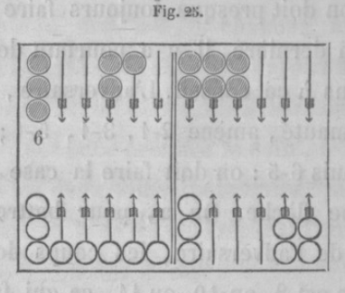
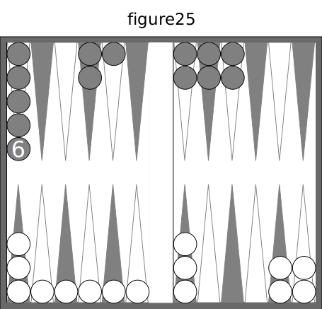

Cette case, étant très difficile à faire, doit être faite le plus tôt possible ; voici une exception à cette règle. Avec ces deux jeux on amène 5-4 : en faisant la case de la neuvième flèche , on ne peut être battu qu'à faux. Au contraire, la case du diable laisserait deux dames qui seraient battues à vrai par 6.5, 6-4, ce qu'il faut éviter, si l'adversaire a six ou huit points.

**296. Prise du coin.**

L'adversaire a deux cases aux flèches sixième, huitième ; on a deux cases aux flèches sixième, septième, deux demi-cases aux flèches troisième et cinquième. On amène 5-4 : il faut prendre son coin; on n'a contre soi que les coups 6-6, 5-5, 4-4, 6-5, qui donnent respectivement à l'adversaire : 6-6, un trou; 5-5, six points; 4-4, quatre points; 6-5, deux points.

L'adversaire a son coin et dix points ; on a deux demi-cases aux flèches quatrième et cinquième, et une case à la septième flèche. On amène 4-4: on ne doit pas prendre son coin, à cause des deux demi-cases et des dix points de l'adversaire ; il aurait 41 chances pour prendre le trou.

L'adversaire a huit points, avec son plein moins la case de la huitième flèche , et ses dames surnuméraires sont, deux à la quatrième flèche, une aux flèches troisième , cinquième, onzième ; on a son plein moins

le coin, avec trois dames surnuméraires au talon, une aux flèches quatrième et neuvième. On amène 4-2 : doit-on prendre son coin ? Si on le prend, l'adversaire a le trou par 6-6, 6-5, 6-4, 6-3, 6-1 , 5-5, 5-4, 5-3, 5-2, 5-1, 18 chances; si on ne le prend pas, l'adversaire prend le trou en battant le coin (cf. n° 280) par 5 fois 5, moins 1 , 24 chances ; 18 et 24 sont dans le rapport de 3 à 4 : donc il faut prendre le coin. Au lieu de donner le détail des coups qui battent la dame, on eût pu dire : 6 et 5 battent directement, cela fait 11 plus 9, 20 chances; mais il faut en retrancher 6-2, qui ne donne que 2 points.

L'adversaire a son coin , et les cases des flèches septième, huitième, neuvième ; on a les cases des flèches sixième, septième, huitième, neuvième, On amène 5-4 : doit-on prendre son coin ? En le prenant, l'adversaire a7 six points par 6-3, 6-2, 5-4, 6 chances; quatre par 6-6, 6-5, 6-4, 6-1, 5-5, 5-3, 5-2, 5-1, 4-4, 15 chances ; deux points par 4-3, 4-2. En ne le prenant pas, l'adversaire le bat par 9 chances; 3 chances donnent 6 points; en outre la dame de la cinquième flèche est battue par 6-5 , 6-4 , 6-3 , 6-1, 5-5, 5-4, 5-2 ; celle de la quatrième flèche par 6-6, 6-5, 6-4, 6-2. Cette manière de jouer donne à l'adversaire le trou par 5-5; 8 points par 6-5, 6-4, 5-4, 6 chances; 6 par 4-4, 3-3; 4 par 6-3, 6-2, 6-1, 5-3, 5-2. La première manière a 6 chances pour 6 points, 15 pour 4, en tout 21 chances, donnant 4 ou 6 points ; la deuxième a 1 chance pour le trou, 6 chances pour 8 points, 12 chances pour 4 points ou 6, 19 chances, donnant 4 points. Donc il faut prendre le coin. S'il ne fallait à l'adversaire que 4 points pour compléter un trou et le marqué ou la partie en 12 trous, on devrait jouer 5-4 tout d'une, pour ne laisser que 9 chances favorables au lieu de 19 ou 21.

**297. Petit jan.**

Il est fait moins une dame à la cinquième flèche; les quatre dames surnuméraires sont, deux au talon, une sur les flèches première et troisième. Pour remplir on a les nombres 5, 4, 2; la règle du n° 269 donne 18, plus les nombres 5, 4, 2, 1, 30 chances. On pouvait, dans ce cas, calculer cela autrement : 5, 4, 2, laissent 6, 3, 1, ou 6-6, 6-3, 6-1, 3-3, 6 chances à retrancher de 36. Si une dame du talon est portée à la deuxième flèche, cela donne les chances du 3; il ne manque plus que 6-6, 6-1, 33 chances.

**298. Petit jan dangereux.**

Il faut quelquefois éviter le petit jan, par exemple dans les cas suivants : si, ayant une case à faire, il y a une dame passée, car il n'y a que 12 chances pour remplir ; si, ayant une demi-case à faire, il y a trois dames passées, ce qui laisse tout au plus 15 chances; si, ayant à couvrir à la cinquième flèche, les dames surnuméraires sont aux flèches troisième et quatrième et deux à la septième, car on a 20 chances pour remplir, mais on pourra être forcé de rompre au coup suivant.

Autre cas : En commençant on a pris son coin par 2 fois 6-5. On a eu ensuite beaucoup de petits nombres, qui ont engagé h tenter un petit jan. On a eu le très grand malheur de réussir, et de porter une dame à sa neuvième flèche. Au coup suivant, on a eu G-3, qui n'a point donné le trou et a forcé de porter la dame de la neuvième flèche à la cinquième de l'adversaire, ce qui donne les deux jeux suivants. 

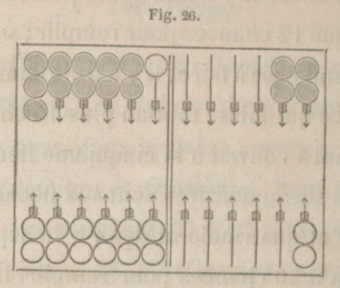
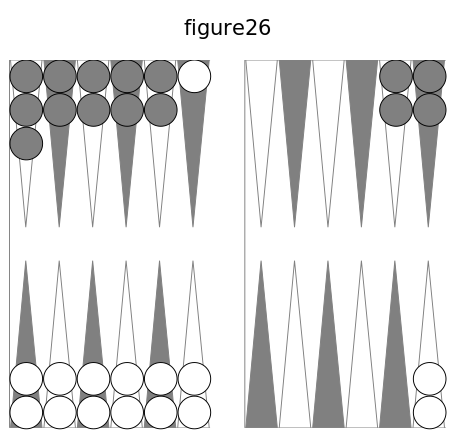

On amène 6-5 ; il faut rompre, et le mieux est de jouer aux flèches dixième et onzième. En effet, la dame passée est battue par 35 chances : 2-1, 3-1, 4.1, 1-1, 2-2, 8 chances, donnant 2 trous; beaucoup donnent 8 points. On est exposé à perdre le marqué en grande bredouille ou la partie en 1 2 trous. Pour tâcher d'éviter cette grande perte , qui est probable, il faut faire tous les sacrifices possibles pour couvrir la dame passée. Les deux dames du 6-5 donnent les sommes 7 et 8, 6 et 5 chances, 11 chances. Au coup suivant, si on n'a pas une de ces chances, on tâche de mettre une dame sur sa neuvième flèche, qui ajoute 4 chances, en tout 15 chances; ensuite sur la huitième flèche, qui donne 3 chances, ensemble 18 chances.

**299. Place d'une dame au retour.**

Si, par suite d'un petit jan ou de toute autre circonstance, on est forcé de passer une dame dans la première table de l'adversaire , faut-1l la laisser à la cinquième flèche, ou l'avancer près du talon ? Si l'on amène 4-2, faut-1l jouer le 4 de la cinquième flèche à la première ? 

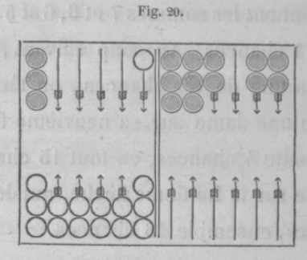
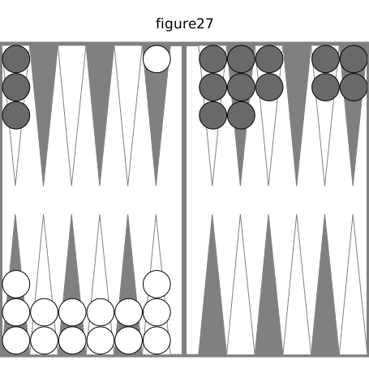

Non, on doit la laisser à la cinquième flèche, quoiqu'il y ait pour la battre 4 chances de plus qu'à la première, car ce faible désavantage estplus que compensé par l'augmentation d'embarras et de difficultés que la présence de cette dame à la cinquième flèche fait éprouver à l'adversaire pour l'arrangement de son jeu. En effet, pour faciliter le passage, il a entretenu dans sa première table le plus de vide possible, et il a passé dans sa deuxième le plus de dames possible , qui servent à battre le coin et les dames découvertes; ainsi, dans cette supposition, la dame placée à la cinquième flèche se trouve dans la position la plus avantageuse. On doit remarquer que, parmi les coups qui la battent, il en est un grand nombre qui sont plus préjudiciables qu'utiles à l'adversaire. S'il amène 5-5, il gagne 2 trous en battant le coin et la dame; mais, ne pouvant jouer le 5-5 qu'en doublant le coin, il est forcé de s'en aller. Il perdra ainsi tous les avantages que semblait lui promettre une si favorable position ; et on sera garanti de tous les dangers dont on était menacé. S'il amène 6-5, il sera forcé de jouer tout d'une, en surchargeant également le coin. Les coups 5-4, 5-3, 5-2, offrent les mêmes inconvénients, qui, quoique plus légers, préjudicient à l'arrangement du jeu de l'adversaire. S'il amène 4-1, 3-1, 3-2, 2-1 , ou il met à découvert des dames qui offrent un grand nombre de chances pour être battues; ou, pour éviter ce danger, et diminuer le nombre de chances qu'il redoute , il joue l'un de ces coups tout d'une, afin de n'exposer qu'une dame, et s'ôte les moyens de caser. Si au contraire on place sa dame à la première flèche , on n'a plus que 11 chances pour qu'elle soit battue; mais aussi l'adversaire ne craint pas d'être battu, et n'éprouve aucune contrariété dans l'arrangement de son jeu. Donc il y a un avantage incontestable à laisser le plus loin possible du talon la dame que l'on a été forcé de passer dans la première table de l'adversaire.

**300. Passer au retour volontairement.**

Lorsqu'on a un jeu si avancé 1 que l'on craint une ruine, si l'on amène un coup par lequel on puisse passer une dame au retour, on ne doit pas manquer de le faire, car on se réserve des moyens de jouer avec avantage les coups suivants. On s'expose à être battu, mais on peut battre aussi ; on gêne la conduite de l'autre jeu, etl'on évite une enfilade qui est à craindre. Par exemple, ayant levé le premier au retour , on a quatre points, on a fait le jan de trois coups, ce qui a mis à huit.

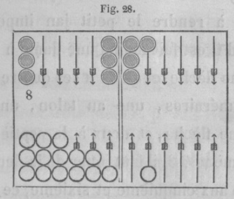
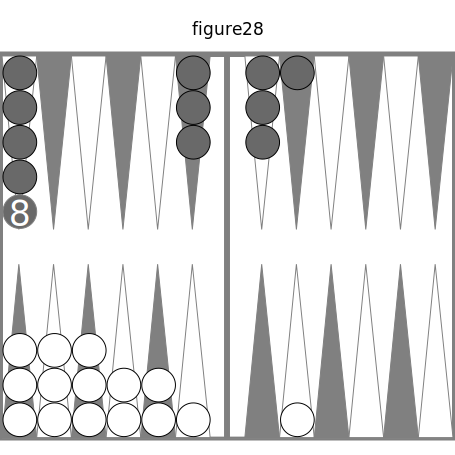

La suite des coups a donné ces deux jeux. On amène 6-6, il faut passer au retour. On a, pour remplir, 5, 4, 3, 30 chances; pour être battu, on a celles des 4, 14 chances, plus 6-6, 6-5, 17 chances, qui donnent quatre points ; 6-6 et 4-4 en donnent 6. En jouant aux flèches sixième et septième, on remplit par 13 chances ; l'adversaire a dix points par 6 6.

**301. Petit jan rendu impossible.**

Il y a des cas où il faut jouer de manière à rendre le petit jan impossible. Quand il est fait moins une dame à la cinquième flèche, et qu'on a ses quatre dames surnuméraires, une au talon, une à la sixième flèche, et deux à la septième, si l'on amène 4-3, il faut jouer de la deuxième flèche aux cinquième et sixième, ce qui ne laisse rien à battre. Ce serait une très grande faute de jouer le 4 du talon et le 3 de la sixième flèche.

**302. Mettre dedans.**

Il y a souvent un grand avantage à mettre dedans, et rarement le danger de perdre le trou. Si l'adversaire cherche aussi à faire son petit jan, ou si ses dames sont peu avancées dans la deuxième table, et qu'il ait peu de points, il ne faut pas manquer de mettre dedans.

**303. Question à résoudre.**

Après ce commencement du jeu, avant d'arriver aux trois pleins , je vais résoudre une question qui servira pour chacun d'eux ; c'est celle-ci : Calculer les nombres de chances qu'on a pour remplir ou battre de deux façons.

## XVII. Calculer les nombres de changes qu'on a pour remplir. de deux façons.

**304. Avec deux nombres.**

Soient les deux nombres 6 et 5 : ils ont pour chances communes 6-5, 5-1, 4 chances, qui remplissent et battent de deux façons. Avec 6 et 3, les chances communes sont 6-3, 3-3, 3 chances, au lieu de 4, parce que 6 est le double de 3. Ainsi : _Deux nombres ont 4 chances communes, 3 si l'un est double de l'autre_.

**305. Avec trois nombres.**

Les nombres 6, 5, 4, ont pour chances communes 6-5, 6-4, 5-4, 5-1 , 4-2, 4-1 , 12 chances. Les nombres 4, 2, 1, ont pour chances communes 4-2, 4-1, 2-1 , 2-2, 3-1, 1 -1, 10 chances , au lieu de 12, parce que 4 est le double de 2, et 2 est le double de 1. Les nombres 5, 3, 2, ont pour chances communes 5-3, 5-2, 3-2, 3-2 qui font 5, 2-3 qui font 5, 2-1 ; donc, des 12 on retranche 4, parce que 5 égale 3 plus 2. D'où la règle : _Trois nombres ont 12 chances communes ; mais il faut en retrancher 1 pour chaque nombre double d'un autre, et 4 si un nombre est la somme des deux autres. Avec 6, 4, 2, on a 7 chances_.

**306. Avec quatre nombres.**

Les nombres 6, 5, 4, 3, ont les chances communes 6-5, 6-4, 6.3, 5-4, 5-3, 4-3, 5-1, 4-2, 3-3, 4-1, 3-2, 3-1 , 12 coups : ce serait 24 chances, s'il n'y avait pas un nombre double de l'autre. Avec 5, 4, 2, 1, on a 4, double de 2; 2, double de 1 ; 5, somme de 4 et 1 : ainsi il faut de 24 retrancher 2 plus 4, il reste 18 chances. Prenons 4, 3, 2, 1 ; de 24 il faut retrancher 2 fois 1 et 2 fois 4 : il reste 14 chances communes, ce qu'on peut vérifier en comptant sur la table B. On a la règle : _Quatre nombres ont 24 chances communes, mais il faut en retrancher 1 pour chaque nombre double d'un autre, et 4 pour chaque nombre qui est la somme de deux autres_.

**307. Nombres directs et indirects.**

Calculez le nombre de chances communes aux nombres directs; ajoutez-y les chances que donnent les nombres indirects , en ne prenant point celles qu'on a déjà. Vous obtenez : pour 8, 3, 1, 6 chances; 7, 4, 1, 8 chances; 8, 5, 2, 1, 15 chances.

**308. Remplir de trois façons.**

Cela a lieu lorsque les deux nombres d'un coup et leur somme sont trois des nombres pour jouer (n° 84). Si trois dames sont placées de manière qu'un coup les porte sur la demi-case à couvrir ou à battre. on remplit ou l'on bat de trois façons. Pour le petit jan, ce sont les coups 2-1, 3-j, 4-1 1 3-2, 8 chances; mais si les quatre dames surnuméraires sont placées aux flèches première, deuxième, troisième, quatrième , ou au talon et aux flèches deuxième, troisième, quatrième, il y a dans ces deux cas deux coups qui remplissent de trois façons : d'abord 2-1 et 3-t , puis 2-1 et 3-2. Pour les autres pleins, le nombre de chances qui remplissent de trois façons est très considérable , comme le fait voir la table F.

**309. Avantages des tables de chances.**

J'en ai déjà parlé (n°277), mais la table F fait voir plusieurs choses nouvelles. La somme 12 des nombres pour jouer peut être décomposée en 5, 4, 3, qui donnent 3o chances pour remplir ou battre d'une façon, et 12 pour remplir de deux façons ; ou en 6, 4, 2, qui donnent 33 chances pour remplir ou battre d'une façon, et 7 pour remplir de deux façons. S'il suffit d'une façon, il faut prendre 6, 4, 2; sur un coup décisif, on a besoin de remplir ou de battre de deux façons , on doit choisir 5, 4, 3, si c'est possible. Les règles sont indispensables, et il faut les appliquer souvent et promptement ; quand on étudie , les tables font faire des remarques très utiles.

La table F est bien longue, parce qu'elle contient bien des choses. Ce sera la suite naturelle des nombres décomposés en 2, 3, 4 nombres donnant des chances, en nombres cherchés, pour remplir ou battre d'une façon, de deux façons, de trois façons, et la somme de toutes ces chances pour toutes les décompositions. Une vérification de la somme des trois espèces de chances est celle-ci : pour 10, 8, 6, 2, on a 3, 5, i6, 12, dont la somme est 36 ; pour 7, 6, 5, 3, on a 6, 16, i5, i3, dont la somme est 50.

## XVIII. Chances pour faire le petit jan, s'il y manque une demi-case , une case, deux demi-cases. — ayant deux cases a faire, faire deux demi-cases ; ayant une case a faire, défaire une case; ayant quatre cases et demie, faire deux demi-cases.

### 18.1. Chances pour remplir, s'il manque une demi case, une case.

**310. Une demi-case a faire.**

Selon qu'il y a î, 2, 3, 4 dames surnuméraires en arrière de la dame à couvrir, la règle d'un des n03 263 , 266 , 269 , 273, servira à trouver le nombre de chances qu'il y a pour remplir. Pour ce plein, le calcul est facile, car il n'y a ni nombres indirects, ni 6.

**311. Places des dames surnuméraires.**

Cette question est très importante pour les trois pleins et pour battre. On va donner ici la règle qui s'applique aux quatre cas.

Avec une même somme de nombres pour jouer, pour remplir ou battre d'une façon, les chances favorables décroissent selon que les dames surnuméraires sont placées dans les conditions suivantes : 1° lorsqu'un nombre est la somme de deux autres, 2° qu'un nombre est le double d'un autre, 3° que les nombres directs sont les plus grands et les nombres indirects les plus petits, 4° que les nombres indirects diffèrent de plus de 6 des nombres directs, 50 qu'il y a plus de dames, 6° qu'il y a plus de dames directes. — Les trois nombres 6, 4, 2,'donnent 33 chances , et les' quatre nombres 6,3,2, n'en donnent que 32, parce que 4, 2, sont plus grands que 3, 2, 1.

**312. Remplir de deux façons.**

Pour remplir ainsi, il faut suivre une règle contraire à celle que l'on vient de voir. En effet la somme 8 se décompose en 5,2, 1, ou 4? 3, 1, qui ont 27 ou 28 chances pour remplir d'une façon, et 1 1 ou 8 pour remplir de deux façons. Pour les deux autres pleins et pour battre, on aura plus de différence : 6, 4, 2, donnent pour remplir d'une façon 33 chances, et 7 pour remplir de deux façons; 5, 4, 3, donnent 3o chances pour remplir d'une façon, 12 pour remplir de deux façons. En général, quand on veut remplir d'une façon, il faut suivre la règle qui précède ; mais si l'on a besoin de remplir de deux façons, on doit prendre la règle suivante : _Pour remplir de deux façêns , il faut éviter d'avoir i° un nombre qui soit la somme de deux autres, 2° un nombre double d'un autre , 3° un nombre indirect qui diffère de plus de 6 des nomhres directs_.

**313. Une case à faire.**

Il faut employer la règle du n° 291. Le cas le plus favorable est celui où les cinq dames surnuméraires sont au talon et aux flèches première, deuxième , troisième, quatrième; on a alors 5 fois 5 moins i, ou 20 chances.

### 18.2. Chances pour remplir, s'il manque deux demi-cases.

**314. Demi-cases contiguës.**

Les demi-cases sont aux flèches quatrième et cinquième ; les cinq dames surnuméraires sont, deux au talon, une aux flèches première, deuxième, troisième. Pour trouver toutes les chances qui remplissent , suivons l'ordre déjà indiqué aux ' nos 54, 69, 100.

**315. Ordre naturel.**

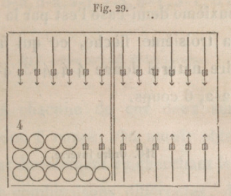
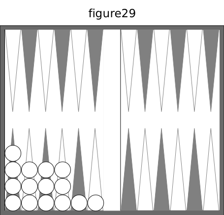

La surcase du talon couvre la première demi-case par le nombre 4; la surcase de la première flèche couvre la deuxième demi-case par un 4 ; elle est aussi couverte par un 3 et un 2, ce qui donne 4-4, 4-3, 4-2. La première demi-case est couverte par la surcase de la première flèche; la deuxième demi-case l'est par la surcase de la deuxième flèche ; elle l'est aussi par la surcase de la troisième flèche, ce qui fait 3-3, 3-2. La première demi-case est couverte par la surcase de la deuxième flèche, la deuxième demi-case l'est par la surcase de la troisième flèche, ce qui fait 2-2. - L'ordre naturel donne 4-4, 4-3, 4-2, 3-3, 3-2, 2-2, 6 coups.

**316. Ordre inverse.**

La surcase du talon couvre la deuxième demi-case j la première demi-case est couverte par la surcase de la première flèche et par celles des flèches 2e et 3e ce qui donne 5-3, 5-2, 5-1. La deuxième demi-case est couverte par la surcase de la première flèche, la première demi-case l'est par la surcase de la deuxième flèche et par celle de la troisième , ce qui fait 4-2, 4-1. La surcase de la deuxième flèche couvre la deuxième demi-case, celle de la troisième flèche couvre la première demi case, ce qui fait 3-1. L'ordre inverse donne 5-3, 5-2,5-1,4-2, 4-.1,3-1, 6 coups.

**317. Ordre naturel. Ordre inverse.**

Dans chacune de ces deux séries il y a donc 6 coups. On aurait obtenu ce résultat directement en cherchant le nombre de combinaisons différentes, deux à deux, fournies par les 4 surcases, nombre donné par le produit de 4 multiplié par 4 moins 1, ou 12, divisé par 2, ou 6.

Au grand jan et au jan de retour, 69, 100, on peut avoir les cinq dames surnuméraires sur les cinq flèches qui précèdent les deux demi-cases à couvrir. Ces cinq dames, combinées 2 à 2, donnent les coups 1er et 2e, 1er et 3e, 1er et 4e, 1er et 5e, 2e et 3e, 2e et 4e, 2e et 5e, 3e et 4e, 3e et 5e, 4e et 5e, dix coups, qu'on trouve aussi en multipliant 5 par 5 moins 1, et divisant le produit 20 par 2. Il en ressort cette règle : _Pour chaque série, le nombre des coups est égal au nombre des dames surnuméraires multiplié par ce nombre moins 1, le produit étant divisé par 2_. On ajoute ces deux séries,ce qui évile les deux divisions. La double surcase ajoute deux chances , 5-4, parce qu'elle n'est pas entre deux surcases contiguës. Les quatre surcases étant contiguës, les séries ont deux chances communes, 4-2 ; il faut les retrancher une fois.

**318. Différence des coups.**

L'ordre naturel donne 3 doublets, autant que de surcases moins 1 ; il faudra retrancher 3 si l'on donble le nombre des coups pour avoir celui des chances. L ordre inverse ne peut avoir de doublets.

**319. Règle pour remplir.**

_Le nombre des chances qui remplissent est le double du nombre des surcases multiplie par ce nombre moins 1, le produit étant diminue du nomhre de surcases continues moins i , et de 2 s'il y a quatre surcases contiguës, ajoutant 2 pour chaque double surcase qui n est pas entre deux surcases contiguës._

**320. Demi-cases non contiguës.**

Il faut combiner les surcases pour couvrir les deux demi-cases dans l'ordre naturel et dans l'ordre inverse. Il y a autant de doublets que de couples de flèches semblablement placées avant les deux demi-cases et ayant une ou deux surcases.

### 18.3. Ayant deux cases a faire, faut-1l faire une case ou deux demi-cases ?

**321. Solution.**

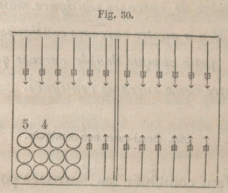
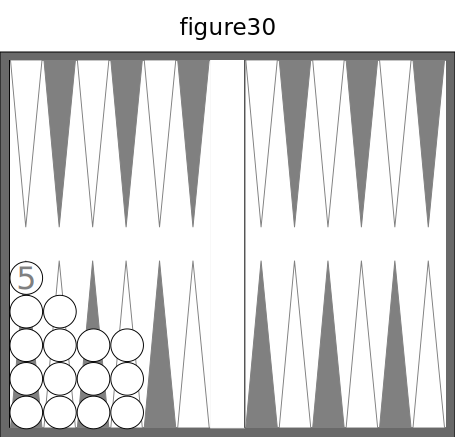

Il faut calculer le nombre.de chances pour remplir avec cinq cases (n°291), puis le nombre de chances pour remplir avec quatre cases et deux demi-cases (n° 319). Avec la fig. 30, on a 4-4 ; la fige 31 donne 4 fois 4 moins 1, plus 1, ou 13 chances; la fig. 29 donne 2 fois 4 multiplié par 4 moins 1, plus 2, moins 3, moins 2, ou 8 fois 3, plus 2, moins 5, 21 chances au lieu de i3.

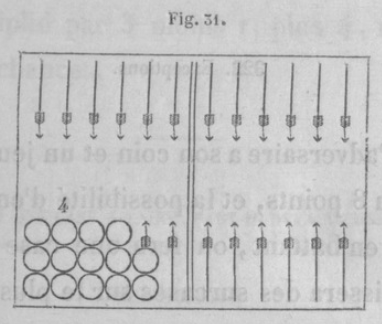
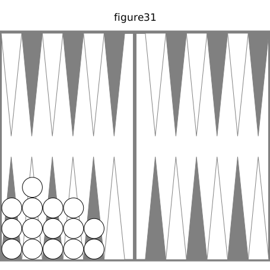

Si on a 3-3, la case donne 7 chances ; les deux demi-cases donnent 2 fois 3 multiplié par 3 moins 1, plus 2, moins 1, ou 13 chances, presque le double.

Avec 4-3, la case donne 13 chances; les deux demi-cases donnent 2 fois 3 multiplié par 3 moins 1, plus 4, moins f, ou 15 chances.

Donc _il faut faire les deux demi-cases de préférence à une case_.

**322. Exceptions.**

Si l'adversaire a son coin et un jeu avancé, ou 8 points, et la possibilité d'en prendre 4 en battant, on fera une case, celle qui laissera des surcases sur le plus grand nombre de flèches. On en ferait une , et ce serait la quatrième , si les dames étaient placées, trois au talon, quatre à chacune des flèches première, deuxième, troisième, et si l'on amenait 2-1, car cette case laisserait des surcases sur 4 flèches, et une double surcase, ce qui donne i3 chances; au lieu que les deux demi-cases ne laissent de surcases que sur 3 flèches, et il y a une double surcase qui ne sert pas, en sorte que l'on a 12 chances seulement. Si une dame de la première flèche est portée au talon, les deux demi-cases donnent 2 fois 3 multiplié par 3 moins 1, plus 4, moins 2, 14 chances.

### 18.4. Ayant une case a faire, faut-1l défaire une case ?

**323. Solution.**

Il faut encore prendre les règles des n˚291 et 319. Si l'on a 1-1, on joue de la deuxième flèche à la troisième, et de la quatrième à la cinquième ; le nombre des chances est 2 fois 4 multiplié par 4 moins 1, plus 2, moins 3, moins 2, ou 26 moins 5, 21 chances. Si l'on joue i-1 de la, deuxième flèche à la troisième, on a 4 fois 4 moins 1, plus 1, i3 chances, 8 de moins.

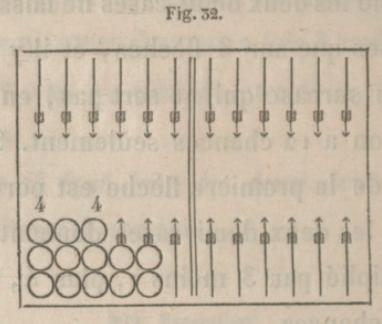
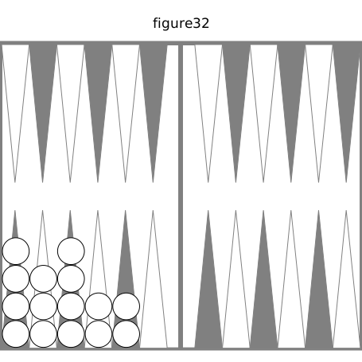

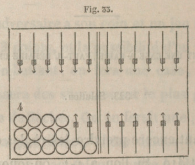
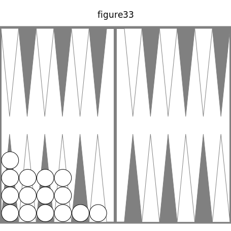

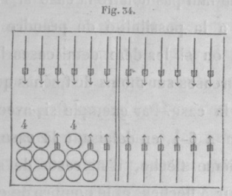
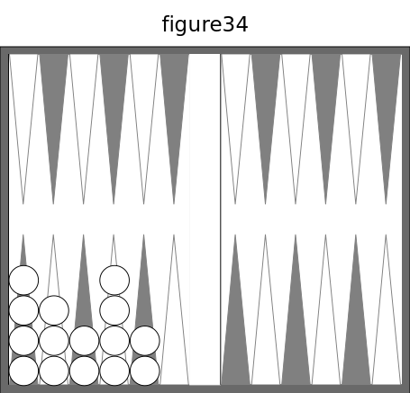

Si l'on a 3-1, les deux demi-cases laissent des surcases sur 4 flèches, et la double surcase n'ajoute rien; le nombre des chances est 2 fois 4 multiplié par 4 moins 1, moins 3, moins 2, ou 24 moins 5, 19 chances. Pour la case, le mieux est de jouer le 3 du talon et l'as de la deuxième flèche : on a encore 13 chances, 6 de moins. _Avec 5 cases il faut en défaire une_.

**324. Exceptions.**

Il ne faut pas défaire la case si l'adversaire a la possibilité de prendre 1 ou 2 trous, ou si les dèux demi-cases laissent des surcases sur moins de flèches que ne le ferait la case. Par exemple si, avec la fig. 32, on a 6-1, en défaisant la case de la quatrième flèche, il ne reste de surcase que sur 3 flèches, et le nombre de chances est 2 fois 3 multiplié par 3 moins 1, plus 2, moins 2, ou 12 chances; au lieu qu'en jouant l'as de la deuxième flèche, on a des surcases sur 4 flèches ; le nombre des chances est également 12,et l'on ne craint pas d'être battu.

**325. Une case, deux demi-cases.**

Avec le même nombre de flèches ayant des surcases, pourquoi une case a faire a-t-elle moins de chances que deux demi-cases ? En se reportant aux deux règles des nos 291 et 319, on voit que dans chacune il faut multiplier le nombre des surcases par ce nombre moins un ; mais dans la deuxième il faut en outre multiplier ce produit par 2. Il est vrai qu'il y a des chances à retrancher quand il y a des surcases contiguës, surtout s'il y a en 4 : car alors on retranche des chances pour les doublets et pour les chances communes, mais aussi le double produit devient plus considérable.

### 18.5. Ayant quatre cases et demie, faut-1l faire une case ou une demi-case?

**326. Solution.**

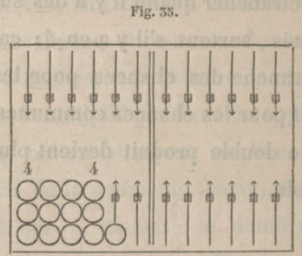

Avec ce jeu on amène 1-1 ; on le joue tout d'une de la troisième flèche, ou l'on couvre la demi-case. Les 2 demi-cases donnent 2 fois 4 multiplié par 4 moins i, plus 2, moins 3, moins 2, ou 26 moins 5, 21 chances. La case donne 4 fois 4 moins 1, plus 1, i3 chances : 8 de moins. Je n'ai pas mis ici les deux figures, car elles sont au n° 323. Avec 6-2, les deux demi-cases donnent 2 fois 4 multiplié par 4 moins 1, moins 3, moins 2 , ou 24 moins 5, 19 chances ; la case de la quatrième flèche laisse des surcases sur 3 flèches, et donne 3 fois 3 moins 1, plus 1, 7 chances au lieu de 19. _Avec quatre cases et demie il faut faire une autre demi-case, pourvu que cela laisse des surcases sur autant de flèches_. Les exceptions à cette règle sont les mêmes que celles des n˚322 et 324.

## XIX. Battre a vrai, battre a faux. — dame battue, ayant son plein moins une case. — deux dames battues, ayant son plein moins une case.

### 19.1. Battre a vrai, battre a faux.

**327. Battre à vrai.**

Pour calculer le nombre de chances qui battent à vrai, il faut employer les règles des numéros depuis 266 jusqu'à 276, et les règles du n° 263, selon qu'il y a 1, 2, 3, 4 nombres directs ou indirects.

**328. Le plus possible de chances.**

Pour battre c'est comme pour remplir : s'il suffit de battre d'une façon, on emploie la règle du n° 311 ; mais s'il est nécessaire de battre de deux façons, il faut prendre la règle du n˚312.

**329. Progression des chances.**

Si l'on veut trouver le nombre des chances qui battent à vrai une dame placée dans la deuxième table de l'adversaire qui a fait les cases qui suivent cette dame, il ne faut prendre que les chances directes. Ainsi 2 ne donnent que 11 chances : 6-2, 5-2, 4-2, 3-2, 2-2, 2 - 1 . Si le coin seul bat la dame placée à la dixième flèche, on a 11 chances. Si l'on a une case à la dixième flèche, on bat aussi par le 3 ; mais il n'ajoute que 9 chances, parce que 3-2 est déjà compté. Une autre case à la neuvième flèche bat par les 4 , qui n'ajoutent que 7 chances , car il ne faut plus compter 4-3, 4-2. A la huitième flèche une case bat du 5, qui ajoute 5 chances, vu qu'il y a déjà 5-4, 5-3, 5-2. A la septième flèche une case bat du .6, qui n'ajoute que les 3 chances 6-6, 6-1. Le nombre des chances qui battent est donc n, plus 9, plus 7, plus 5, plus 3, ou 35 chances; ces nombres vont en diminuant de 2. On a successivement 11, 20, 27, 32, 35.

**330. Battre à faux.**

Si la somme des deux nombres d'un coup qui bat à faux est plus grande que 6, ou un nombre indirect (n° 262), il faut employer la règle : _De 13 retranchez la somme des deux nombres, le reste sera le nombre de chances qui battent a faux_. Si la somme des. deux nombres est 7, il y a 6 chances. Si cette somme est moindre que 7, elle est un de ces nombres 2, 3, 4, 5, 6, qui se décomposent ainsi 1-1; 2-1 ; 3-1, 2-2; 4-1 , 3.2; 5-1, 4-2, 3-3, et ont les nombres de chances, 1, 2, 3, 4, 5. Il est évident que pour passer des premiers nombres aux derniers, il faut retrancher 1 ; d'où la règle : _Si la somme est plus petite que 7, il faut en retrancher 1, et on aura le nombre de chances qui battent à faux_.

**331. Battre à vrai, battre à faux.**

On a 8 points, l'adversaire en a 10. Avec les deux jeux de la fig. 37, ci-après, on amène 6-6. On bat à vrai de deux façons la dame de la sixième flèche, 8 points ; celle de la quatrième, 6 points; 8 et 6 font 14 ; celle de la deuxième, 6 points, 14 et 6, 20; la dame du talon, 6 points, 20 et 6, 26 points que l'on gagne, et qui, avec 8 qu'on avait, font 34, ou 2 fois 12 plus 10. A cause des 8 points qui n'étaient pas en bredouille , le premier trou est simple ;

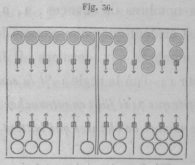

le deuxième est double, parce qu'on est rentré en bredouille (no 117) : on doit ainsi marquer 3 trous et 10 points. On joue ensuite de la deuxième flèche à la huitième. L'adversaire marque 2 trous pour ses dames des flèches première et cinquième qu'on a battues à faux, et efface les io points qu'on a marqués. En s'en allant, on n'eût pas marqué les 10 points, et l'on eût empêché l'adversaire de marquer ses 2 trous. On .est resté, parce qu'il ne manque plus qu'une dame au plein, et que l'adversaire a mauvais jeu. Cependant, si ces 2 trous faisaient perdre le pavillon en le donnant, on devrait s'en aller.

**332. Les pleins faits**

Si les deux pleins sont faits , une dame est battue à faux par les chances et les nombres de chances qui suivent : 6-6, 1 ; plus 6-5, 3 ; plus 6-4, 5-5, 6 ; plus 6-3, 5-4, 10 ; plus 6-2 , 5-3, 4-4, 1 5 ; plus 6-1, 5-2, 4-3, 2t; ou 1, 3, 6, 10, 15, 21.

**333. Flèche vide.**

Si l'adversaire a son plein, si l'on a le sien moins une case , on peut avoir une dame battue à vrai et une à faux ; à la cinquième flèche il y a 21 chances ; à la quatrième 15 ; ensuite 10, 6, 3, 1.

### 19.2. Dame battue, ayant son plein moins une case.

**334. Dame à la cinquième flèche.**

Si l 'on a sa dixième flèche vide, la dame de la cinquième flèche est battue à vrai par les 5, 6-5, 5-5, 5-4, 5-3, 5-2, 9 chances; et à faux par 12 chances, qui sont 6-6, 6-4, 6-3, 6-2, 6-1 , 4-4, 4-3. La flèche vide étant la neuvième, on a sa dame battue par les 4, 6-4, 5-4, 4.4 , 4-3, 7 chances : donc 14 chances battent à faux, ,6-6, 6-5, 6-3, 6-2, 6-19 5-5, 5-3, 5-2. La huitième flèche donne à vrai 6-3, 5-3, 4-3, 6 chances : donc 15 battent à faux. La septième donne à vrai 6-2 et 5-2; la sixième, 6-1. Donc : _La flèche vide se rapprochant de la dame, les chances à vrai diminuent, et celles à faux augmentent_.

**335. Dame a la quatrième flèche.**

On n'a plus sa dame battue que par i5 chances. La dixième flèche étant vide, la dame est battue à vrai par 6-6,6-5, 6-4, 6-3, 6-2, 9 chances ; elle est battue à faux par 6 chances , 5-5 , 5-4, 5-3, 4-4. Si la neuvième est vide, les 5 battent à vrai 6-5, 5-5, 5-4, 5-3, 7 chances; à faux 8 chances, 6-6, 6-4, 6-3, 6-2, 4-4. La huitième, vide, donne à vrai 6-4, 5-4, 4-4, 5 chances; 10 à faux. La septième donne à vrai 6-3, 5-3, 4 chances; la sixième, 6-2. Même conclusion.

**336. Dame à la troisième flèche.**

La dame n'est battue que par 10 chances. La flèche vide étant la dixième, la dame est battue à faux par -les 10 chances. Si la flèche vide est la neuvième, la dame est battue par 6-6, 6-5, 6-4,6-3,7 chances, et à faux par 5-5, 5-4, La huitième, vide, donne à vrai 6-5, 5-5,5-4, 5 chances; la septième, 6-4, 5-4. La sixième donne à vrai 6-3 ; à faux, 8 chances. Encore la même conclusion.

**337. Conseil. Application.**

_On doit tâcher d'éloigner du coin sa flèche vide et sa dame à battre, et de faire en torte que la flèche vide et la dame soient à plus de 6 flèches l'une de l'autre_. Je suppose la dixième flèche vide, les 4 dames surnuroéraires au talon ; on amène 2-2, 3-3, ou 4-4 : il faut porter à la dixième flèche la case de la huitième , de la septième ou de la sixième.

19.3. Deux dames battues, ayant son plein moins une case.

**338. Deux dames à battre.**

L'adversaire a son plein ; on a le sien moins une case , et deux demi-cases aux flèches quatrième et cinquième. Quelles sont les chances qui battent ces deux dames à vrai, à faux ? Elles ne peuvent l'être toutes deux que par les chances dont les nombres font plus de 7, par i5 chances : 6-6, 6-5, 6-4, 6-3, 6-2, 5-5, 5-4, 5-3, 4-4. Si la flèche vide est la dixième, 6-5 bat à vrai les deux dames, 4-4 les bat à faux; les 12 autres chançes battent l'une à vrai et l'autre à faux.

Si la flèche vide est la neuvième , elles sont battues à vrai par 5-4; à faux par 6-6, 6-3, 6-2 ; l'une à vrai et l'autre à faux par les 8 autres chances. La flèche vide étant la huitième, aucune chance ne peut battre à vrai les deux dames ensemble; elles sont battues à faux toutes deux par 6-6, 6-5, 6-2, 5-5, 6 chances. La septième, vide, donne , pour battre à faux, 6-6,6-5, 6-4, 5-5, 5-4, 4-4, 9 chances. La sixième, vide, donne, pour battre à faux, toutes les chances, excepté 6-2. On peut remarquer que les deux dames ne sont battues à vrai ensem-- ble que quand la flèche vide est la dixième ou la neuvième; le nombre de chances qui battent l'une à vrai va en diminuant.

**339. Conseil. Application.**

_Il faut éloigner du coin la flèche vide_. Je suppose la dixième flèche vide, et les trois dames surnuméraires au talon ; on amène 2-2, 3-3 ou 4-4 : on doit porter à la dixième flèche la case de la huitième, de la septième ou de la sixième.

**340. Autre exemple.**

Soient les deux demi-cases aux flèches troisième et quatrième. Elles ne peuvent être battues toutes les deux que par les chances dont les nombres sont au-dessus de 8, 10 chances : 6-6, 6-5, 6-4, 6-3, 5-5, 5-4. Si la flèche vide est la dixième, aucune chance ne bat les deux dames à vrai; 5-5, 5-4, les battent à faux; les 7 autres chances battent l'une à vrai, l'autre à faux. La neuvième étant vide, elles sont battues à vrai par 6-5; aucune chance ne bat à faux toutes les deux ; les 8 autres chances battent l'une à vrai et l'autre à faux. La huitième étant vide, 5-4 bat à vrai les deux dames; 6-6, 6-3 les battent à faux; les 5 autres chances battent l'une à vrai et l'autre à faux. Si la septième est vide, aucune chance ne bat à vrai les deux dames; 6-6, 6-5, 5-5, battent à faux; 6-4, 6-3, 5-4, battent ] une à vrai, l'autre à faux. La sixième flèche vide, les deux dames sont battues à faux par toutes les chances, excepté 6-3. On comprend facilement pourquoi aucune chance ne bat a vrai les deux dames lorsque la flèche vide est la dixième, et l'on voit que cela a lieu quand la flèche vide est la neuvième ou la huitième par 6-5, puis par 5-4.

## XX. Chances pour faire le grand jan, s'il y manque une demi-case, une case, deux demi-cases. — ayant cinq cases , défaire une case. — ayant deux cases a faire, faire deux demi-cases. — coups remarquables.

### 20.1. Chances pour remplir s'il manque une demi-case , une case.

**341. Une demi-case à faire.**

Selon qu'il y a 1,2, 3, 4 dames surnuméraires qui peuvent remplir, on emploie une des règles du n° 263, ou des nos 266 à 270, pour calculer combien il y a de chances qui remplissent.

**342. Choix pour jouer.**

L'adversaire a son plein moins une case et une demi-case. On a son plein moins une dame à la dixième flèche; les dames surnuméraires sont, i au talon, 3 à la cinquième flèche. On amène 3-1 ; on joue de la cinquième flèche aux flèches sixième et huitième, ce qui donne, pour remplir, les nombres io, 5, 4, 2, ou 3o chances. Si l'on joup du talon à la quatrième flèche, on a, pour remplir, 6, 5, 27 chances, 3 de moins. Ce n'est pas une exception à la règle du n° 3u; 4 est le double de 2, et n'est pas aussi petit que 2 et i ; d'ailleurs, la règle du n° 269 donne 18 plus 5 plus 4 plus 2 plus 1, ou 3o, et la règle du n° 266 donne 16 plus 6 plus 5, ou 27.

L'adversaire a son plein moins la case de la huitième flèche. On a le sien moins une dame à la dixième flèche; les dames surnuméraires sont, 1 aux flèches première et onzième, 2 à la sixième. On amène 2-1, on le joue de la première flèche à la quatrième; on a, pour remplir, 6, 4, 26 chances. Toute autre manière en donne moins.

**343. Case du diable.**

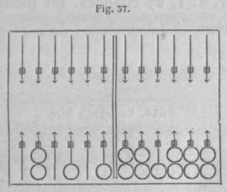
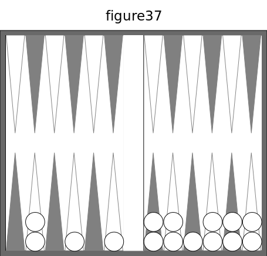

Avec ce jeu, on amène I-t ; on joue de la première flèche à la deuxième et de la septième à la huitième. On a, pour remplir, 6, 5, 4, 2, 36 chances. Si l'on n'eût pas achevé le plein par la case du diable, on eût eu moins de chances.

On a son grand jan moins une dame à la septième flèche ; les dames surnuméraires sont, 1 au talon, 2 à la cinquième flèche et 1 à la sixième. On amène 3-3 ; on joue du talon à la troisième flèche, et de la cinquième à la huitième ; on a, pour remplir, 4, 2, t, 27 chances. En jouant de la cinquième à la onzième, on a 7, 2, 1, 22 chances.

**344. Une case à faire.**

Il faut employer la règle du n° 291. Le cas le plus favorable est celui où les cinq dames surnuméraires sont sur 5 des 6 flèches qui précèdent. la flèche à couvrir; alors on a 20 chances.

### 20.2. Chances pour remplir, s'il manque deux demi-cases.

**345. Demi-cases contiguës.**

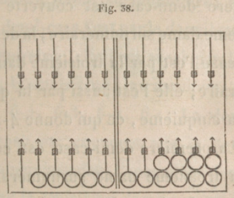
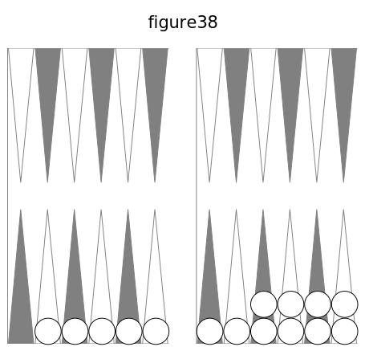

Les demi-cases sont aux flèches sixième et septième ; le contraire est très rare. On place les cinq dames surnuméraires sur les cinq flèches précédentes. Pour n'oublier aucune chance qui remplisse, suivons la marche adoptée aux nos 69, et de 315 à 319.

**346. Ordre naturel.**

La première demi-case est couverte par la première dame surnuméraire; la deuxième demi-case l'est par la deuxième dame surnuméraire; elle l'est aussi par la troisième, la quatrième, la cinquième, ce qui donne les coups 5-5, 5-4, 5-3, 5-2. La première demi-case est couverte par la deuxième dame surnuméraire ; la deuxième demi-case l'est par la troisième dame surnuméraire; elle l'est aussi par la quatrième, la cinquième, ce qui donne 4-4, 4-3, 4-2. La première demi-case est couverte par la troisième dame surnuméraire; la deuxième demi-case Test par la quatrième dame surnuméraire et par la cinquième, ce qui fait 3-3, 3-2. La première demi-case est couverte par la quatrième dame surnuméraire, la deuxième demi-case l'est par la cinquième dame surnuméraire, ce qui fait 2-2. L'ordre naturel donne 5-5 , 5-4, 5-3, 5-2, 4-2, 3-3, 3-2, 2-2 , 10 coups.

**347. Ordre inverse.**

La deuxième demi-case est couverte par la première dame surnuméraire; la première demi-case l'est par la deuxièrne dame surnuméraire ; elle l'est aussi par la troisième, la quatrième, la cinquième, ce qui donne 6-4, 6-3, 6-2, 6-1. La deuxième demi-case est couverte par la deuxième dame surnuméraire ; la première demi-case l'est par la troisième dame surnuméraire ; elle 1 est aussi par la quatrième et la cinquième, ce qui donne 5-3, 5-2, 5-1. La deuxième demi-case est couverte car la troisième dame surnuméraire ; la première demi-case Test par la quatrième dame surnuméraire et par la cinquième, ce qui fait 4-2, 4-1. La deuxième demi-case est couverte par la quatrième dame surnuméraire; la première demi-case Test par la cinquième, ce qui fait 3-1. L'ordre inverse donne 6-4, 6-3, 6-2, 6-1, 5-3, 5-2, 5-1, 4-2, 4-1, 3-1, 10 coups.

**348. Ordre naturel, ordre inverse.**

Dans chacune de ces deux séries il y a 10 coups obtenus en combinant les 5 dames surnuméraires 2 à 2; ce nombre 10 vient de 5 multiplié par 5 moins i, le produit 20 étant divisé par 2. On doit ajouter ces deux séries, ce qui évite les deux divisions, et on a la règle : _Le nombre des coups est égal au nombre des dames surnuméraires multiplié par ce nombre moins 1_. Les 5 dames surnuméraires étant contiguës, il y a 5-3, 5-2, 4-2, 6 chances communes aux deux séries; il faut les retrancher une fois.

**349. Différence des coups.**

L'ordre naturel donne 4 doublets, autant que de dames surnuméraires moins i ; il faudra retrancher 4, si l'on double le nombre des coups pour avoir celui des chances- L'ordre inverse ne peut avoir de doublets. Avec la fig. 38, on a 2 fois 5 multiplié par 5 moins 1, moins 4, moins 6, ou 4o moins 10, 30 chances.

**350. Règle pour remplir.**

_Le nombre de chances qui remplissent est le double du nombre des dames surnuméraires multiplié par ce nombre moins 1, le produit étant diminué du nombre des dames surnuméraires contiguës moins 1, et de 6 quand les 5 dames surnuméraires sont contiguës._

**351. Diminution de chances.**

Si la flèche vide n'est pas au talon, le nombre des chances diminue; dans l'ordre inverse, la dame du talon ne donne aucune chance. Le nombre des chances à retrancher pour les dames surnuméraires contiguës et pour les chances communes aux deux séries diminue aussi. Il faut modifier la règle suivant les cas. S'il y a une double dame surnuméraire non comprise entre deux dames surnuméraires contiguës, elle ajoute deux chances.

**352. Demi-cases non contiguës.**

Il faut combiner les dames surnuméraires pour couvrir les deux demi-cases dans l'or -dre naturel et dans l'ordre inverse. Il y a autant de doublets que de couples de flèches semblablement placées avant les deux demi-cases et ayant i ou 2 dames surnuméraires.

**353. Défaire une case.**

Avec les deux jeux de la fig. 39 ci-après, n'ayant des points d'aucun côté, on a 1-1 ; il faut jouer de la quatrième flèche à la cinquième et de la sixième à la septième ; on a pour remplir (n° 349) 30 chances. Quel est le danger? On a contre soi les 6 et les 5; notons les points que gagne l'adversaire pour chaque coup. Pour 6-6,6-5, 6-4, 6-3,6-2,6-1, 5-5, 5 -4, 5-3, 5-2, 5-1, les points sont respectivement 4, 10, 10, 10, 10, 8, 14, 8, 8, 8, 4. 

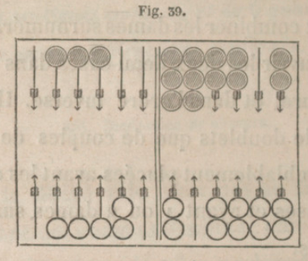
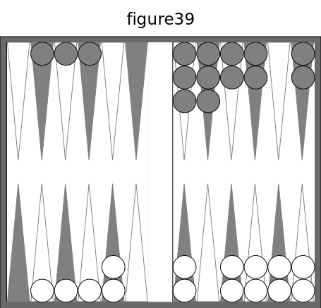

On voit que, sur 36 chances, t seule prenant le trou, il y en a 35 contre 1 qu'il ne le prendra pas. Il y a 8 chances pour prendre 10 points, 8 pour en prendre 8 ; ce qui fait 16 sur 36, 4 sur 9. Les 8 ou 10 points ne lui serviront pas, si l'on remplit, et il y a 30 à parier contre 6, 5 contre 1 que l'on remplira. Si l'on ne remplit pas, on couvrira la dame de la septième flèche.

Si l'on joue de la quatrième flèche à la sixième, pour avoir le plus possible de chances, 20 chances, on a contre soi 5-5, donnant 6 points; 6-5, 5-4, 5-3, 4 points. Les 20 chances pour remplir permettent de parier 20 contre 16, 5 contre 4, que l'on remplira, au lieu que la première manière donnait 5 contre 1, 4 fois autant d'avantage. Les chances pour battre à faux les dames de l'adversaire sont les mêmes dans les deux manières de jouer. L'avantage de remplir le premier étant très grand, il faut _défaire la case_ dans les suppositions faites. Si l'adversaire a 4 points, une case à la dixième flèche, et des dames à ses flèches quatrième et cinquième, ou seulement les 4 points ou la case, il faut _ne pas défaire la case_.

**354. Ayant deux cases à faire, faire deux demi-cases.**

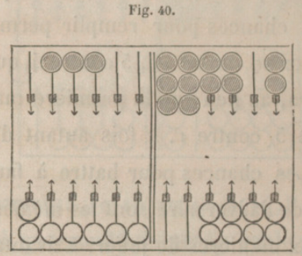
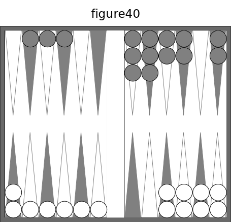

Avec ces deux jeux, aucun joueur n'ayant de points, on amène 6-6. Si l'on fait les deux demi cases, on a, pour remplir, 6-5, 6-4, 6-3,6-2,4-4, 4-3, 4_2, 3-3, 3-2, 2-2, 5-3, 5-2, 5-1, 4-2, 4-1, 3-1, 27 chances contre 9, 3 contre 1. En faisant la case, on a, pour remplir, 20 chances contre 16, 5 contre 4. Pour comparer les chances pour et contre dans les deux manières de jouer, multipliez 3 et i par 4, et vous aurez 12 et 4 à comparer avec 5 et 4. Ainsi, avec le même nombre de chances contraires, le nombre des chances favorables est 12 dans la première manière, et 5 dans la deuxième, pas la moitié.

Si l'on fait la case, l'adversaire gagne 6 points par 5-5: 4 par 6-5, 5-4, 5-3, 5-2 : 9 chances. Si l'on fait les deux demi-cases, l'adversaire gagne 14 points par 5-5; 10 par 6-6 , 6-4 , 6-3 , 6-2 ; 8 par 6-1, 5-4, 5-3, 5-2; 6 par 6-5,4 par 5-1 : 16 chances, qui donnent 8 points au moins. Excepté la chance unique 5-5, ces points sont nuls , si l'on remplit; si l'on ne remplit pas, on couvre la dame de la septième flèche. L'avantage de remplir le premier est si grand qu'_il faut faire les deux demi-cases_. Si l'adversaire a 4 points, on fait la case.

**355. Règle générale pour un coup important.**

Lorsqu'il se présente ainsi deux manières de jouer un coup important, il faut se hâter d'examiner les jeux, et de calculer promptement les chances pour et contre dans les deux manières, afin de bien choisir. _On ne doit pas craindre de courir un petit danger quand il est très probable qu'on aura un grand avantage_.

**356. Revirades.**

L'adversaire a des cases à ses flèches première, quatrième et dixième ; on a une dame à sa cinquième flèche et à la septième, deux à la sixième. On amène 5-1 ; on abat le 5 et on joue Pas de la sixième flèche à la septième ; on n'est battu que par la somme 7,6 chances. Si l'on eût joué l'as du talon, la dame de la septième flèche eût eu 16 chances pour être battue.

L'adversaire a son plein ; on a le sien moins la case du coin ; on a une dame surnuméraire à sa sixième flèche et les autres dans sa première table- Si l'on amène 5-5 ou 5-4, 5-3, 5-2, 5-1, on fait la revirade en prenant le coin ; il était battu par 25 chances, dont 5 donnaient 6 points.

L'adversaire a son plein et ses dames surnuméraires aux flèches première, quatrième et sixième ; on a le sien moins la case de la dixième flèche; les cinq dames surnuméraires sont au talon et aux flèches troisième, quatrième, cinquième, sixième. On amène 4-4; on fait la revirade qui, donne pour remplir 6, 3, 2, 1, ou 32 chances ; l'adversaire peut prendre 10 points par 6 6, 8 par 6-3, 6-2, 6-1 ; 4 par 6-5, 6-4. En jouant tout d'une du talon à la huitième flèche, on a 12 chances pour remplir; pour battre, l'adversaire a les 6 et les 5, moins 6-1 et 5-1, 16 chances. On doit revirer à cause des 32 chances, au lieu de 12, pour remplir, et d'après le n. 355.

L'adversaire a son plein moins la case de la huitième flèche, et ses dames surnuméraires sont : deux à la quatrième flèche, une aux flèches troisième , cinquième , onzième, et il a 8 points. On a son plein moins la case du coin ; les dames surnuméraires sont : trois au talon, une aux flèches quatrième et neuvième. On amène 4-2. Si l'on fait la revirade, l'adversaire gagne 8 points par 4 chances, 6 par 4, 4 par en tout 18 chances, donnant 4 points. Si l'on ne prend pas le coin , il est battu par 24 chances, qui donnent 4 points; 4 en donnent 6. En prenant le coin , on n'a que la moitié des chances contre soi, et en ne le prenant pas, on en a les deux tiers; d'ailleurs le coin peut être battu plusieurs fois. On a 17 chances pour remplir. Donc _il faut revirer_.

Avec le jeu de la fig. 41, on amène 3-3 ;

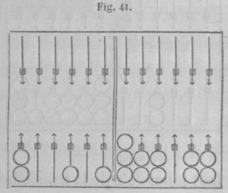
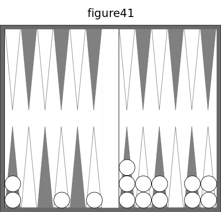

on revire, et pour remplir on a 6, 3, 1, 29 chances, et l'on n'est battu que par les 6 directs, par des chances directes (n° 262). En jouant tout d'une de la troisième flèche, on a pour remplir 4, 3, 23 chances, 6 de moins; on est battu par toutes les chances, excepté 2-2, 2-1, 1-1, 4 chances, 32 chances au lieu de 11.

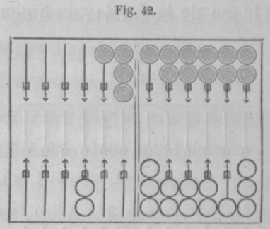
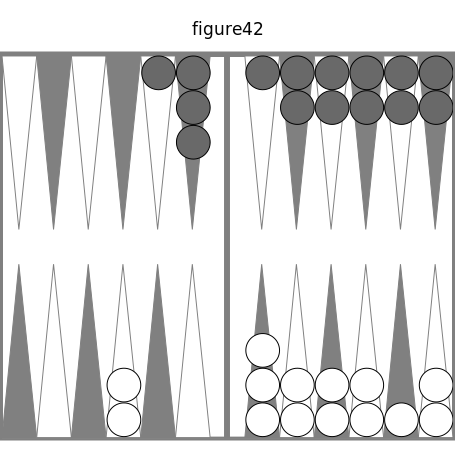

Avec les deux jeux de la fig. 42 on amène 3-2 ; il faut jouer le 2 de la troisième flèche et revirer de la septième à la dixième; on a pour remplir 4, 2, 1, 27 chances; l'adversaire n'a plus pour battre que 20 chances au lieu de 35; les 13 autres manières de jouer ne donnent que 24 ou 25 chances.

**357. Mettre dedans.**

Il faut mettre dedans, à moins que l'adversaire n'ait bien des chances pour prendre le trou. Soit le jeu de la fig. 41 : on n'a pour remplir que 6 chances. Si l'on amène 5-4, on met dedansen jouant tout d'une du talon,ce qui donne, pour remplir, 9, 6,4,3, 32 chances. En jouant de la troisième flèche à la huitième et de la cinquième à la neuvième, on a pour remplir 9, 3 et 1 , 22 chances, 10 de moins.

Avec les deux jeux de la fig. 43 ci-après, on amène 5-5 ; on joue tout d'une du talon ; on a pour remplir 8,7,6,2,29 chances. L'adversaire gagne 10 points par 6-6; 8 par 6-5, 6-4, 6-2,2-2; 4 par les autres chances; 6-3, 5-3, 3-1, 2-1, donnent 2 points; 1-1 bat à faux. Ainsi une chance donne 10 points; 7 chances, 8 ponts ; 19 chances, 4 points. 

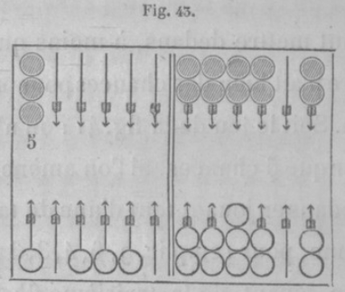
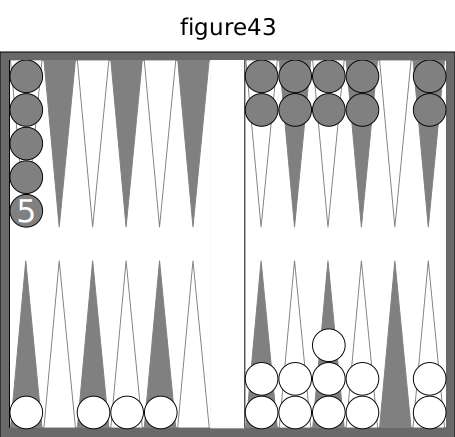

Si l'adversaire a 8 points, il ne faut pas mettre dedans. S'il a quatre points, il faut mettre dedans; en effet, des autres manières de jouer, prenons la meilleure : on joue un 5 du talon et l'autre 5 de la deuxième flèche; on a 4 dames pour remplir, 12 chances au lieu de 29. Pour battre, 6-5 donne 8 points; 6-6, 5-5, en donnent 6; 6-1, 5-1, ne comptent pas; les 12 autres chances donnent- 4 points. Ainsi, en mettant dedans, on a 59 chances pour remplir contre 7, c'est plus de 4 fois ; au contraire 12 est la moitié de 24, c'est une bien grande différence. Puisqu'on n'a contre soi que 7 chances, nombre inférieur au quart de 36, on ne doit pas hésiter à jouer de la première manière (n° 355). Donc : _L'adversaire ayant 4 points, on doit mettre dedans_.

On a son plein moins la case de la dixième flèche; les dames surnuméraires sont: deux à la quatrième flèche, une aux flèches sixième, septième, huitième. On amène 3-3 : il faut jouer tout d'une ; pour remplir on a 6, 4, 3, 2, 35 chances. Que peut prendre l'adversaire, s'il a son plein moins la case de la dixième flèche? Il ne faut s'occuper que des coups principaux qui battent, des doublets et des coups qui battent de trois façons; 6-6 donne i o points; 6-5, 6-4, 6-2, 2-2, 7-chances, donnent 8 points; 4-2 en donnent 6; 5-5, 4-4, 3-3,4.

Ainsi 8 chances donnent8 points ou i o; i3en donnent 4 ou davantage ; mais 1 3 n'a qu'une chance de plus que le tiers de 36. A cause des 35 chances, _il faut mettre dedans_, (n° 355).

**358. Avec six trous, mettre dedans.**

On est près de terminer son plein ; on a 6 trous, et par conséquent le marqué; l'adversaire a 2 ou 3 trous : on ne doit pas hésiter à mettre dedans, aussitôt qu'on en trouve l'occasion favorable. Il ne faut pas se laisser intimider par le danger même apparent de perdre i ou 2 trous. En négligeant l'occasion qui se présente, en retardant sa marche, on s'expose à compromettre un marqué presque assuré, mais qui cesse de l'être si l'on se laisse précéder par l'adversaire. La perte de 2 trous est insignifiante lorsqu'elle tend à assurer le marqué.

### 20.3. Coups remarquables.

**359. Passer une dame.**

L'adversaire a son plein, ses dames surnuméraires aux flèches huitième, neuvième, dixième, avec 4 points. On a son plein moins une dame à sa sixième flèche, deux dames au talon, une aux flèches première et deuxième. On amène 2-1 : on joue le 2 de la sixième flèche, l'as de la première. L'adversaire ne peut passer au retour, et ne peut conserver que par 6-6, 6-3, 6-2, 6-1 , 3-2, 3-1, 2-2, 2-1, 1-1, 15 chances, donnant tout au plus 6 points. Il ne peut s'en aller , et subira l'enfilade. Si l'on joue du talon, l'adversairé a t5 chances pour conserver, et 11 pour battre à vrai.

L'adversaire a son plein, deux dames surnuméraires au coin, une à la dixième flèche, avec 11 trous et 8 points. On a son plein moins une daine à sa neuvième flèche, avec deux dames surnuméraires à la quatrième, une à la première, une à la troisième. On amène 2-2 : on joue de la première flèche à la troisième, et de la neuvième au coin. L'adversaire ne peut conserver que par 6-6, 6-1, 4-4, 4-3, 6 chances, et n'a rien à battre.

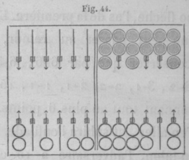
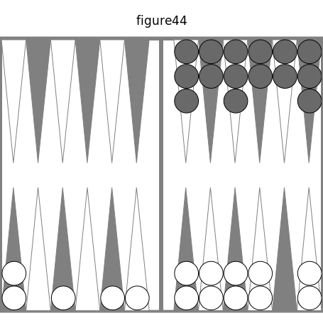

Avec ces deux jeux, l'adversaire ayant 4 points, on amène 6-2 : on joue de la deuxième à la quatrième, et de la cinquième à la onzième, pour ne rien laisser à battre. En ne passant point la daine, on eût été battu à vrai par 6-5, 5-5, 5-4, 5-3, 5-2, 9 chances. L'adversaire ne peut prendre le trou qu'en conservant deux fois. On verra , au n- 379, que le nombre des chances qui conservent est les trois quarts du nombre des chances qui rompent: donc il est probable qu'il rompra.

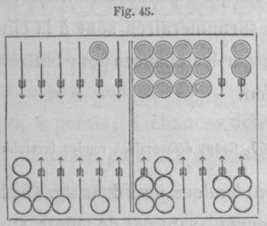
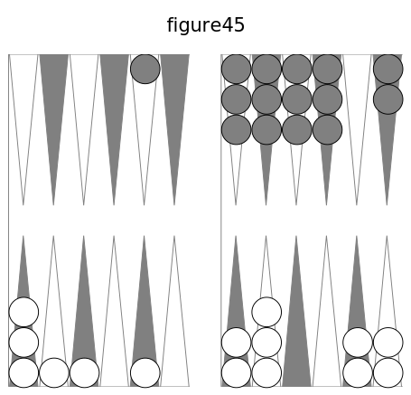

On a ces deux jeux ; l'adversaire a 11 trous et 8 points ; il a, pour remplir et gagner la partie, 20 chances, et 16 contraires, dont chacune le mettrait en danger de perdre la partie. On a aussi 8 points, et l'on amène 6-1 : il faut jouer le 6 de la quatrième flèche à la dixième, l'as de la première à la deuxième ; on ne peut être battu. Si l'on fait la case de la huitième flèche, la dame de la quatrième est battue à vrai par 6-5, 5-5, 5-3, 5 chances, le quart de 20, que l'on donne. On fait la case de la huitième flèche, si deux dames surnuméraires sont à la cinquième flèche, car les chances pour battre n'ajoutent rien.

**360. Coups défavorables rendus favorables.**

Soient les deux jeux de la fig. 46 ci-après, les joueurs n'ayant pas de points. On amène 5-2. On remarque aisément que pour remplir l'adversaire a les nombres 6 et 8; il faut donc se les rendre favorables. Pour cela, on joue tout à bas aux flèches deuxième et cinquième. Les coups 6-6, 6-5, 6-4, 6-3, 6-2, 6-1, 5-5, 5-4, 4-4, 4-3, 17 chances, battent à faux 3 dames, 2 ou 1, et donnent respectivement 18, 8, 12, 8, 4, 4; 12, 4, 6, 4 points; 4 chances donnent le trou, 4 autres 8 points, L'adversaire a 8 points par 6-5 et 6-2.

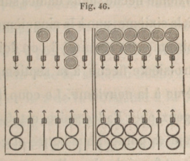
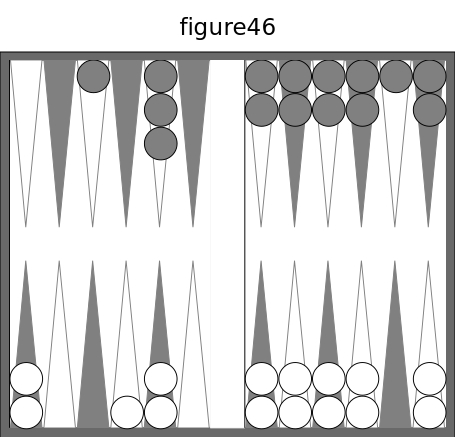

**361. Perdre quatre trous au lieu de deux.**

L'adversaire a son plein, deux dames surnuméraires à la cinquième flèche, une à la neuvième, avec i 0 points : donc il y a pour lui certitude du trou et nécessité de s'en aller. On a son grand jan moins la case de la dixième flèche, deux dames surnuméraires à la sixième, une à la cinquième, deux a la troisième. On amène 4.3 : on doit jouer de la troisième flèche à la septième et de la sixième à la neuvième. Le coup le plus avantageux pour l'adversaire est 5-5, qui lui donne 12 points pour battre et conserver; il est forcé de s'en aller avec 2 trous. Si l'on joue tout d'une de la troisième flèche à la dixième, l'adversaire a 5-5, 5-3, 5-2, 4-4, 3-3 , 2-2 , 8 chances, presque le quart, pour prendre 4 trous : c'est donc une faute grave.

**362. Trou d'un seul coup.**

L'adversaire a son plein ; ses dames surnuméraires sont au talon et aux flèches première et deuxième ; il a 4 points. On a son plein moins une dame à la septième flèche ; on a deux dames surnuméraires à la sixième, une à la troisième, une au talon ; on n'a pas de points. On amène 3-2 : on joue le 3 de la sixième flèche à la neuvième, et le 2 de la troisième à la cinquième, parce que, si l'on amène 1-1, on remplit de deux façons, on prend 2 trous et l'on s'en va. On peut aussi être battu à faux pas 21 chances, ce qui donne 4 points, et si ensuite l'on a 2-1, on remplit de deux façons et l'on gagne les 2 trous.

**363. Faire rompre.**

Les deux pleins sont faits ; on a deux dames surnuméraires à la septième flèche, une à la neuvième, avec 4 points. L'adversaire a quatre dames à sa sixième flèche et trois à sa septième, avec 5 trous et 8 points. Il est sûr du marqué, si le jeu reste ainsi. On amène 5-4: il faut jouer les deux dames de la sixième flèche, ce qui force l'adversaire à rompre s'il amène 6-6, 6-3, 6 -2, 6-1, 7 chances.

L'adversaire a son plein ; ses dames surnuméraires sont, une à la sixième flèche, deux à la septième. On a rompu par un 5; on amène 4-4 ; on doit jouer des flèches sixième et septième ; cela lui donne , pour passer et rompre, 6-6 , 6-3, 6-2 , 6-1, 7 chances ; pour battre à vrai, les 6 et les 5, 20 chances ; à faux 4- 4, 4 -3, 4*2, 4-1, 3-3, 3-2, io chances. Si on lève la case, on lui donne, pour passer et rompre, 6-6, 6-2, 6-1, 5 chances; pour battre à vrai les 6 et 5-1, 13 chances ; pour battre à faux 4-2, 3-3, 3 chances.

Le coup suivant ne laisse aucun doute. L'adversaire a 5 trous et 8 points, son plein et ses dames surnuméraires à sa sixième flèche. On n'a ni trous, ni points; on a des cases aux flèches cinquième, septième, neuvième, onzième, cinq dames au talon, une à la troisième flèche, une à la quatrième. On amène 4-3 : il faut jouer le 4 de la cinquième flèche à la neuvième, et le 3 du talon à la troisième flèche. Si l'adversaire a 6-6 ou 6-5 , il rompra ; avec 6-6 , il battra à faux une dame, et au lieu de gagner le marqué en bredouille , il peut le perdre. Si l'on fait case a la troisième flèche, l'adversaire n'a rien à craindre.

**364. Jeu désespéré.**

Par l'effet d'une série de coups contraires, on a quatre dames surnuméraires au coin, et son plein rompu par la sixième flèche ; on a à jeter les dés. L'adversaire a déjà 12 trous ou plus en bredouille avec 4 points de reste, et la faculté de jouer, sans rompre, 5-5 et 6-5. Si l'on amène 4-3, 4-21 4-1, 3-3, 3-2, 3-1, 2-2, 2-1, 14 chances, il faut mettre en demi-case les flèches septième et huitième , qui, jointes à celles de la sixième, présentent le coup unique d'être battu à faux par 3-3 pour gagner le trou. De plus , en jouant de cette manière , on fortifie la case de la neuvième flèche, ce qui est très avantageux pour contrarier le succès de l'adversaire.

**365. Choix entre 3 dames.**

On voit dans la figure 47, ci-après, que le jeu de l'adversaire est très arriéré, et qu'on a un jeu trèsavancé. On amène 6-t ; on marque 4 points et l'on remplit par l'as. 

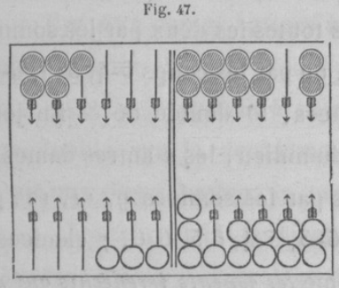
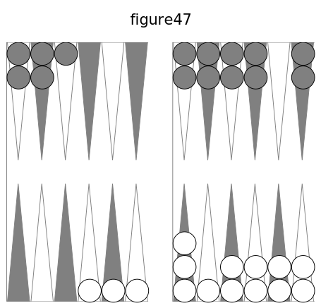

Il reste un 6 à jouer ; on a besoin avoir une aame battue à faux pour arriver à 8 points, et s'en aller au coup suivant, en prenant le trou. Il y aura nécessairement 2 dames dé.. couvertes; si elles sont battues, on sera forcé de prendre le trou et on ne pourra s'en aller, ce qui exposera au danger de l'enfilade. Laquelle des 3 dames doit-on jouer? C'est celle de la droite, celle de la cinquième flèche. En effet, les 2 dames à gauche ne peuvent être battues toutes les deux que par les sommes 1 t et 12, ou les 3 chances 6-5, 6-6. Si l'on joue la dame de la gauche, les 2 dames de droite seront battues toutes les deux par les sommes 10, 11, 12, ou par les coups 6-4, 5-5, 6-5, 6-6, 6 chances, le double de 3. En jouant la dame du milieu, les 2 autres dames seront battues par les sommes 9, il, 12, par les coups 6-3, 5-4, 6-5, 6-6, 7 chances. Guiton blâme _les joueurs irréfléchis qui ne consultent pas les calculs_, et en écrit bien long pour prouver que la deuxième manière de jouer est meilleure que la troisième; il ne parle nullement de la première.

Il y a une autre considération. Il faut avoir une dame battue à faux : quelle est celle des trois manières de jouer qui donne le plus de chances pour cela? Par la première , 8 bat une seule dame , 9 aussi, 10 également, 12 chances. Par la deuxième, 7 bat une seule dame, 8 et 9 aussi, i5 chances. Par la troisième, 7 bat une seule dame , 10 aussi, 9 chances.

Pour qu'il y ait 2 dames battues à faux , la première manière n'a que 3 chances, la deuxième en a 6 : la première a donc un avantage double sur la deuxième. Pour qu'il y ait une dame battue, la première n'a que 12 chances, et la deuxième en a i5 ; la première a un désavantage dans le rapport de 12 à 1 5 , ou de 4 à 5 , un désavantage d'un quart ou d'un cinquième, bien au dessous de l'avantage double. Donc _il faut jouer la dame de droite_ (n° 355).

**366. Ménager son jeu.**

Il faut quelquefois prévoir un coup unique qui peut embarrasser. L'adversaire a des cases à ses flèches septième, neuvième, dixième, onzième. On n a plus que son coin ayec plusieurs surcases et la case de la dixième flèche, et des dames aux flèches quatrième, troisième, deuxième, première, et au talon. On amène 1-t : on le joue dans la première table de l'adversaire, afin que, s'il vient 5-5, on puisse le jouer.

On a quatre dames à la neuvième flèche, deux à la dixième, huit au coin, une à la deuxième de l'adversaire. Il a les cases des flèches neuvième, dixième, onzième. On a huit points, l'adversaire en a 10. On amène 2-j : il faut le jouer avec deux dames de la neuvième flèche, afin de pouvoir jouer 3-2 sans être battu. Si l'on joue le 2 de la deuxième flèche au talon, et une dame de la neuvième flèche à la dixième, le 2-2 laisse une dame à battre par 36 chances moins 1-9, 2-1, 2-2, 32 chances.

**367. Dames du coin.**

Une troisième dame au coin ne peut passer que selon le nombre des flèches vides dans la deuxième table. Si la flèche vide est la sixième, on ne peut passer que par les 6 directs (n° 262), 11 chances. Si la huitième flèche est vide aussi, on passe par les 4, n chances; mais il ne faut plus compter 6-4, ce qui les réduit à 9 : la somme fait 20 chances. La neuvième flèche vide ajoute 7 chances pour les 3, parce qu'on a déjà 6-3, 4-3. S'il y a 1, 2, 3 flèches vides de plus, cela ajoute 5, 3, 1. Cette progression est la même que celle du n° 329.

Cette progression sert pour le passage des dames du coin. Le coin vide oppose les 11 chances de l'as : s'il y a une ou deux dames sur une flèche, cela ajoute 9 chances contraires; s'il y en a sur 2, 3, 4, 5 flèches, sans compter le coin, on a successivement 11, 20, 27, 32, 35, 36, chances.

**368. Gêner le passage du coin.**

L'adversaire a son jan de retour, son coin, sa troisième dame surnuméraire à la cinquième flèche et 8 points. On a son coin, une dame à sa dixième flèche, des cases aux flèches cinquième, quatrième et troisième ; des demi-cases au talon et aux flèches première, deuxième , sixième, septième, huitième. On amène 4-2 : on ne doit pas le jouer avec la dame de la dixième flèche. L'adversaire a contre le passage de son coin les as et les 2, 20 chances; il est forcé de rompre par 5-2, 4-2, 5-1, 6 chances. La dame de la deuxième flèche ne donne que 2 points, excepté 2-2, qui donne le trou en conservant.

## XXI. Chances pour conserver une fois, pour conserver deux fois.

### 21.1. Chances pour conserver une fois, l'adversaire ayant son plein.

**369. Dames surnuméraires.**

Il y a trois dames surnuméraires ; mais, comme à chaque coup on n'en joue que deux ou une, on ne s'occupe que de deux. La manière de les placer est importante. Supposons-les aux flèches sixième, septième, huitième : si l'on amène 2-1, il faut jouer tout d'une de la huitième flèche au coin ; on n'aura pour rompre que 5-5. Toute autre manière est moins bonne. La plus mauvaise est de jouer à la huitième flèche les 2 autres dames : on a, pour rompre, tous les 5 et les 4, 20 chances. Il faut _tacher de se donner des nombres pour jouer égaux a 3 ou tres près_. Les nombres 5, 3, valent mieux que 4, 4 : les premiers rompent par 5-5, 5-4 > 4-4, 4 chances; les autres rompent par tous les 5, 11 chances.

**370. Une dame surnuméraire.**

On en suppose deux sur le coin. L'autre peut occuper 12 places sur les 12 flèches. On a, pour jouer, les nombres o, t, 2, 3,... to, il. Les nombres de chances, en y comprenant les 6, qui ne se jouent pas, sont : 1; 6-1, 3; plus 6-2, 1-1, 6; plus 6-3, 2-1, 10; plus 6-4, 3-1, 2-2, 15; plus 6-5, 4-1, 3-2 : 21 chances. Le 6 pour jouer donne 6-6, 5-1, 4-2, 4-1, 3-3, 3-2, 3-1, 2-2 2-1, i-ti 16 chances ; plus 6-1, 5-2, 4-3, 22; plus 6-2, 5-3, 4-4, 2j; plus 6-3, 5-4, 31; plus 6-4, 5-5, 34; plus 6-5 : 36 chances. Les nombres de chances sont donc 1, 3, 6, 10, 15, 21, 16, 22, 27, 31, 34, 36. Les six premiers nombres correspondent aux 6 pour jouer 0, 1, 2, 3, 4, 5, et peuvent se trouver par la règle suivante : _Au nombre pour jouer ajoutez i, à ce même nombre ajoutez 2, multipliez ces deux sommes l'une par l autre, et divisez le produit par 2_. Ainsi le nombre 5 donne 6 fois 7, ou 42, dont la moitié est 21.

**371. Passage ouvert.**

S'il manque une case au plein de l'adversaire, on est forcé de rompre pour jouer le 6, lorsqu'on trouve dans sa première table une flèche vide où l'on peut placer une dame. Dans ce cas, on n'est sûr de conserver que par les coups que l'on peut jouer dans son jeu , ce qui diminue beaucoup le nombre des chances qui conservent. Il faut donc calculer ces nombres de chances.

Pour les 12 positions que la dame peut occuper, on a : 0 ; 0 ; 1-1 ; 2-1, 1-1, 3 chances ; plus 3-1, 2-2, 6 ; plus 4-1, 3-2, 10; plus 5-1, 4-2, 3-3, 15 ; plus 6-1, 5-2, 4-3, 21 ; plus 6-2, 5-3, 4-4, 26; plus 6-3, 5-4, 30; plus 6-4,5-5, 33; plus 6-5 : 35 chances. Ces 12 nombres sont donc 0, 0, 1, 3, 6, 10, 15, 21, 26, 30, 33, 35 , qui correspondent aux nombres pour jouer 0, 1, 2, 3, 4, 5, 6, 7, 8, 9, 10, 11. Cherchons une règle : 10 correspond à 5; on peut voir que 5 multiplié par 5 moins 1 donne 20, qui, divisé par 2, donne 10 : _Le nombre de chances pour jouer s dans son jeu s'obtient en multipliant le nomhre pour jouer par ce nombre moins 1, et divisant ce produit part 2_. Cette règle se trouve juste jusqu'à 7, pas au delà.

**372. Avec deux dames surnuméraires.**

Si; l'une étant à la dixième flèche, l'autre avance de la dixième à toutes les autres jusqu'au talon, les chances et les nombres de chances sont : 6-6, 6-1, 1-1, 4 chances; plus 6-2, 2-1, 8; plus 6-3, 3-1, 12; plus 6-4, 4-1, 2-2, 17 ; plus 6-5, 5-1, 3-2, 23 chances. A la cinquième flèche, on a le 6 pour jouer 6-6, 6-1,5-1,4 2,4-1, 3-3,3-2, 3-1, 2-2, 2-1, 1-1, 18 chances; à la quatrième flèche, les chances sont 18 plus 5-2, 4-3, 22; à la troisième , 22 plus 6 2, 5-3, 4-4, 27 ; à la deuxième, 27 plus 6-3, 5-4, 31 ; à la première, 3t plus 6-4, 5-5, 34 ; au talon, 34 plus 6-5, 36 chances.

Mettons deux dames sur la neuvième flèche , puis avançons l'une vers la gauche, comme on l'a fait: on a 6-6, 6-2, 6-1, 2-2, 2-1, 1-1, 9 chances; 9 plus 6-3, 3-2, 3-1, 15; 15 plus 6-4, 4-2, 4-1, 21; 21 plus 6.5, 5-2,5-1, 27. Le nombre 6 pour jouer donne 6-6 , 6-2, 6- 1, 5-2 , 5-1, 4-2 , 4-1,3-3, j-2, d-1, 2-2, 2-1, i-1, 22 chances; 7 donne 22 plus 4-3, 24 ; 8, 24 plus 5-3 , 4-4, 27; 9, 27 plus 6-3, 5-4, 31; 10, 31 plus 6-4, 5-5, 34; 34 plus 6-5, 36 chances.

Je mets deux dames sur la huitième flèche , et j'en fais avancer une vers la gauche : j'ai 6-6, 6-3, 6-2, 6-1, 3-3, 3-2, 3-1, 2-2, 2-1, 1-1, 16 chances; 16 plus 6-4, 4-3,4-2, 4-1, 24; 24 plus 6-5, 5-3, 5-2, 5-1, 32 chances. Les nombres 6, 3, donnent 6-6, 6-3, 6-2, 6-1, 5-3, 5-2, 5-1, 4-3, 4-2, 4 3-3, 3-2, 3-1, 2-2, 2-1, î-1, 28 chances; 7, 3, donnent aussi 28 ; 8 n'ajoute que 4-4, ce qui fait 29; 9, 29 plus 5-4, 3i ; 31 plus 6-4, 5-5, 34 ; 34 plus 6-5, 36 chances.

Avec deux dames surnuméraires à la septième flèche et la marche de l'une, on a 36 chances moins les 11 du 5, ou 25 chances; puis 36 moins 5-5, 35. Avec 6, 4, il manque 6-5, 5-5, reste 33 chances; de même pour 7, 8, 9; to ajoute 5-5, 34; n ajoute 6.5, 36 chances. Les deux dames surnuméraires à la sixième flèche donnent 36 chances.

Faisons le rapprochement de ces nombres de chances. On a 4, 8, 12, 17, 23, 18, 22, 27, 3t, 34, 36; 9, 151 21, 27, 22, 24, 27, 31, 34, 36; 16, 24, 32, 28, 28, 29, 3i, 34, 36; 25, 35, 33, 33, 33, 33, 34, 36; 36, 36 Dans ces 5 séries, les premiers nombres 4, 9, 16, 25, 36, sont les produits des deux nombres pour jouer augmentés chacun d'une unité : pour 1, c'est 2 fois 2; pour 2, 3 fois 3; 3 donne 4 fois 4; 4, 5 fois 5; 5, 6 fois 6. Les nombres de chances augmentent jusqu'à 5; ils diminuent à 6; augmentent à 7, ou 8, 9, et même to, si l'un des nombres pour jouer est 14.

Ces 5 séries de nombres de chances pour conserver font faire une remarque utile.

Si l'on veut _mettre les nombres pour jouer dans Vordre où ils donnent le plus de chances, on trouve_ 11, 5, 10, 4,9, 3, 8, 2, 7. Cet ordre est facile à retenir. On a 11, 10, 9, 8, 7, et chaque nombre qui suit ceux-ci en diffère de 6 : 11 moins 6 donne 5, io moins 6 donne 4, 9 moins 6 donne 3, 8 moins 6 donne 2.

Autre remarque : 11 donne 36 chances ; 5 avec un nombre égal ou supérieur, 36; avec 4, 35 ; avec 3, 32; 10 seul ou avec 1, 2, 3, 4, donne 34; 4 avec 6, 7, 8, 9, 33; 9 avec 1,2, 3, 31 chances.

**373. Règle pour conserver.**

_Pour avoir le plus grand nombre possible de chances pour conserver, il faut tâcher de se donner deux nombres pour jouer plus grands que 5 ou égaux a 5, ou un nombre le plus grand possible dans l'ordre suivant : 11, 5, 10, 4, 9, 3, 8, 2, 7, en suppssant que 5 est avec 10, 9, 8, 7, 6, 5, ou 4 avec 9, 8, 7, 6._

**374. Passage ouvert.**

S'il manque à l'adversaire une case pour avoir son plein, cela peut diminuer beaucoup le nombre de chances qui conservent. Il n'y a de certaines que celles que l'on joue dans son jeu. Il faut donc reprendre les 5 séries de nombres de chances, en supprimant les chances qui sont données par les 6, qui ne se jouent pas, et laissant celles qui se jouent. Dans tous ces nombres, il faut retrancher 6-6, 1 chance. Dans ceux donnés par des nombres pour jouer qui ne surpassent point 5, on supprime 2, puis 4, 6, 8, 10, dans la première série; 4, 6, 8, 10, dans la deuxième ; 6, 8, 10, dans la troisième; 8, 10, dans la quatrième; to danj> la cinquième. On a ainsi les 5 séries :

1, 3, 5, 8, 12, 171 21, 26, 30, 33, 35; 4, 8, 1-2, i6, 21, 23, 26, 3o, 33, 35; 9, i5, 21, 27,27,28, 3o,33,35 ; 16, 24, 32, 32, 32, 32, 33, 35 ; 25, 35, 35. Dans chacune de ces 5 séries, le premier nombre (1, 4, 9, 16, 25) est le produit de la multiplication des deux nombres pour jouer 1, 2, 3, 4, 5.

Supposons que l'adversaire n'a pas de dames aux flèches quatrième, cinquième , dixième, ce qui fera un passage lorsque, dans les deux nombres à jouer, il y aura 6 ou 5, et 2 ou 3, 4, 5, 6. Les trois dames surnuméraires étant sur le coin, on n'a pour conserver que 6-2, 5-2 ; une étant à la dixième flèche ajoute 6-3, 5-3, 8 chances ; à la neuvième, 8 plus 1-1, 9; à la huitième, 6-2, 5-2, 6-5, 5-5, 2-1, 1-1, 10 chances; à la septième, 6-2, 5-2, 6-6, 6-5, 3-1, 2-2 2-1,1-1, 13 chances; àla sixième, 6-2, 5-2, 4-1, 3-2, 3-1, 2-2, 2-1, 1-1, 14; à la cinquième flèche, 6-2, 5-2, 5-1, 4-2, 4-1, 3-3, 3-2, 3-1, 2-2, 2-1, 1-1, 19; à la quatrième, 19 plus 6-1, 4-3, 23; à la troisième, a3 plus 5-3,4-4, 26 ; à la deuxième, 26 plus 6-3, 5-4, 3o; à la première, 3o plus 6-4, 5-5, 33; au talon 33 plus 6-5.

Si l'on reculait deux ou trois dames surnuméraires , cela augmenterait le nombre de chances pour conserver. Supposons-les aux flèches neuvième, dixième, onzième, on aura 6-4, 6-3, 6-2, 5-4, 5-3, 5-2, 2-1, 1-1, 15 chances pour conserver. Si le passage était fermé, il n'y aurait que 6-6, 6-2, 6-1, 2-1, 1-1 8 chances.

### 21.2. Chances pour conserver deux fois.

**375. Marche à suivre.**

Cette question est facile à résoudre, mais il faut de l'attention pour être certain de ne pas se tromper dans les détails. On sait ce que c'est qu'un nombre à jouer, un nombre pour jouer (n° 84). La marche est naturelle, et l'on peut s'aider d'un trictrac. Chaque question indique la place de trois dames surnuméraires, ou les nombres qu'on a d'abord pour jouer. On écrit sur une ligne verticale les 21 coups; à la suite de chacun de ces coups, de ces deux nombres à jouer, on met les nombres pour jouer que laisse chaque coup; c'est une deuxième colonne. Avec les nombres qui restent pour jouer, on voit, et l'on écrit vis-à-vis d'eux, les coups que l'on peut jouer sans rompre. Si c'est plus court, on met, à la suite du nombre 36, les coups qui font rompre. On connaît ainsi le nombre de chances qui font conserver et on l'écrit dans une quatrième colonne, La cinquième colonne contient le nombre de chances qui font rompre au coup joué en second lieu, pour chaque coup joué en premier. Les nombres de la quatrième colonne et ceux de la cinquième doivent être doublés, s'ils correspondent à un coup simple dans la première ligne verticale ; cela forme une sixième colonne et une septième. On fait l'addition dans chacune de ces deux lignes, et les deux sommes réunies doivent former 1296 chances, produit de 36 multiplié par 36.

**376. Moins de vingt-et-une lignes.**

On a moins de 21 lignes horizontales si les dames surnuméraires sont placées de manière à faire rompre dès la première fois avec quelques coups. Par exemple, si elles sont sur les flèches huitième, neuvième, dixième, il n'y a pour jouer que les nombres 3, 2, 1, que les coups 6-6, 6-3, 6-2, 6-1, 3-2, 3-1, 2-2, 2-1, 1-1, 9 coups, 9 lignes, parce qu'il n'y a que 9 coups qui conservent en commençant. Cela fait i5 chances au lieu de 36: donc la réunion du nombre des chances qui font conserver au deuxième coup et de celles qui font rompre est i5 fois 36, ou 60 fois 9, ou 540; le premier nombre est 139, le deuxième 401, presque le triple de 13g. Il est d'ailleurs évident que, pour avoir le nombre de toutes les chances qui. font rompre au deuxième coup, il faut de 1296 retrancher 139, celles qui conservent; on a 1157, qui est 8 fois aussi grand que i3g. Pour cet exemple on suit la même marche que quand il y a 21 coups, mais c'est plus court.

**377. Notions sur cette question.**

Je vais poser quelques exemples eL dire les résultats pour chacun ; on pourra les vérifier. Je donnerai les détails pour le cas le plus difficile, le plus compliqué (fig. 48, ci-après) ; c'est celui où l'adversaire a encore une case à faire pour avoir son plein. Ce passage augmente beaucoup le nombre de chances pour conserver. Il est nécessaire, pour éviter les erreurs, de mettre les deux dames surnuméraires mobiles aux places qu'elles doivent occuper successivement. Le passage fait conserver par 5-2 joué du coin, et rompre par 6-5 joué de la septième flèche. Si le premier coup est 3-1, on conserve au deuxième par 6-5. 5-2 laisse pour jouer 4, 3, 2. Le passage est remarquable pour 5 -5 et 5-2 ; on porte une dame de la huitième flèche a la cinquième de l'adversaire, ce qui donne les nombres 9 pour jouer 4, 3, 2, et en outre 5. Donnons d'abord les autres questions.

**378. Divers exemples.**

Si l'on a pour jouer les nombres 5, 5 c'est-à-dire deux dames surnuméraires à la sixième flèche et une à la onzième, pour conserver on a 673 chances, et pour rompre 623, 50 de moins.

Si les daines sont aux flèches cinquième, sixième, huitième, on a 930 chances pour conserver, 366 pour rompre.

Si les dames sont, deux à la sixième flèche , une à la septième, on a i i3g chances pour conserver, 157 pour rompre.

Le quatrième exemple qui va suivre est dans le _Magasin pittoresque_ de novembre 1850, d'après de Montmort, 1713, avec les résultais, mais sans le moyen de les trouver. Les dames surnuméraires sont aux flèches cinquième , sixième , onzième; pour conserver on a 565 chances, pour rompre 731.

Dans le deuxième exemple, le nombre des chances pour conserver est plus du double de l'autre; pour le troisième , c'est plus de 7 fois ; pour le quatrième, le nombre des chances pour conserver est un peu plus des trois quarts de l'autre.

**379. Question difficile.**

Avec les deux jeux de la fig. 48, ci contre, combien a-t-on de chances pour conserver deux fois? combien de chances contraires? En suivant la marche indiquée au n° 375, et la première phrase du n° 376, on voit que dès la première fois on rompt par 6-5 , 6 4, 4-4, 3 coups, 5 chances. Donc il n'y a que 18 lignes horizontales dans les détails qui sont aux tables, à la fin du volume. 

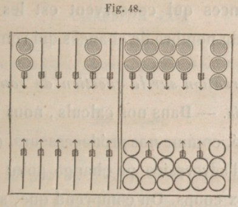
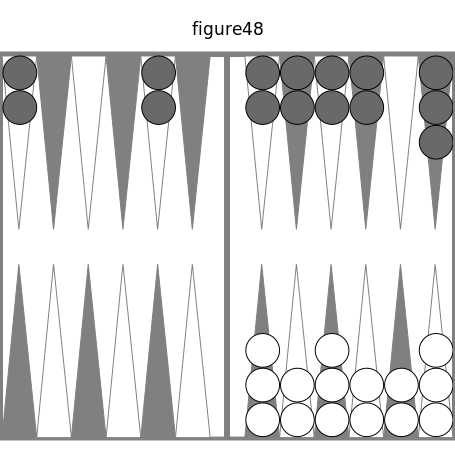

L'on a fait usage des remarques du n° 377. Le nombre des chances pour conserver est 55o, et celui des chances pour rompre est 566 ; leur somme est 1116, produit de 36 multi plié par 3i, parce qu'il n'y a que 31 chances qui conservent la première fois. Pour avoir le nombre total des chances qui rompent au deuxième coup, il faut de 1296 retrancher les 550 chances qui conservent; le reste est 746. Si l'on multiplie 550 par 4, et 746 par 3, on a deux produits qui diffèrent seulement de 38 : donc le nombre de chances qui conservent est les trois quarts du nombre de chances qui rompent.

_Observation sur la question de conserver deux fois_. — Dans nos calculs, nous avons supposé, comme nos prédécesseurs, que le jeu de l'adversaire ne change point entre les deux coups. On comprend que, s'il fallait tenir compte de toutes les manières dont il est possible qu'il joue, on ne pourrait établir aucun calcul de probabilité.

## XXII. Se faire battre a faux. — quand faut-1l l'éviter?

**380. Conseil.**

Si le jeu de l'adversaire est tellement avancé, qu'il est certain de remplir le premier, on doit se livrer à une sage défensive, opposer à l'adversaire des obstacles, des écueils. C'est dans la première table que doivent se préparer ces écueils, en y exposant des dames qui peuvent être battues à faux, si l'adversaire amène de grands nombres qui portent sur ces dames ainsi étalées. Il faut donc, en les exposant, choisir les flèches qui donnent le plus de chances pour être battues à faux. Il arrive souvent que, ces dames étant disposées avec prévoyance, le joueur qui remplit ou qui vient de remplir perd le trou par 6-6 ou 5-5 , et même par 6-5 ou 6-4. Ainsi son jeu se consommant par les grands nombres qu'il est forcé de jouer, il se trouve exposé à ne pouvoir conserver assez de fois pour obtenir le trou. Si l'on ne gagne pas le trou par les dames battues à faux, on peut ob tenir 4 ou 8 points, qui ôtent la bredouille des jetons, retardent le marqué, et déterminent souvent le joueur à s'en aller, malgré la beauté de son jeu; ce qu'il n'eût pas fait s'il n'eût pas battu à faux.

**381. Exemple.**

Soient les deux jeux de la fig. 49, ci-contre. 

On amène 5-4 : on doit le jouer du talon aux flèches quatrième et cinquième, car si l'adversaire amène 6-6 ou 5-5, on a le trou ; s'il a 6-5 ou 6-4, on a 8 points : voilà donc 6 chances très favorables ; 4-4 donne 6 points; 6-3 et 5-4 en donnent 4. L'adversaire ne peut prendre que 4 points par 6-5, 6-2, 6-1.

**382. Ne pas être battu à faux.**

En général, il faut se faire battre à faux; mais il y a bien des exceptions à cette règle. Avec ces deux jeux, on a 4 points et l'on amène 2-2 : on le joue de la troisième à la cinquième flêche, et de la septième à la neuvième, pour être certain de conserver et de s 'en aller. Si l'on joue de la septième flèche au coin, en se laissant séduire par les 10 points, par l'espoir de battre plusieurs dames, il peut arriver que l'adversaire remplisse par 6-2 au coup suivant, vous complète le trou et vous empêche de vous en aller. Il en résultera que vous subirez l'enfilade, pour avoir voulu gagner un ou deux trous de plus. _Lorsqu'on cherche à gagner quelques trous, on doit examiner avec soin si l'on ne s'expose pas à en perdre heaucoup, et même à une enfilade, à une grande bredouille, si l'adversaire n'a pas encore de trous_.

**383. Se faire battre à faux, ou s'en garantir.**

Celui qui a la plus grande somme de nombres pour jouer sans rompre doit s'exposer, le plus qu'il lui est possible, à être battu à faux, et disposer ses dames en conséquence, parce qu'il n'en peut résulter pour lui aucun danger. Mais celui dont le jeu est le plus avancé, et à qui, par conséquent, il reste une moindre somme de nombres pour jouer sans rompre, ne doit s'exposer à être battu qu'avec la plus grande circonspection, et autant seulement que cela lui est nécessaire pour parvenir au trou. Ainsi, quand il a 4 points, il ne doit exposer qu'une seule dame en demi-case, parce que, s'il en exposait deux et qu'elles fussent battues l'une et l'autre, il marquerait le trou sans pouvoir s'en aller: il se trouverait ainsi exposé à tous les dangers qui pourraient résulter de la supériorité du jeu de l'adversaire. Par le même motif, lorsqu'il a 8 points, il doit, s'il le peut, ne laisser aucune dame exposée à être battue à faux, ou, s'il est obligé d'en laisser, préférer celles qui sont placées à une plus grande distance, afin de diminuer au moins le nombre de chances qu'il a à redouter. Si l'adversaire se trouvait avoir aussi 8 points, alors il faudrait, s'il était possible, exposer deux dames, ou au moins une, parce que , l'adversaire prenant le trou par le coup qu il doit jouer, il est possible qu'il donne 8 points ou 4. Dans le premier cas, il est forcé de s'en aller; dans le deuxième, la prudence exige souvent qu'il prenne le même parti; ou, s'il ne le prend pas, il reste au joueur qui est battu à faux, et qui reçoit 4 points, des prétentions probables au trou.

**384. Avec huit points que doit-on faire?**

Lorsqu'on a 8 points avec un jeu bien inférieur à celui de l'adversaire, on doit éviter avec le plus grand soin d'être battu à faux : car si on l'était, l'adversaire, qui ne serait plus entravé dans sa marche par la crainte de ces 8 points, s'exposerait à perdre quelques points pour arriver plus promptement à son plein, et pourrait profiter ainsi de tout l'avantage de sa position.

Si au contraire on le tient long-temps sous l'échec de ces 8 points , on le force Je plus souvent à user et à ruiner tout à fait son jeu, s'il n'a pas la prudence, en faisant le sacrifice du trou, de prévenir cette ruine avant qu'elle soit consommée. Si cependant, avec 8 points et un très beau jeu, on se trouvait exposé à la crainte d'une grande bredouille, on pourrait, on devrait même chercher à être battu à faux, afin d'écarter au moins le danger d'une perte plus considérable.

## XXIII. Rester, s'en aller. — rompre. — coin repris.

### 23.1. Rester, s'en aller.

**385. Rester.**

Discerner avec sagesse et prudence quand on doit rester ou s'en aller, savoir apprécier avec justesse les avantages et les inconvénients de l'une ou l'autre détermination , c'est posséder une des parties les plus essentielles de la théorie du trictrac, celle qui exige l'examen le plus mûr et le plus réfléchi. Une tenue inconsidérée peut causer et cause très souvent les plus funestes revers, les révolutions les plus subites et les plus désastreuses. D'un autre côté, se refuser à une tenue qui offre les probabilités les plus favorables, balancées seulement par la crainte d'événements possibles , à la vérité, mais invraisemblables, c'est se priver d'un bénéfice presque certain , c'est renoncer à un avantage présent qu'on aura peut-être peine à ressaisir. Les faveurs du sort sont compensées par des revers; si l'on ne sait pas profiter des unes, qu'aura-t-on à opposer à la rigueur des autres? La véritable prudence consiste à tenir un juste milieu entre une témérité irréfléchie et une crainte pusillanime. Pour fixer en pareil cas l'incertitude du choix, on doit consulter non seulement la position respective des jeux , mais encore l'état de la partie : cette dernière considération influe nécessairement beaucoup sur le choix à faire. En général, il faut _rester toutes les fois quil y a plus a gagner qu à perdre , et s'en aller lorsqu'en restant il y a plus à perdre qu'à gagner_.

En s'attachant invariablement à cette maxime, on évitera de compromettre un marqué acquis, soit simple , soit en bredouille; et cela pour obtenir un ou deux trous de plus. Mais cet espoir d'un si faible bénéfice, fût-1l même très probable, peut être détruit par un revers inattendu. Ce danger est surtout à redouter lorsqu'en perdant la bredouille on la donne à l'adversaire. Mais, d'un autre côté, on ne néglige pas une tenue qui, sans compromettre le marqué, peut néanmoins offrir la perspective d'un bénéfice bien supérieur à la perte qui pourrait en résulter.

**386. Quand il faut rester pour la grande bredouille.**

Il y a un cas où il faut se livrer à une spéculation ambitieuse, en s'exposant àla perte d'une portion du gain acquis, pour obtenir un bénéfice beaucoup plus considérable. Ainsi, par exemple, on parvient à 9 ou 10 trous en bredouille, on a son plein et les autres dames placées avantageusement dans la première table. L'adversaire a son plein moins une dame à la dixième flèche, et ses dames surnuméraires sur les flèches sixième, septième, huitième, neuvième. Il a, pour prendre le trou d'emblée, 3-1, 2-1, 2-2, 1-1, 6 chances. Il a, pour prendre 8 points, en remplissant de 2 façons, 4-3, 4-2, 4-1,3-2, 8 chances; avec ces 4 coups, il a, pour conserver, des chances dont le nombre est 21, 24, 24, 32, et par conséquent probabilité. On peut perdre le pavillon par 6 plus 8, ou i4 chances; mais on le conserve par 22 : dans aucun cas le marqué n'est compromis. Que perdra-t-on, si on le perd ? Au lieu de recevoir 22 ou 24 jetons, le bénéfice sera réduit à 11 ou 12 : ainsi la différence sera de 11 ou 12. Si, au contraire, on a une des 22 chances favorables, on arrive à la grande bredouille et on reçoit au moins 56 jetons, c'est-à-dire 32 de plus qu'on n'aurait reçu en s'en allant. Ainsi on a d'adord 22 chances contre 14 au plus; et, outre cet avantage, on a celui de ne risquer que t t ou 12 contre 32, ou i contre presque 3. Mais si la perte de ces t 1 ou 12 jetons pouvait entraîner celle de la queue, dont, au contraire, le gain était assuré par le marqué de 22 ou 24 jetons, on aurait tort de ne pas s'en aller.

On ne peut détailler les positions auxquelles ce calcul est applicable; je crois qu'il a suffi d'indiquer une de celles où le joueur contre qui on entreprend la grande bredouille a un grand nombre de chances en sa faveur. La réflexion et l'expérience doivent guider chaque joueur dans toutes les occasions qui se présentent de faire l'application de cette démonstration.

**387. Partie en douze trous.**

Il est d'autres circonstances où l'on doit hasarder une tenue incertaine, qui, dans tout autre cas, serait jugée téméraire. Si, à la partie en 12 trous, l'adversaire en a 11 et si l'on a 2 ou 3 trous, on doit hasarder une tenue qui présente des dangers, si elle offre en même temps un certain nombre de chances qui peuvent faire espérer le gain de la partie. Si, au contraire, on a 11 trous, on doit mettre dans la tenue la plus grande circonspection; on ne doit pas exposer un si grand avantage aux hasards d'un coup qui, quoique improbable, peut, dans un instant, changer un gain presque certain en une perte indubitable.

**388. Tenue de circonstance.**

A la partie à écrire, celui qui prend un trou, mais qui en s'en allant serait marqué, doit rester, si en restant il entrevoit quelque espoir, quoique très incertain et peu probable, d'atteindre l'adversaire et de faire un refait, ou même de marquer. Si néanmoins cette tenue était tellement péril'euse qu'elle dût entraîner à une enfilade qui augmenterait la perte de 10 à 12 trous, la prudence exige qu'on s'en aille, et qu'on se résigne à une perte légère pour en éviter une plus grande.

**389. Tenue ayant le pavillon.**

Lorsque, ayant le pavillon, on s'en va, si l'adversaire a le même nombre de trous, il y a refait : car c'est le nombre de trous qui détermine le marqué , et non la valeur différente que le pavillon attache à chaque trou. En s'en allant à nombre égal de trous, on perd l'avantage du pavillon: d'où il résulte que, dans ce cas d'égalité de trous, on se détermine souvent à faire une tenue incertaine que, dans tout autre cas, on n'eût pas cru devoir faire.

**390. Rester, donnant deux trous.**

Si, prenant le trou, on en donne deux à l'adversaire, on peut rester, lorsque la position a un si grand avantage sur celle de l'adversaire, qu on est assure que ce sa crifice de 2 trous sera plus que compensé par le bénéfice qu'on a droit d'attendre de cette position. A la partie à écrire, celui qui n'a plus besoin que d'un trou pour arriver au marqué ne doit pas hésiter à faire ce sacrifice de 2 trous , lorsqu'il est assuré de prendre le suivant. Il en est même qui portent l'étendue de ce sacrifice jusqu'à celui du pavillon, préférant un marqué simple, mais certain, à un marqué en bredouille incertain.

**391. Marquer, sans pavillon.**

Lorsqu'on prend un trou qui consomme le marqué , si l'on n'a pas le pavillon, ou si, l'ayant, la position des jeux ne présente aucun espoir d'arriver à la grande bredouille, on doit s'en aller, à moins qu'on ne soit évidemment certain de prendre le trou suivant, ou bien que le jeu de l'adversaire ne soit dans un tel état de ruine, que, loin d'offrir aucun danger, il présente au contraire l'espoir de gagner encore un grand nombre de trous.

Cette prudence est surtout nécessaire lorsque le jeu opposé est retardé et arriéré, parce qu'alors celui qui croit le marqué acquis serait lui-même exposé à être marqué, s'il lui survenait un ou plusieurs coups contraires; et il éprouverait ainsi une perte égale, ou peut-être bien supérieure au gain qu'il a imprudemment compromis. Le bénéfice de quelques trous de plus ne peut compenser le dommage auquel exposerait un pareil revers ; car, à la différence d'être obligé de payer autant qu'on aurait pu et dû recevoir, il faut ajouter celle d'un postillon, et souvent même celle de la queue.

Il est néanmoins une circonstance où celui qui a le marqué peut hasarder une tenue incertaine, mais qui offre l'espoir très probable de prendre encore quelques trous : c'est lorsqu'au dernier marqué la fortune est tellement balancée entre les deux joueurs, que le gain de la queue ne dépend que d'un petit nombre de jetons qu'on peut espérer d'obtenir en restant (n° 232). Alors la différence de la perte au gain de celte queue peut être considérée comme une compensation des revers auxquels on s'expose.

**392. S'en aller si l'adversaire h une case et demie à faire.**

Lorsqu'on n'a plus qu'une case à faire, et l'adversaire une case et demie, mais avec plusieurs dames disposées de manière que les unes et les autres aboutissent par quelques nombres directs tant à la demi-case qu'à la flèche vide, si l'on amène un coup qui donne le trou, mais sans pouvoir placer une dame sur la flèche vide, on doit s'en aller. En effet, il est probable que l'adversaire , vu la belle disposition de son jeu, pourra, le coup suivant, couvrir et mettre dedans, et obtiendra ainsi la priorité pour le plein, et par suite, les avantages attachés à cette priorité.

**393. Insuffisance de vingt et une unités.**

Presque toujours, lorsqu'on est forcé de rompre, bien des unités se trouvent perdues. Par exemple, on peut jouer 5-2 et rompre par 4-3, en sorte que 7 unités sont inutiles. Les trois dames surnuméraires, étant sur la septième flèche, donnent 12 points pour jouer, et 5-1 fait rompre. La somme des nombres pour jouer étant 33, on peut rompre au troisième coup, s'il y a passage; par exemple, ayant 6-6, 6-5, puis un coup qui contienne un 6, que l'on peut jouer en rompant.

Il y a des joueurs qui comptent sur les pointsqu1iIs gagneront en étant battus à faux. Le cas le plus favorable est celui où l'adversaire a son plein, et alors on a 21 chances, 15, 10, 6, 3, 1, selon que la dame est à la flèche cinquième, quatrième, troisième, deuxième, première, ou au talon : c'est donc un gàin très incertain.

### 23.2. Rompre. — reprendre son coin.

**394. Rompre pour remplir.**

Avec les deux jeux de la fig. 51 ci-après on amène 4-4; en jouant des flèches sixième et septième, on est battu par ii chances, qui donnent 4 points, excepté 6-5, 6-3, qui en donnent 2 ; on ne peut plus remplir. En passant les dames du coin, il est battu par 16 chances, dont 4 donnent 6 points; l'adversaire peut passer par 6-5, 6-3, 6-2, 6-1, 8 chances; on remplit par 6 chances: on doit ne point passer les dames du coin. Si l'on a 6-6, on est forcé de rompre de la neuvième flèche ; si l'on passe une dame à la deuxième flèche, on est battu par les 7, 5, 4, 32 chances; 20 chances remplissent; si l'adversaire a 8 ou 10 points, on passe la case, et on n'a que 2-1 pour remplir.

On rompt par la flèche la plus éloignée du coin. L'adversaire a toutes ses dames dans sa deuxième table, sa septième flèche est vide ; on a son plein, les trois dames surnuméraires au coin et aux flèches première et troisième de l'adversaire. On amène 6-3 : en le jouant de la septième à la septième de l'adversaire, on est battu par 6 et 5, 20 chances, et par 1, 1 1 chances réduites à 7 parce que 6-1 et 5-1 sont déjà comptées dans les 20 premières, en tout 27 chances. 5-5 donne 8 points; 6-3, 5-4, 4-1, 3-1, 2-1, 10 chances donnent 2 points; 6-1, 5-1, donnent 6 points, et 12 chances 4 points. On est battu à faux par 4-4, 4-3, 4-2, 4-1, 3-3, 3-2, 10 chances ; 4-1 bat une dame à vrai, et une à faux; 2-2 ne bat ni à vrai ni à faux, et complète les 36 chances.

En jouant de la dixième flèche à la quatrième, on est battu par 34 chances; 2-2 donne 8 points; 6-1, 5-1, donnent 2 points; 29 chances en donnent 4. Donc la première manière est la meilleure.

**395. Rompre pour remplir.**

Les deux jeux sont comme ici ; on amène 6-6; on joue de la neuvième flèche à la deuxième de l'adversaire ; on a pour remplir, 3, 2, 1, 27 chances; pour être battu à vrai, il Y a 3, 4 , 5, 7, 9, ou 18 plus 3,4, 5, 2 pour 6-1, 32 chances; mais il faut en retrancner 2-2, 2-1, dont la somme est ô , et qui battent à faux ; il reste 29 chances. L'adversaire a 6 points par 4-3, 4 par 17 chances, 2 par 10 chances. En passant la case, on a 6 chances pour remplir, aucune chance pour être battu : c'est bon quand l'adversaire a 8 ou 10 points. Il en sera de même si l'adversaire a sa septième flèche vide, et si l'on amène 6-6 ; on joue de sa dixième flèche à la première de l'adversaire ; on a pour remplir 18 plus 4, 3, 2, t, 28 chances; on ne peut perdre que 4 points, excepté par 2-2, qui en donne 8 : on ne doit passer la case que si l'adversaire a 8 ou 10 points.

**396. Reprendre son coin.**

Si avec les deux jeux de la fig. 53, ci-après, on amène 5-5, on reprend son coin; cela laisse une dame à battre, qui donne 8 points par 6-6, 2 par 6-5, 4 par les 8 autres chances.

Si l'on joue de la sixième flèche de l'adversaire , le coin est battu par 25 chances, dont 5 donnent 6 points. Avec 4-4, on prend le coin; on laisse une dame qui donne 6 points par 6-5, 2 par 6-4, 4 par les 16 autres chances; en ne prenant pas le coin, il est battu par 25 chances, dont 5 donnent 6 points ; en outre, on n'a que 6 chances pour remplir, au lieu de fi. Si on a 3-3, en prenant le coin il reste une dame, qui donne 8 points par 5-5 et 4-4, 6 par 6-4, 2 par 6-3 , et il reste encore 21 chances pour gagner 4 points, ce qui fait les 27 chances de la progression 11, 9, 7. Les 6 chances 3-3, 3-2, 3-1, 2-2, battent à faux. Si l'on ne prend pas le coin, il est battu par 25 chances, dont 5 donnent 6 points ; on ne remplit que par 6 chances au lieu de 20, ce qui est un grand désavantage.

## XXIV. Passage. — chances pour faire le jan de retour, s'il y manque une demi-case, une case, deux demi-cases. — ayant deux cases a faire, faire deux demi-cases. — ayant une case à faire, en défaire une. — ayant quatre cases et demie, faire deux demi-cases.

### 24.1. Passage. - remplir, s'il manque une demi-case, une case.

**397. Passage.**

On a vu, n° 61, qu'il y a trois conditions. Le n° 93 dit quand il faut fermer ou ouvrir le passage ; la dame de la sixième flèche donne 11 chances à l'adversaire; les deux demi-cases des flèches sixième et septième donnent 20 chances. Si l'on a ses trois dernières cases, on oppose 27 chances au passage du coin. Pour jouer les 2 convenablement, on met plusieurs dames sur la case de la neuvième flèche. Si l'on est obligé de passer une des 3 dernières cases, on sort les dames du coin, parce que, vide, il oppose i 1 chances au passage de celui de l'adversaire. On doit passer son coin quand l'adversaire n'a que trois cases, car elles opposent 27 chances à sa sortie, et ne peuvent le battre que par 4 chances, ou 8 ou 9. On doit faire d'abord des demi-cases, puis des cases, en commençant par les flèches cinquième, quatrième, troisième, lorsqu'on le peut.

**398. Demi-case à faire.**

Il y a 4 dames surnuméraires qui peuvent servir à remplir, s'il n'y en a point de passées au delà de la dame à couvrir, ni en arrière de cette dame de plus de 12 flèches. Celles qui ne satisfont pas à ces conditions, ni aux autres du n° 98, ne doivent pas être comptées dans le calcul des chances pour remplir au coup suivant. Selon le nombre de dames qui peuvent remplir, et selon les nombres directs ou indirects, on choisit la règle convenable depuis le n° 266 jusqu'au n° 276. Il faut revoir ce qu'on a dit aux n'* 31 1, 3i2, pour avoir le plus possible de chances, selon qu'il suffit de remplir d'une façon, ou qu'on a besoin de remplir de deux façons. Le nombre de chances va à36 quand les nombres pour jouer sont 1, 4, 5, 6, ou 2, 4, 5, 6.

_Applications_. On a des cases au talon et aux flèches première, troisième, sixième ; des demi-cases sur les sept autres flèches. On amène 5-2 : on joue le 5 de la dixième flèche et le 2 de la sixième; on a, pour remplir, 4» 5, 4,5,6,7, 33 chances. Si l'on amène 2-1, on joue le 2 de la sixième flèche, l'as de la troisième ; on a, pour remplir, 1, 4, 5, 6, 36 chances; si l'on joue le 2 de la quatrième flèche, l'as de la sixième, on a, pour remplir, 1, 3, 4, 5, 33 chances.

On a son jan de retour moins une dame à la première flèche , deux dames surnuméraires à sa dixième flèche, une aux flèches septième, huitième : on a, pour remplir, 6, 7, 12, 20 chances. On amène 2-1 : on le joue tout d'une de la huitième flèche, on a 4, 6, 12, 26 chances; ou on joue le 2 de la troisième flèche et l'as de la septième, et on a 3, 5, 10, 26 chances ; ou bien le 2 de la septième, l'as de la deuxième, ce qui donne 3, 6, 11, 26 chances. Les six autres manières de jouer donnent i5, 16, 18, 22, 23, 25 chances.

On a le plein moins une dame au talon, et les quatre dames surnuméraires aux flèches troisième , quatrième , cinquième , sixième; on a 35 chances. 

Si on relève une dame de la première flèche à la deuxième, on a le jeu de la fig. 54, qui donnera (no 403) 3o chances, 5 de moins, 6-6, 6-5, 2-1. Dans cet exemple comme dans le premier, 1-1 est contraire.

On met dedans toutes les fois qu'on en trouve l'occasion. On a le plein moins la case de la deuxième flèche, et les dames surnuméraires aux flèches première, cinquième, septième, huitième, dixième. On amène 6-2 i on joue tout d'une de la dixième flèche; on a, pour remplir, 3, 5, 6, 33 chances; il manque 4-4» 2-2, 1-1 .

On a son jan de retour moins une dame au talon, trois dames surnuméraires à sa dixième flèche et une à la première flèche de l'adversaire. L'as ne donne pas ii chances pour remplir : il faut en retrancher 1-1, 2-t; et même, si l'adversaire a des dames à ses flèches dixième et neuvième, il faut en retrancher 3-1, Pour qu'un nombre d'un coup remplisse, il faut que l'autre nombre puisse se jouer sans rompre : cela s'applique aux trois pleins.

**399. Une case à faire.**

Il y a 5 dames surnuméraires, mais on ne peut compter que sur celles qui ne sont ni passées au delà de la flèche à couvrir, ni à plus de six flèches de cette première. On doit employer la règle du n° 291. Le plus grand nombre de chances pour remplir est 20, lorsque les cinq dames sont placées sur cinq des six flèches qui précèdent.

### 24.2. Remplir lorsqu'il manque deux demi-cases.

**400. Demi-cases contiguës.**

On les suppose au talon et à la première flèche ; les cinq dames surnuméraires sont aux cinq flèches suivantes. Pour n'oublier aucune chance qui remplisse, on peut adopter l'ordre suivant dans la combinaison des cinq dames avec les deux dames à couvrir.

**401. Ordre naturel.**

La dame de la sixième flèche, qui se trouve la première à droite, peut couvrir la première demi-case par un 5 ; la dame de la cinquième flèche couvre la deuxième demi-case par un 5 ; celle-ci est aussi couverte par un 4, par un 3, par un 2, ce qui donne déjà 5-5, 5-4, 5-3, 5-2. On peut couvrir la première demi-case par la dame de la cinquième flèche , et porter à la deuxième deini-case la dame de la quatrième flèche, ou de la troisième, ou de la deuxième, ce qui fait encore 4 -4, 4-3, 4-2. On peut couvrir la première demi case par la dame de la quatrième flèche, et porter à la deuxième demi case la dame de la troisième flèche, puis celle de la deuxième flèche, ce qui donne 3-3, 3-2. Enfin on couvre la première demi case avec la dame de la troisième flèche, et la deuxième demi-case avec celle de la deuxième flèche, ce qui fait 2-2. Donc l'ordre naturel donne 5-5, 5-4, 5-3, 5-2, 4-4, 4-3, 4-2, 3-3, 3-2, 2-2, 10 coups.

**402. Ordre inverse.**

La deuxième demi-case est couverte par la première dame surnuméraire ; la première demi-case J'est par la deuxième dame surnuméraire; elle l'est aussi par la troisième, la quatrième, la cinquième, ce qui donne 6-4, 6-3, 6-2, 6-1. La deuxième demi-case est couverte par la deuxième dame surnuméraire, la première demi-case l'est par la troisième dame surnuméraire ; elle l'est aussi par la quatrième, la cinquième, ce qui fait 5-3,5'2, 5-1. La deuxième demi-case est couverte par la troisième dame surnuméraire, la première demi-case J'est par la quatrième dame surnuméraire et par la cinquième, ce qui fait 4-2, 4-1. La deuxième demi-case est couverte par la quatrième dame surnuméraire, la première demi-case l'est par la cinquième, ce qui fait 3-1. L'ordre inverse donne 6-4, 6-3 , 6-2, 6-t, 5-3, 5-2, 5-1, 4-2, 4-1, 3-1, 10 coups.

**403. Ordre naturel. Ordre inverse.**

Dans chacune de ces deux séries il y a 10 coups obtenus en combinant les cinq dames surnuméraires 2 à 2 ; ce nombre io vient de 5 multiplié par 5 moins 1, le produit 20 étant divisé par 2. On doit ajouter ces 2 séries, ce qui évite les 2 divisions, et on a la règle : _Le nombre des coups est égal au nombre des dames surnuméraires multiplié par ce nombre moins 1_. Les cinq dames surnuméraires étant contiguës, il y a 5-3, 5-2, 4-2, 6 chances communes aux deux . séries; il faut les retrancher une fois. Si les cinq dames surnuméraires sont sur les flèches troisième, quatrième , cinquième , sixième, septième, l'ordre inverse n'a que 6 coups ; on en retranche 3, 6-4, 6-3, 5-3 : il n'y a que 22 chances pour remplir, au lieu de 30 chances.

**404. Différence des coups.**

L'ordre naturel donne 4 doublets, autant que de dames surnuméraires moins i ; il faudra retrancher 4, si l'on double le nombre des coups pour avoir celui des chances. L'ordre inverse ne peut avoir de doublets. Avec la fig. du n˚398 on a 2 fois 5 multiplié par 5 moins 1, moins 4, moins 6, ou 40 moins 10, 30 chances.

**405. Règle pour remplir.**

_Le nombre de chances qui remplissent est le douhle du nombre de dames surnuméraires multiplié par ce nombre moins 1, ce produit diminué du nombre de dames surnuméraires contiguës moins t, et de 6 quand les 5 dames surnuméraires sont contiguës._

**406. Chances de moins.**

Si la dame de la sixième flèche est à la septième, les chances de Tordre naturel sont 6-5, 6-4, 6-3, 6-2, 4-4, 4-3, 4-2, 3-3, 3-2, 2-2,10 coups, 17 chances; celles de l'ordre inverse sont 5-3, 5-2, 5-1, 4-2, 4-1,3-1, 6 coups, 12 chances ; mais 4-2 y est déjà, ainsi on a 27 chances. Au no 4o3, il y a 22 chances, 5 de moins, parce qu'il y a un doublet de plus, puis 6 chances retranchées au lieu de 2.

**407. Demi-cases non contiguës.**

On les suppose au talon et à la deuxième flèche; les 5 dames surnuméraires sont aux flèches troisième, quatrième, cinquième, sixième, septième. Dans l'ordre naturel on a 6-5, 5-5, 5-4, 5-3, 5-4, 4-4, 4-3, 4-3, 3-3, 3-2 j et dans l'ordre inverse, 6-3, 6-2, 6-1, 5-2, 5-1, 4-1, 25 chances.

### 24.3. Ayant deux cases a faire, faire deux demi-cases. ayant une case a faire, en défaire une. — ayant quatre cases et demie, faire deux demi-cases.

**408. Ayant deux cases à faire, faire deux demi-cases.**

Avec ce jeu, on amène 2-2. Si l'on fait les deux demi-cases, on a une figure où les dames sont placées comme dans celle du n° 398, et on a (n° 404) 3o chances pour remplir. En faisant une des cases, on a 13 chances pour remplir. Si l'on amène 2-1, en faisant deux demi-cases, il ne reste de dames surnuméraires que sur _quatre flèches contiguës_, et une double surcase, ce qui donne 21 chances; les 15 qui ne remplissent pas sont les 11 de l'as, 6-6, 6-5, 2-2. En faisant la case de la deuxième flèche, la seule possible, il reste des dames surnuméraires sur _cinq flèches_, et on a 20 chances pour remplir. Ainsi dans le cas le plus contraire aux demi-cases, on a encore une chance de plus.

Le coup 3-3 donne, avec les deux demi-cases, 22 chances pour remplir, 2 fois 4 multiplié par 4 moins 1, plus 2 pour la double surcase, moins 2 pour 2 couples de dames surnuméraires contiguës, moins 2 pour 2 chances communes à cause de 4 dames surnuméraires semblablement placées par rapport aux deux demi-cases, ou 24 plus 2 moins 4 ; 22 chances. La case donne 13 chances.

**409. Ayant une case à faire, en défaire une.**

Avec ce jeu on amène 1-1 ; il faut jouer de la deuxième flèche à la première, de la quatrième à la troisième ; les cinq dames surnuméraires donnent (n° 404) 30 chances. En jouant tout d'une de la quatrième flèche à la deuxième, on a !10 chances. En jouant tout d'une de la troisième flèche à la première, on a 22 chances.

Si les cinq dames surnuméraires sont, deux à la cinquième flèche, deux à la sixième, une à la septième, et si on amène 2-1, on joue de la cinquième flèche à la troisième, et de la deuxième à la première ; on a, pour remplir, 2 fois 4 multiplié par 3, moins 2, pour trois dames surnuméraires contiguës, 22 chances.En jouant de la cinquième flèche à la deuxième, on n'aurait que 13 chances.

**410. Ayant quatre cases et demie, faire une seconde demi-case.**

Avec le jeu de la fig. 57 ci-contre, on amène 2-1 ; en jouant de la quatrième flèche à la première, on a le jeu de l'alinéa précédent; 22 chances. La case donne 13 chances.

## XXV. Remplir. — conserver une fois, deux fois.

### 25.1. Remplir. - conserver une fois.

**411. Remplir.**

Exemple remarquable. On a ce jeu, on amène 4-4; on doit jouer de sa neuvième lleche a la dixième de l'adversaire, et de la sixième à la deuxième; on a, pour remplir, 6, 5, 3, 33 chances ; les chances contraires sont 4-4, 2-2, 1-1. En jouant de sa neuvième flèche à la dixième de l'adversaire, et de la neuvième à la cinquième , on a les nombres pour jouer 6, 3, 2, 1, 32 chances ; les chances contraires sont 5-5, 5-4, 4-4. Si l'on joue tout d'une de sa neuvième flèche à la sixième de l'adversaire, on a les nombres pour jouer 5, 3, 2, 3o chances : n'en parlons plus. Mais les deux autres manières:de jouer sont dignes de notre examen. La première, avec une dame passée, avec 3 dames pour remplir, donne une chance de plus que la deuxième, qui a 4 dames pour remplir et point de dame passée, ce qui n'a pas lieu ordinairement. Cela peut s'expliquer aisément : la somme des nombres pour jouer est d'abord 14, puis 12, et 10 dans la troisième manière. Il n'y a rien de contraire à la règle du n° 311 qui suppose une même somme de nombres pour jouer.

Dans cette figure on porte la dame de sa neuvième flèche à sa dixième; alors on doit jouer 4-4 tout d'une de sa dixième flèche à la cinquième; on a, pour remplir, 5, 3, 2, 1, 32 chances.

On a deux dames au talon et aux flèches deuxième et septième, trois aux flèches troisième, quatrième et cinquième. On amène 3-3; on joue tout d'une de la septième flèche à la première; on a pour remplir 6, 4, 3, 2, 35 chances ; il manque 5-5.

**412. Conserver.**

On a vu les rares exceptions où l'on conserve sans jouer les 6 (n° 107) ; il faut presque toujours les jouer. On doit donc s'attacher à avoir des dames à la sixième flèche de l'adversaire, quand les dames ne sont pas toutes entrées dans la première table; car, si elles y étaient, ce serait de la cinquième que l'on jouerait les 6. On va prendre quelques exemples. Les trois dames surnuméraires étant au talon et aux flèches quatrième et cinquième, on amène 5-1 ; il faut lever 2 dames, et non pas i : on laisse 6 pour jouer les coups 5-1, 4-2, 4-1, 3-3, 3-2, 3-1, 2-2, 2-1, 1-1, 15 chances; l'autre manière laisse 5, 1, pour jouer 5-1, 4-1, 3-2, 3-1, 2-2, 2-1, 1-1, 12 chances, au lieu de 15. On sait que le contraire a lieu pour remplir ou battre.

Avec les dames surnuméraires au talon et aux flèches cinquième et sixième, on a 5-2 : on joue le 5 de la sixième flèche à la première, et alors tout élant dans la première table, la bande compte pour une flèche et l'on joue le 2 de la première flèche hors des flèches; il reste, pour jouer, 6, 1, ou bien les coups 6-1, 5-1, 4-2, 4-t, 3-3, 3-2, 3-1, 2-2, 2-1, 1-1, 17 chances. En jouant le 5 de la cinquième flèche, et le 2 de la sixième, il reste, pour jouer, 5, 1 ; en se reportant aux 17 chances, on voit qu'avec 5, 1, on ne peut jouer 6-1, 4-2, 3-3, 5 de moins, 12 seulement.

Avec le jeu indiqué, on a 6-2 ; on joue le 2 de la sixième flèche à la quatrième, et le 6 de la cinquième hors des flèches ; il reste, pour jouer, 5, 1, ou 12 chances, comme on l'a dit. Si l'on joue le 6 de la sixième flèche, et le 2 de la cinquième, on a, pour jouer, 4, 1 , ou les coups 4-t > 3-1, 2-2, 2-1, 1-1, 8 chances, 4 de moins. Avec 5-1, on joue le 5 de la sixième flèche à la première, l'as du talon hors des flèches; il reste pour jouer 0,2. »j 1 on joue I as de la sixième flèche à la cinquième, puis le 5 de la cinquième au talon, il reste pour jouer 6, t ; il y a de moins 6-2, 5-2, 4 chances de moins. De même, 4-1 laisse , pour jouer, 6, 3; 3-1 laisse 6, 4; 2-1 laisse 6, 5; 1-1 laisse 6, 6.

Les dames étant au talon et aux flèches quatrième, sixième, 5-1, 4~S 2-1, 1-1, laissent, pour jouer, 6 et 1, 6 et 1, 6 et 3, 6 et 5, en jouant d'abord Tas. Le 3- 1 fait exception; il ne laisse que 6, 2, 21 chances; au lieu qu'en jouant le 3 de la sixième flèche, puisj'as du talon, on a 5, 4, 24 chances. Cela lient à ce qu'avec 6, 2, il y a un point perdu, la somme de 6 et 2 est 8, celle de 5 et 4 est 9.

Les dames étant aux flèches troisième, quatrième, cinquième, ce qui donne pour jouer 4) 5, 6, le 6-6 fait rompre ; les 5 autres coups du 6 et 5-5 ôtent le 6. Les 14 autres coups le conservent avec avantage, excepté 3-3, qui, comme 3-1, exemple précédent , laisse 6,2, ou 5, 4. (cf. la fin de l'alinéa précédent). Si l'on joue 4-2 des deux manières, 5, 4, donnent 24 chances; 6, 3, en donnent 27. Pour les questions semblables, il n'y a que ces deux exceptions. Pour connaître les nombres de chances qui conservent, il faut écrire toutes les chances qui donnent 6,2; 6, 3; 5, 4; puis les compter pour chaque cas : on ne peut employer les règles données pour remplir ou battre.

Si deux dames sont au talon et une à la dixième flèche, les coups 4-1, 3-1,2-2, 2-1, 1-1, laissent, pour jouer, 7, 8, 7, 9, 11.

On a levé deux dames, la troisième va du talon successivement jusqu'à la dixième flèche; on a les nombres, pour jouer, 1, 2, 3,... 10, 11, qui donnent les nombres de chances suivants, 0, 1, 3, 6, 10, 15, 21, 26, 30, 33, 35. On peut remarquer qu'entre 15 et 21, qui correspondent aux nombres pour jouer, 6 et 7, il y a 6; puis, avant et après, les différences sont 5, 4, 3, 2. Si les deux autres dames sont au talon, les nombres 0, 1, 3, 6, 10, 15, 21, deviennent 0, 3, 5, 8, 12, 17, 21, 2 chances de plus, si la dame mobile est dans la première table.

**413. Conseils.**

On voit qu'il faut _garder 1 ou 2 dames surnuméraires sur la cinquième flèche ou le plus près possible, et pour cela examiner quel est celui des deux nombres qu'il faut jouer le premier_.

### 25.2. Conserver deux fois.

**414. Marche à suivre.**

On suit entièrement la marche expliquée au n° 375. Dans les 21 coups, il y en a qui peuvent se jouer de deux manières ; pour le choix, on doit suivre le conseil qui vient d'être donné. Nous allons examiner plusieurs questions et en présenter les résultats. Bien des joueurs s'en contenteront; d'autres s'exerceront non seulement sur les exemples de ce livre, mais encore sur d'autres. Ils formeront des tableaux semblables à celui expliqué au 11° 379 et placé à la fin de ce volume. Nous avons vu , à la première phrase du n° 376, qu'on peut avoir à écrire moins de 21 lignes horizontales : alors le travail est plus court.

**415. Questions.**

On place successivement les trois dames surnuméraires sur le talon et les flèches cinquième et sixième; sur le talon et les flèches quatrième et sixième ; toutes les trois sur la quatrième flèche ; sur les flèches troisième, quatrième, cinquième ; deux au talon, une à la dixième flèche. Les nombres de chances qui font conserver, sont 582, 420, 508, 773, 412. Les chances qui font rompre, sont au nombre de 714, 876, 788, 523, 884. Le rapport des premiers nombres aux derniers est- à peu près 4 à 5, 1 à 2, 9 à 14, 3 à 2, 1 à 2. On peut voir que, le pour le deuxième exemple et le dernier, le rapport est à peu près 1 à 2 ; en effet, on a 420 et 876, puis 412 et 884. Cela tient-1l à ce que de la deuxième figure on passe à la dernière en reculant une dame de quatre flèches, et en avançant une autre également de quatre flèches, et que, dès lors, dans les deux cas, on a exactement la même somme de nombres pour jouer?

